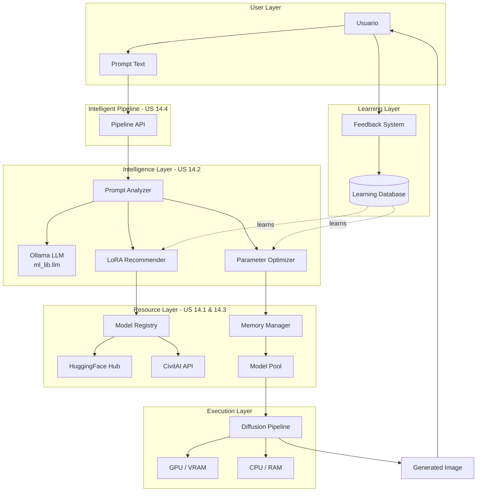

# Épica 14: Intelligent Image Generation

**Estado:** 📋 PLANIFICADO
**Prioridad:** ⚡ ALTA
**Estimación Total:** 116 horas (~14-15 días)

---

## 📋 Visión General

Sistema inteligente de generación de imágenes que integra HuggingFace Hub y CivitAI para seleccionar automáticamente modelos, LoRAs y parámetros óptimos basándose en el análisis semántico del prompt del usuario, con gestión eficiente de memoria para trabajar en hardware limitado.

### Objetivos de Negocio

1. **Democratizar generación de IA**: Permitir a usuarios sin experiencia técnica generar imágenes de alta calidad
2. **Optimizar recursos**: Usar memoria eficientemente para ejecutar en GPUs consumer
3. **Automatización inteligente**: Reducir trial-and-error mediante selección automática de componentes
4. **Aprendizaje continuo**: Mejorar recomendaciones con feedback del usuario

---

## 📊 User Stories

### ✅ US 14.1: Integración con Model Hubs
**Estimación:** 32 horas | **Prioridad:** ⚡ CRÍTICA

Integración completa con HuggingFace Hub y CivitAI para búsqueda, descarga y gestión de modelos y LoRAs.

**Entregables:**
- `HuggingFaceHubService`: Cliente para HF Hub
- `CivitAIService`: Cliente para CivitAI API
- `ModelRegistry`: Registro unificado de modelos
- Cache local inteligente con verificación de integridad

[📄 Ver detalle completo](US_14.1_model_hub_integration.md)

---

### ✅ US 14.2: Sistema Inteligente de Prompting
**Estimación:** 40 horas | **Prioridad:** ⚡ CRÍTICA

Análisis semántico de prompts usando Ollama (via módulo `ml_lib.llm`) para recomendar LoRAs y optimizar parámetros automáticamente.

**Entregables:**
- `PromptAnalyzer`: Análisis semántico con Ollama
- `LoRARecommender`: Recomendación basada en embeddings
- `ParameterOptimizer`: Optimización multi-objetivo
- `LearningEngine`: Sistema de feedback y aprendizaje continuo

**Componentes clave:**
- Extracción de conceptos (estilo, sujeto, escena, calidad)
- Detección de intención artística
- Scoring multi-factor para LoRAs
- Balanceo automático de pesos (alpha)

[📄 Ver detalle completo](US_14.2_intelligent_prompting_system.md)

---

### ✅ US 14.3: Gestión Eficiente de Memoria
**Estimación:** 24 horas | **Prioridad:** ⚡ CRÍTICA

Gestión dinámica de memoria con offloading automático a CPU/disco para trabajar con modelos grandes en GPUs pequeñas (<8GB VRAM).

**Entregables:**
- `MemoryManager`: Detección de recursos y tracking
- `ModelPool`: Pool con LRU eviction
- `ModelOffloader`: Offload automático CPU/GPU
- `QuantizationEngine`: Quantización automática (fp16, int8)
- Integración con xformers, Flash Attention

**Estrategias:**
- AUTO: Decisión automática según VRAM
- SEQUENTIAL: Carga componentes bajo demanda
- CPU_OFFLOAD: UNet en GPU, resto en CPU
- FULL_GPU: Todo en GPU (requiere 16GB+)

[📄 Ver detalle completo](US_14.3_efficient_memory_management.md)

---

### ✅ US 14.4: Pipeline Integration
**Estimación:** 20 horas | **Prioridad:** ⚡ CRÍTICA

Pipeline unificado que integra todos los subsistemas en una API coherente con modos AUTO, ASSISTED y MANUAL.

**Entregables:**
- `IntelligentGenerationPipeline`: Pipeline principal
- Workflow completo: Análisis → Recomendación → Optimización → Generación
- Batch processing con estrategias de variación
- Sistema de explicaciones de decisiones
- Feedback loop para aprendizaje

**Modos de operación:**
- **AUTO**: Decisiones completamente automáticas
- **ASSISTED**: Muestra recomendaciones, usuario aprueba/modifica
- **MANUAL**: Control total del usuario

[📄 Ver detalle completo](US_14.4_pipeline_integration.md)

---

## 🏗️ Arquitectura General



---

## 🗂️ Estructura de Código

```
ml_lib/diffusion/
├── intelligent/                      # Nuevo submódulo
│   ├── __init__.py
│   │
│   ├── hub_integration/              # US 14.1
│   │   ├── __init__.py
│   │   ├── huggingface_service.py
│   │   ├── civitai_service.py
│   │   ├── model_registry.py
│   │   └── entities/
│   │       ├── model_metadata.py
│   │       ├── download_result.py
│   │       └── model_filter.py
│   │
│   ├── prompting/                    # US 14.2
│   │   ├── __init__.py
│   │   ├── prompt_analyzer.py        # Usa ml_lib.llm.OllamaProvider
│   │   ├── lora_recommender.py
│   │   ├── parameter_optimizer.py
│   │   ├── learning_engine.py
│   │   └── entities/
│   │       ├── prompt_analysis.py
│   │       ├── lora_recommendation.py
│   │       ├── optimized_parameters.py
│   │       └── intent.py
│   │
│   ├── memory/                       # US 14.3
│   │   ├── __init__.py
│   │   ├── memory_manager.py
│   │   ├── model_pool.py
│   │   ├── model_offloader.py
│   │   ├── quantization_engine.py
│   │   └── entities/
│   │       ├── system_resources.py
│   │       ├── offload_config.py
│   │       └── loaded_model.py
│   │
│   └── pipeline/                     # US 14.4
│       ├── __init__.py
│       ├── intelligent_pipeline.py
│       ├── batch_processor.py
│       ├── decision_explainer.py
│       ├── feedback_collector.py
│       └── entities/
│           ├── pipeline_config.py
│           ├── generation_result.py
│           ├── generation_metadata.py
│           └── batch_config.py
│
├── services/                         # Servicios existentes
│   ├── pipeline_service.py
│   ├── lora_service.py
│   └── ...
│
└── docs/                             # Documentación existente
    ├── readme.md
    ├── intelligent_prompting_system.md
    └── ...
```

---

## 📅 Roadmap y Priorización

### Sprint 1: Foundations (Semana 1-2)
**Duración:** 2 semanas | **Horas:** 56h

- [x] US 14.1: Model Hub Integration (32h)
  - HuggingFace Hub service
  - CivitAI service
  - Model Registry
  - Cache management

- [ ] US 14.3: Memory Management (24h)
  - Resource detection
  - Model Pool con LRU
  - Basic offloading

**Entregable:** Sistema capaz de buscar, descargar y cachear modelos con gestión de memoria

---

### Sprint 2: Intelligence (Semana 3-4)
**Duración:** 2 semanas | **Horas:** 40h

- [ ] US 14.2: Intelligent Prompting (40h)
  - Prompt Analyzer con Ollama
  - LoRA Recommender
  - Parameter Optimizer
  - Learning Engine

**Entregable:** Sistema que analiza prompts y recomienda LoRAs/parámetros

---

### Sprint 3: Integration (Semana 5)
**Duración:** 1 semana | **Horas:** 20h

- [ ] US 14.4: Pipeline Integration (20h)
  - Intelligent Pipeline
  - Batch processing
  - Decision explainer
  - Feedback loop

**Entregable:** Pipeline end-to-end completamente funcional

---

## 🧪 Testing Strategy

### Unit Tests
- Cada componente con >80% coverage
- Mocks para APIs externas (HF, CivitAI, Ollama)
- Tests de edge cases (OOM, network errors)

### Integration Tests
- Workflow completo con modelos pequeños
- Tests en diferentes configuraciones de VRAM
- Verificación de cache persistence

### Performance Tests
- Benchmarks de tiempos de generación
- Memory usage profiling
- Throughput en batch processing

### User Acceptance Tests
- Generación con prompts reales
- Comparación con generación manual experta
- Feedback qualitativo de usuarios

---

## 📊 Métricas de Éxito

### Métricas Técnicas
- **Tiempo de setup**: <30s para cargar pipeline
- **Uso de memoria**: Generación SDXL con <8GB VRAM
- **Calidad de recomendaciones**: >70% de LoRAs recomendados son relevantes
- **Accuracy de parámetros**: Parámetros óptimos en >80% de casos

### Métricas de Usuario
- **Satisfacción**: Rating promedio >4/5 en generaciones AUTO
- **Reducción de iteraciones**: <2 intentos promedio vs >5 en modo manual
- **Adopción**: >60% de usuarios prefieren modo AUTO vs MANUAL

---

## 🔗 Dependencias

### Internas
- `ml_lib.llm` - Para análisis semántico con Ollama ✅ Existe
- `ml_lib.diffusion.services` - Servicios base de diffusion ✅ Existe
- `ml_lib.core` - Interfaces y validación ✅ Existe

### Externas
```requirements
torch>=2.0.0
diffusers>=0.25.0
transformers>=4.36.0
huggingface-hub>=0.20.0
sentence-transformers>=2.2.0
safetensors>=0.4.0
requests>=2.31.0
aiohttp>=3.9.0
psutil>=5.9.0
bitsandbytes>=0.41.0  # INT8 quantization
xformers>=0.0.20  # Optional, memory-efficient attention
Pillow>=10.0.0
tqdm>=4.66.0
```

---

## 📝 Notas de Implementación

### Integración con Ollama

El análisis semántico de prompts se realizará mediante el módulo `ml_lib.llm` existente:

```python
from ml_lib.llm.providers import OllamaProvider
from ml_lib.llm.clients import LLMClient

# Configurar Ollama
provider = OllamaProvider(
    base_url="http://localhost:11434",
    model="llama2:7b"  # o "mistral", "codellama", etc.
)

client = LLMClient(provider=provider)

# Analizar prompt
response = client.generate(
    prompt=f"Analyze this image generation prompt and extract style, subject, mood: '{user_prompt}'"
)
```

### Consideraciones de Memoria

Para VRAM limitado (<8GB), el sistema automáticamente:
1. Detecta VRAM disponible
2. Selecciona estrategia de offloading apropiada
3. Cuantiza modelos a fp16 o int8
4. Usa Sequential loading si es necesario

### Cache y Persistencia

- Modelos descargados se cachean en `~/.cache/ml_lib/models/`
- Metadata en SQLite: `~/.ml_lib/models.db`
- Feedback history: `~/.ml_lib/feedback.db`
- Learning data se persiste entre sesiones

---

## 🚀 Getting Started (Post-implementación)

### Instalación

```bash
pip install ml-lib[diffusion]  # Incluye dependencias de diffusion
```

### Uso Básico

```python
from ml_lib.diffusion.intelligent import IntelligentGenerationPipeline

# Modo AUTO: Todo automático
pipeline = IntelligentGenerationPipeline()

result = pipeline.generate(
    prompt="anime girl with magical powers in Victorian mansion"
)

result.image.save("output.png")
print(result.explanation.summary)
# "Selected anime_style_lora (α=0.8), detail_enhancer (α=0.5) |
#  Parameters: 35 steps, CFG 7.5, 1024×1024 | Complexity: moderate"
```

### Uso Avanzado

```python
from ml_lib.diffusion.intelligent import (
    IntelligentGenerationPipeline,
    PipelineConfig,
    GenerationConstraints,
    Priority
)

# Configuración custom
config = PipelineConfig(
    base_model="stabilityai/sdxl-base-1.0",
    constraints=GenerationConstraints(
        max_vram_gb=8.0,
        priority=Priority.QUALITY
    )
)

pipeline = IntelligentGenerationPipeline(config=config)

# Generación batch
results = pipeline.generate_batch(
    prompt="anime character, different poses",
    batch_config=BatchConfig(num_images=4)
)
```

---

**Última actualización:** 2025-10-09
**Responsable:** Equipo ML
**Revisores:** TBD
