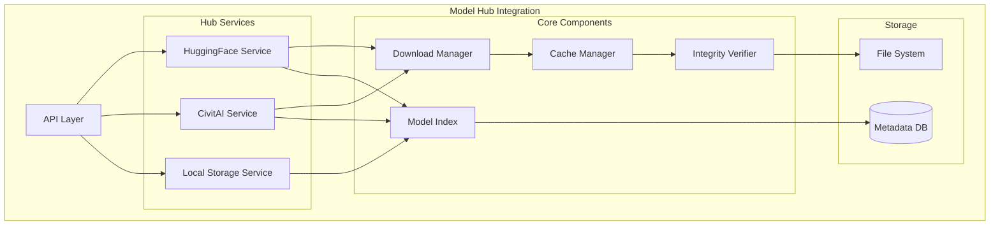

# US 14.1: Integración con Model Hubs (HuggingFace y CivitAI)

**Épica:** 14 - Intelligent Image Generation
**Prioridad:** ⚡ CRÍTICA
**Estimación:** 32 horas
**Estado:** 📋 PENDIENTE

---

## 📋 Descripción

Como desarrollador, necesito un sistema que se integre con HuggingFace Hub y CivitAI para descargar, cachear y gestionar modelos de difusión (Stable Diffusion, SDXL, Pony, etc.) y sus LoRAs asociados de forma eficiente y segura.

---

## 🎯 Objetivos

1. **Integración con HuggingFace Hub**
   - Autenticación segura con tokens
   - Búsqueda y descarga de modelos
   - Cache local inteligente
   - Soporte para diferentes formatos (safetensors, ckpt)

2. **Integración con CivitAI**
   - API REST para búsqueda de modelos y LoRAs
   - Sistema de descarga con rate limiting
   - Verificación de integridad (checksums)
   - Cache y versionado

3. **Gestión Unificada**
   - Abstracción común para ambas plataformas
   - Sistema de índice local de modelos
   - Metadata enriquecida (triggers, tags, stats)

---

## 📊 Criterios de Aceptación

### AC 1: HuggingFace Hub Integration
```python
hub_service = HuggingFaceHubService(token="hf_...")

# Buscar modelos
models = hub_service.search_models(
    query="stable-diffusion-xl",
    filter=ModelFilter(
        task="text-to-image",
        library="diffusers"
    )
)

# Descargar modelo
model_path = hub_service.download_model(
    model_id="stabilityai/stable-diffusion-xl-base-1.0",
    revision="main",
    cache_dir="/models"
)

# Listar modelos cacheados
cached = hub_service.list_cached_models()
assert len(cached) > 0
```

### AC 2: CivitAI Integration
```python
civitai_service = CivitAIService(api_key="...")

# Buscar LoRAs
loras = civitai_service.search_models(
    query="anime style",
    type=ModelType.LORA,
    base_model=BaseModel.SDXL,
    sort=SortBy.POPULARITY
)

# Descargar LoRA
lora_info = civitai_service.download_model(
    model_id=12345,
    version_id=67890,
    download_dir="/loras"
)

# Verificar integridad
assert civitai_service.verify_checksum(lora_info.path, lora_info.sha256)
```

### AC 3: Unified Model Registry
```python
registry = ModelRegistry()

# Registrar desde múltiples fuentes
registry.register_from_huggingface("stabilityai/sdxl-turbo")
registry.register_from_civitai(model_id=12345)

# Búsqueda unificada
results = registry.search(
    query="anime",
    sources=[Source.HUGGINGFACE, Source.CIVITAI],
    model_type=ModelType.LORA
)

# Obtener metadata completa
model = registry.get_model("anime_style_v2")
print(model.trigger_words)  # ["anime", "manga style"]
print(model.recommended_weight)  # 0.7
```

---

## 🏗️ Arquitectura Técnica

### Componentes Principales



### Estructura de Clases

```python
@dataclass
class ModelMetadata:
    """Metadata completa de un modelo."""
    model_id: str
    name: str
    source: Source  # HUGGINGFACE, CIVITAI, LOCAL
    type: ModelType  # BASE_MODEL, LORA, EMBEDDING, VAE
    base_model: BaseModel  # SD15, SDXL, PONY, SD3
    version: str

    # Información técnica
    format: ModelFormat  # SAFETENSORS, CKPT, DIFFUSERS
    size_bytes: int
    sha256: str

    # Metadata semántica
    trigger_words: list[str]
    tags: list[str]
    description: str

    # Stats y recomendaciones
    download_count: int
    rating: float
    recommended_weight: float | None

    # Paths
    local_path: Path | None
    remote_url: str

    # Dates
    created_at: datetime
    updated_at: datetime


class HuggingFaceHubService:
    """Servicio para interactuar con HuggingFace Hub."""

    def __init__(
        self,
        token: str | None = None,
        cache_dir: Path = Path("~/.cache/huggingface")
    ):
        self.client = HfApi(token=token)
        self.cache_dir = cache_dir

    def search_models(
        self,
        query: str,
        filter: ModelFilter | None = None,
        limit: int = 20
    ) -> list[ModelMetadata]:
        """Busca modelos en HuggingFace Hub."""
        pass

    def download_model(
        self,
        model_id: str,
        revision: str = "main",
        allow_patterns: list[str] | None = None,
        ignore_patterns: list[str] | None = None
    ) -> Path:
        """Descarga modelo del Hub."""
        pass

    def list_cached_models(self) -> list[ModelMetadata]:
        """Lista modelos cacheados localmente."""
        pass

    def delete_cached_model(self, model_id: str) -> bool:
        """Elimina modelo del cache."""
        pass


class CivitAIService:
    """Servicio para interactuar con CivitAI API."""

    BASE_URL = "https://civitai.com/api/v1"

    def __init__(
        self,
        api_key: str | None = None,
        cache_dir: Path = Path("~/.cache/civitai"),
        rate_limit: float = 1.0  # requests per second
    ):
        self.api_key = api_key
        self.cache_dir = cache_dir
        self.rate_limiter = RateLimiter(rate_limit)

    def search_models(
        self,
        query: str | None = None,
        type: ModelType | None = None,
        base_model: BaseModel | None = None,
        sort: SortBy = SortBy.POPULARITY,
        limit: int = 20
    ) -> list[ModelMetadata]:
        """Busca modelos/LoRAs en CivitAI."""
        pass

    def get_model_details(self, model_id: int) -> ModelMetadata:
        """Obtiene detalles completos de un modelo."""
        pass

    def download_model(
        self,
        model_id: int,
        version_id: int | None = None,
        download_dir: Path | None = None
    ) -> DownloadResult:
        """Descarga modelo desde CivitAI."""
        pass

    def verify_checksum(self, file_path: Path, expected_hash: str) -> bool:
        """Verifica integridad del archivo descargado."""
        pass


class ModelRegistry:
    """Registro unificado de modelos de todas las fuentes."""

    def __init__(
        self,
        db_path: Path = Path("~/.ml_lib/models.db")
    ):
        self.db = ModelDatabase(db_path)
        self.hf_service = HuggingFaceHubService()
        self.civitai_service = CivitAIService()

    def register_model(self, metadata: ModelMetadata) -> None:
        """Registra un modelo en el índice."""
        pass

    def register_from_huggingface(self, model_id: str) -> ModelMetadata:
        """Descarga y registra modelo de HuggingFace."""
        pass

    def register_from_civitai(self, model_id: int) -> ModelMetadata:
        """Descarga y registra modelo de CivitAI."""
        pass

    def search(
        self,
        query: str | None = None,
        sources: list[Source] | None = None,
        model_type: ModelType | None = None,
        base_model: BaseModel | None = None
    ) -> list[ModelMetadata]:
        """Búsqueda unificada en todas las fuentes."""
        pass

    def get_model(self, model_id: str) -> ModelMetadata:
        """Obtiene metadata de un modelo."""
        pass

    def list_models(
        self,
        source: Source | None = None,
        model_type: ModelType | None = None
    ) -> list[ModelMetadata]:
        """Lista todos los modelos registrados."""
        pass

    def cleanup_cache(
        self,
        keep_recent: int = 10,
        max_size_gb: float = 50.0
    ) -> CacheCleanupReport:
        """Limpia cache de modelos."""
        pass
```

---

## ✅ Tasks Técnicas

### Task 14.1.1: HuggingFace Hub Service (10h)
- [ ] Implementar `HuggingFaceHubService` con cliente de HuggingFace Hub
- [ ] Métodos de búsqueda con filtros
- [ ] Sistema de descarga con progress tracking
- [ ] Cache local con `huggingface_hub` library
- [ ] Tests de integración con mocks

**Subtareas:**
```python
# 14.1.1.1: Cliente base (2h)
def test_hf_client_initialization():
    service = HuggingFaceHubService(token="hf_test")
    assert service.client is not None

# 14.1.1.2: Búsqueda de modelos (3h)
def test_search_models():
    service = HuggingFaceHubService()
    results = service.search_models("sdxl", limit=5)
    assert len(results) <= 5
    assert all(r.source == Source.HUGGINGFACE for r in results)

# 14.1.1.3: Descarga y cache (4h)
def test_download_and_cache():
    service = HuggingFaceHubService()
    path = service.download_model("hf-internal-testing/tiny-stable-diffusion-xl-pipe")
    assert path.exists()

    # Verificar que segunda descarga usa cache
    import time
    start = time.time()
    path2 = service.download_model("hf-internal-testing/tiny-stable-diffusion-xl-pipe")
    assert time.time() - start < 1.0  # Debe ser instantáneo

# 14.1.1.4: Gestión de cache (1h)
def test_cache_management():
    service = HuggingFaceHubService()
    cached = service.list_cached_models()
    assert isinstance(cached, list)
```

### Task 14.1.2: CivitAI Service (12h)
- [ ] Implementar cliente REST para CivitAI API
- [ ] Sistema de rate limiting
- [ ] Parseo de respuestas y metadata
- [ ] Descarga con verificación de checksums
- [ ] Tests con API real y mocks

**Subtareas:**
```python
# 14.1.2.1: Cliente REST (3h)
def test_civitai_api_client():
    service = CivitAIService()
    assert service.BASE_URL == "https://civitai.com/api/v1"

# 14.1.2.2: Búsqueda y filtrado (4h)
def test_search_loras():
    service = CivitAIService()
    results = service.search_models(
        query="anime",
        type=ModelType.LORA,
        base_model=BaseModel.SDXL
    )
    assert all(r.type == ModelType.LORA for r in results)
    assert all(r.base_model == BaseModel.SDXL for r in results)

# 14.1.2.3: Descarga con rate limiting (4h)
def test_download_with_rate_limit():
    service = CivitAIService(rate_limit=0.5)  # 0.5 req/s

    # Simular múltiples descargas
    start = time.time()
    for i in range(3):
        service.download_model(model_id=test_id, version_id=test_ver)
    elapsed = time.time() - start

    # Debe respetar rate limit
    assert elapsed >= 4.0  # 3 requests at 0.5 req/s = 6s min

# 14.1.2.4: Verificación de integridad (1h)
def test_checksum_verification():
    service = CivitAIService()
    # Test con archivo real
    assert service.verify_checksum(test_file, known_sha256)
    assert not service.verify_checksum(test_file, "wrong_hash")
```

### Task 14.1.3: Model Registry (6h)
- [ ] Implementar base de datos SQLite para índice
- [ ] Esquema de tablas para metadata
- [ ] API unificada de búsqueda
- [ ] Sistema de registro automático
- [ ] Tests de persistencia

**Subtareas:**
```python
# 14.1.3.1: Database schema (2h)
CREATE TABLE models (
    id TEXT PRIMARY KEY,
    name TEXT NOT NULL,
    source TEXT NOT NULL,
    type TEXT NOT NULL,
    base_model TEXT NOT NULL,
    version TEXT,
    format TEXT NOT NULL,
    size_bytes INTEGER,
    sha256 TEXT,
    trigger_words TEXT,  -- JSON array
    tags TEXT,  -- JSON array
    description TEXT,
    download_count INTEGER,
    rating REAL,
    recommended_weight REAL,
    local_path TEXT,
    remote_url TEXT,
    created_at TEXT,
    updated_at TEXT
);

CREATE INDEX idx_source ON models(source);
CREATE INDEX idx_type ON models(type);
CREATE INDEX idx_base_model ON models(base_model);
CREATE INDEX idx_tags ON models(tags);

# 14.1.3.2: CRUD operations (2h)
def test_registry_crud():
    registry = ModelRegistry()

    # Create
    metadata = ModelMetadata(...)
    registry.register_model(metadata)

    # Read
    retrieved = registry.get_model(metadata.model_id)
    assert retrieved.model_id == metadata.model_id

    # Update
    metadata.rating = 4.5
    registry.update_model(metadata)

    # Delete
    registry.delete_model(metadata.model_id)

# 14.1.3.3: Unified search (2h)
def test_unified_search():
    registry = ModelRegistry()

    # Búsqueda cross-source
    results = registry.search(
        query="anime",
        sources=[Source.HUGGINGFACE, Source.CIVITAI]
    )

    assert len(results) > 0
    assert any(r.source == Source.HUGGINGFACE for r in results)
    assert any(r.source == Source.CIVITAI for r in results)
```

### Task 14.1.4: Cache Management (4h)
- [ ] Implementar estrategia LRU para cache
- [ ] Sistema de limpieza automática
- [ ] Métricas de uso de espacio
- [ ] Compresión de modelos antiguos

**Subtareas:**
```python
# 14.1.4.1: LRU eviction (2h)
def test_lru_eviction():
    registry = ModelRegistry()

    # Configurar límite de 1GB
    registry.set_cache_limit(max_size_gb=1.0)

    # Descargar modelos hasta superar límite
    for i in range(10):
        registry.download_model(f"model_{i}")

    # Verificar que se eliminaron los menos usados
    cached = registry.list_cached_models()
    assert sum(m.size_bytes for m in cached) < 1.0 * 1024**3

# 14.1.4.2: Cleanup reporting (2h)
def test_cleanup_report():
    registry = ModelRegistry()
    report = registry.cleanup_cache(keep_recent=5, max_size_gb=10.0)

    assert report.deleted_count >= 0
    assert report.freed_space_gb >= 0.0
    assert len(report.kept_models) <= 5
```

---

## 🧪 Casos de Prueba

### Test Case 1: Download Complete Workflow
```python
def test_complete_workflow():
    # 1. Inicializar servicios
    registry = ModelRegistry()

    # 2. Buscar modelo en HuggingFace
    hf_models = registry.hf_service.search_models("sdxl-turbo")
    assert len(hf_models) > 0

    # 3. Descargar modelo base
    model = registry.register_from_huggingface(hf_models[0].model_id)
    assert model.local_path.exists()

    # 4. Buscar LoRAs compatibles en CivitAI
    loras = registry.civitai_service.search_models(
        base_model=BaseModel.SDXL,
        type=ModelType.LORA
    )

    # 5. Descargar LoRA
    lora = registry.register_from_civitai(loras[0].model_id)
    assert lora.local_path.exists()

    # 6. Verificar en registry
    all_models = registry.list_models()
    assert len(all_models) >= 2
```

### Test Case 2: Cache Persistence
```python
def test_cache_persistence():
    # Primera sesión
    registry1 = ModelRegistry()
    model = registry1.register_from_huggingface("some-model")

    # Segunda sesión (reiniciar registry)
    registry2 = ModelRegistry()
    cached = registry2.get_model(model.model_id)

    # Debe recuperar de DB sin re-descargar
    assert cached.model_id == model.model_id
    assert cached.local_path.exists()
```

---

## 📚 Dependencias

### Bibliotecas Externas
```
huggingface-hub>=0.20.0
requests>=2.31.0
aiohttp>=3.9.0  # Para async downloads
tqdm>=4.66.0  # Progress bars
```

### Módulos Internos
- `ml_lib.core.interfaces` - Para interfaces base
- `ml_lib.diffusion.models` - Para ModelMetadata

---

## 🔗 Referencias

- [HuggingFace Hub Documentation](https://huggingface.co/docs/huggingface_hub)
- [CivitAI API Documentation](https://github.com/civitai/civitai/wiki/REST-API-Reference)
- [SafeTensors Format](https://github.com/huggingface/safetensors)

---

## 📝 Notas de Implementación

### Rate Limiting para CivitAI
```python
class RateLimiter:
    def __init__(self, requests_per_second: float):
        self.min_interval = 1.0 / requests_per_second
        self.last_request = 0.0

    def wait_if_needed(self):
        now = time.time()
        time_since_last = now - self.last_request
        if time_since_last < self.min_interval:
            time.sleep(self.min_interval - time_since_last)
        self.last_request = time.time()
```

### Verificación de Integridad
```python
def verify_file_integrity(path: Path, expected_hash: str) -> bool:
    """Verifica SHA256 de un archivo."""
    sha256 = hashlib.sha256()
    with open(path, 'rb') as f:
        for chunk in iter(lambda: f.read(8192), b''):
            sha256.update(chunk)
    return sha256.hexdigest() == expected_hash
```

---

**Estimación Total:** 32 horas

**Prioridad:** ⚡ CRÍTICA - Esta US es fundamental para el resto del sistema
