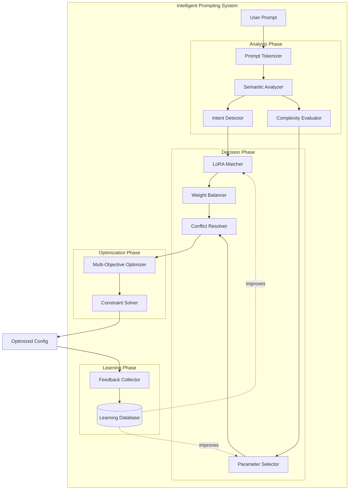

# US 14.2: Sistema Inteligente de Prompting y Selecci

ón de Parámetros

**Épica:** 14 - Intelligent Image Generation
**Prioridad:** ⚡ CRÍTICA
**Estimación:** 40 horas
**Estado:** 📋 PENDIENTE

---

## 📋 Descripción

Como usuario del sistema, necesito que el prompt que proporciono sea analizado semánticamente para seleccionar automáticamente los modelos, LoRAs y parámetros óptimos de generación, sin necesidad de configuración manual experta.

---

## 🎯 Objetivos

1. **Análisis Semántico de Prompts**
   - Extracción de conceptos clave (estilo, sujeto, escena)
   - Detección de intención artística
   - Clasificación de complejidad
   - Identificación de palabras clave para LoRAs

2. **Recomendación Inteligente de LoRAs**
   - Matching semántico prompt→LoRA
   - Scoring basado en relevancia y popularidad
   - Balanceo automático de pesos (alpha)
   - Detección de conflictos entre LoRAs

3. **Optimización de Parámetros**
   - Steps óptimos según complejidad
   - CFG scale según estilo
   - Resolución según contenido
   - Sampler según características

4. **Aprendizaje Continuo**
   - Feedback loop con resultados
   - Mejora de recomendaciones con uso
   - Historial de generaciones exitosas

---

## 📊 Criterios de Aceptación

### AC 1: Prompt Analysis
```python
analyzer = PromptAnalyzer()

# Analizar prompt complejo
analysis = analyzer.analyze(
    "1girl, anime style, magical powers, detailed Victorian mansion background, "
    "cinematic lighting, masterpiece, best quality"
)

# Verificar extracción de conceptos
assert analysis.detected_concepts == {
    "character": ["1girl"],
    "style": ["anime style"],
    "content": ["magical powers"],
    "setting": ["Victorian mansion", "background"],
    "quality": ["masterpiece", "best quality"],
    "lighting": ["cinematic lighting"]
}

# Verificar clasificación de intención
assert analysis.intent.artistic_style == ArtisticStyle.ANIME
assert analysis.intent.content_type == ContentType.CHARACTER
assert analysis.intent.quality_level == QualityLevel.HIGH

# Verificar score de complejidad
assert 0.6 <= analysis.complexity_score <= 0.8  # Moderadamente complejo
```

### AC 2: LoRA Recommendation
```python
recommender = LoRARecommender(registry=model_registry)

# Obtener recomendaciones basadas en prompt
recommendations = recommender.recommend(
    prompt_analysis=analysis,
    base_model="sdxl-base-1.0",
    max_loras=3
)

# Verificar relevancia
assert len(recommendations) <= 3
assert all(r.confidence_score >= 0.5 for r in recommendations)

# Verificar que incluye LoRAs relevantes
lora_names = [r.lora_name for r in recommendations]
assert any("anime" in name.lower() for name in lora_names)

# Verificar pesos sugeridos
for rec in recommendations:
    assert 0.3 <= rec.suggested_alpha <= 1.2
    assert rec.reasoning  # Debe explicar por qué lo recomienda
```

### AC 3: Parameter Optimization
```python
optimizer = ParameterOptimizer()

# Optimizar parámetros basados en análisis
params = optimizer.optimize(
    prompt_analysis=analysis,
    constraints=GenerationConstraints(
        max_time_seconds=60,
        max_vram_gb=12,
        priority=Priority.QUALITY
    )
)

# Verificar parámetros optimizados
assert 30 <= params.num_steps <= 50  # Prompt complejo → más steps
assert 7.0 <= params.guidance_scale <= 9.0  # Anime style
assert params.width == 1024 and params.height == 1024  # SDXL default
assert params.sampler_name in ["DPM++ 2M Karras", "Euler A"]

# Verificar estimaciones
assert params.estimated_time_seconds <= 60
assert params.estimated_vram_gb <= 12
```

### AC 4: End-to-End Workflow
```python
intelligent_pipeline = IntelligentGenerationPipeline(
    model_registry=registry,
    prompt_analyzer=analyzer,
    lora_recommender=recommender,
    param_optimizer=optimizer
)

# Generación completamente automática
result = intelligent_pipeline.generate(
    prompt="anime girl with magical powers in Victorian mansion",
    negative_prompt="low quality, blurry",
    constraints=GenerationConstraints(priority=Priority.QUALITY)
)

# Verificar resultado
assert result.image is not None
assert result.config.lora_weights  # LoRAs aplicados
assert result.explanation  # Explica decisiones tomadas

# Verificar explicación
print(result.explanation.summary)
# "Selected anime_style_lora (α=0.8) and detail_enhancer (α=0.5)
#  based on 'anime style' and 'detailed' keywords.
#  Using 40 steps and CFG 7.5 for high-quality anime generation."
```

---

## 🏗️ Arquitectura Técnica

### Componentes Principales



### Estructura de Clases

```python
@dataclass
class PromptAnalysis:
    """Resultado del análisis de un prompt."""
    original_prompt: str
    tokens: list[str]
    detected_concepts: dict[str, list[str]]
    intent: Intent
    complexity_score: float  # 0.0 - 1.0
    emphasis_map: dict[str, float]  # palabra → importancia

    @property
    def complexity_category(self) -> ComplexityCategory:
        if self.complexity_score < 0.3:
            return ComplexityCategory.SIMPLE
        elif self.complexity_score < 0.7:
            return ComplexityCategory.MODERATE
        else:
            return ComplexityCategory.COMPLEX


@dataclass
class Intent:
    """Intención detectada del prompt."""
    artistic_style: ArtisticStyle
    content_type: ContentType
    quality_level: QualityLevel
    confidence: float


@dataclass
class LoRARecommendation:
    """Recomendación de un LoRA."""
    lora_name: str
    lora_metadata: ModelMetadata
    confidence_score: float
    suggested_alpha: float
    matching_concepts: list[str]
    reasoning: str

    def is_compatible_with(self, other: 'LoRARecommendation') -> bool:
        """Verifica compatibilidad con otro LoRA."""
        pass


@dataclass
class OptimizedParameters:
    """Parámetros optimizados de generación."""
    num_steps: int
    guidance_scale: float
    width: int
    height: int
    sampler_name: str
    clip_skip: int

    # Estimaciones
    estimated_time_seconds: float
    estimated_vram_gb: float
    estimated_quality_score: float

    # Estrategia
    optimization_strategy: str
    confidence: float


class PromptAnalyzer:
    """Analiza prompts para extraer información semántica."""

    def __init__(
        self,
        concept_db: ConceptDatabase,
        embedding_model: str = "sentence-transformers/all-MiniLM-L6-v2"
    ):
        self.concept_db = concept_db
        self.embedder = SentenceTransformer(embedding_model)

    def analyze(self, prompt: str) -> PromptAnalysis:
        """
        Analiza un prompt completo.

        Process:
        1. Tokenización y limpieza
        2. Extracción de conceptos
        3. Detección de intención
        4. Cálculo de complejidad
        5. Mapa de énfasis
        """
        # Tokenizar
        tokens = self._tokenize(prompt)

        # Extraer conceptos
        concepts = self._extract_concepts(tokens)

        # Detectar intención
        intent = self._detect_intent(concepts, tokens)

        # Calcular complejidad
        complexity = self._calculate_complexity(tokens, concepts)

        # Mapa de énfasis
        emphasis = self._build_emphasis_map(tokens)

        return PromptAnalysis(
            original_prompt=prompt,
            tokens=tokens,
            detected_concepts=concepts,
            intent=intent,
            complexity_score=complexity,
            emphasis_map=emphasis
        )

    def _tokenize(self, prompt: str) -> list[str]:
        """Tokeniza prompt respetando sintaxis de SD."""
        # Manejar (emphasis), [de-emphasis], {attention}
        pass

    def _extract_concepts(self, tokens: list[str]) -> dict[str, list[str]]:
        """
        Extrae conceptos por categoría.

        Categories:
        - character: 1girl, 1boy, etc.
        - style: anime, photorealistic, oil painting
        - content: magical powers, sword, dragon
        - setting: indoors, forest, city
        - quality: masterpiece, best quality
        - lighting: cinematic, soft, dramatic
        - camera: close-up, wide shot
        - technical: 4k, detailed, sharp
        """
        pass

    def _detect_intent(
        self,
        concepts: dict[str, list[str]],
        tokens: list[str]
    ) -> Intent:
        """
        Detecta intención artística del prompt.

        Uses:
        - Keyword matching
        - Embedding similarity
        - Rule-based classification
        """
        pass

    def _calculate_complexity(
        self,
        tokens: list[str],
        concepts: dict[str, list[str]]
    ) -> float:
        """
        Calcula score de complejidad.

        Factors:
        - Número de tokens (25%)
        - Diversidad de conceptos (35%)
        - Especificidad técnica (20%)
        - Estructura sintáctica (20%)
        """
        lexical_complexity = len(tokens) / 100.0  # Normalize
        semantic_complexity = len(concepts) / 10.0
        detail_complexity = self._count_detail_words(tokens) / 20.0

        return np.clip(
            0.25 * lexical_complexity +
            0.35 * semantic_complexity +
            0.40 * detail_complexity,
            0.0, 1.0
        )


class LoRARecommender:
    """Recomienda LoRAs basándose en análisis de prompt."""

    def __init__(
        self,
        registry: ModelRegistry,
        embedding_model: str = "sentence-transformers/all-MiniLM-L6-v2"
    ):
        self.registry = registry
        self.embedder = SentenceTransformer(embedding_model)

    def recommend(
        self,
        prompt_analysis: PromptAnalysis,
        base_model: str,
        max_loras: int = 3,
        min_confidence: float = 0.5
    ) -> list[LoRARecommendation]:
        """
        Recomienda LoRAs para el prompt.

        Algorithm:
        1. Filtrar LoRAs compatibles con base_model
        2. Calcular relevancia semántica
        3. Aplicar scoring multi-factor
        4. Resolver conflictos
        5. Balancear pesos
        6. Retornar top-K
        """
        # 1. Filtrar LoRAs
        candidates = self.registry.list_models(
            model_type=ModelType.LORA,
            base_model=BaseModel[base_model.upper()]
        )

        # 2. Scoring
        scored = []
        for lora in candidates:
            score = self._calculate_relevance(lora, prompt_analysis)
            if score >= min_confidence:
                scored.append((lora, score))

        # 3. Sort by score
        scored.sort(key=lambda x: x[1], reverse=True)

        # 4. Construir recomendaciones
        recommendations = []
        for lora, score in scored[:max_loras]:
            alpha = self._suggest_weight(lora, prompt_analysis, score)
            reasoning = self._generate_reasoning(lora, prompt_analysis)

            recommendations.append(LoRARecommendation(
                lora_name=lora.name,
                lora_metadata=lora,
                confidence_score=score,
                suggested_alpha=alpha,
                matching_concepts=self._find_matching_concepts(
                    lora, prompt_analysis
                ),
                reasoning=reasoning
            ))

        # 5. Resolver conflictos
        recommendations = self._resolve_conflicts(recommendations)

        return recommendations

    def _calculate_relevance(
        self,
        lora: ModelMetadata,
        analysis: PromptAnalysis
    ) -> float:
        """
        Calcula relevancia de un LoRA para el prompt.

        Scoring factors:
        - Semantic similarity (40%)
        - Keyword matching (30%)
        - Popularity/rating (20%)
        - User history (10%)
        """
        # Embedding similarity
        prompt_emb = self.embedder.encode(analysis.original_prompt)
        lora_desc_emb = self.embedder.encode(lora.description)
        semantic_score = cosine_similarity(prompt_emb, lora_desc_emb)

        # Keyword matching
        keyword_score = self._keyword_match_score(lora, analysis)

        # Popularity
        popularity_score = min(lora.rating / 5.0, 1.0)

        # Weighted sum
        return (
            0.40 * semantic_score +
            0.30 * keyword_score +
            0.20 * popularity_score +
            0.10 * self._user_history_score(lora)
        )

    def _suggest_weight(
        self,
        lora: ModelMetadata,
        analysis: PromptAnalysis,
        relevance_score: float
    ) -> float:
        """
        Sugiere peso (alpha) óptimo para el LoRA.

        Factors:
        - Recommended weight from metadata
        - Relevance score
        - Complexity of prompt
        - Presence of other LoRAs
        """
        base_weight = lora.recommended_weight or 0.7

        # Adjust by relevance
        weight = base_weight * (0.5 + 0.5 * relevance_score)

        # Adjust by complexity
        if analysis.complexity_score > 0.7:
            weight *= 0.9  # Reduce slightly for complex prompts

        return np.clip(weight, 0.3, 1.2)

    def _resolve_conflicts(
        self,
        recommendations: list[LoRARecommendation]
    ) -> list[LoRARecommendation]:
        """
        Detecta y resuelve conflictos entre LoRAs.

        Conflicts:
        - Style conflicts (anime vs photorealistic)
        - Overlapping concepts
        - Weight imbalance
        """
        # Check compatibility matrix
        for i, rec1 in enumerate(recommendations):
            for rec2 in recommendations[i+1:]:
                if not rec1.is_compatible_with(rec2):
                    # Keep higher confidence
                    if rec1.confidence_score < rec2.confidence_score:
                        recommendations.remove(rec1)
                    else:
                        recommendations.remove(rec2)

        # Rebalance weights if total > 3.0
        total_weight = sum(r.suggested_alpha for r in recommendations)
        if total_weight > 3.0:
            scale = 3.0 / total_weight
            for rec in recommendations:
                rec.suggested_alpha *= scale

        return recommendations


class ParameterOptimizer:
    """Optimiza parámetros de generación."""

    def optimize(
        self,
        prompt_analysis: PromptAnalysis,
        constraints: GenerationConstraints
    ) -> OptimizedParameters:
        """
        Optimiza parámetros basándose en análisis y restricciones.

        Multi-objective optimization:
        - Maximize quality
        - Minimize time
        - Respect VRAM constraints
        - Maximize prompt fidelity
        """
        # Calcular parámetros base
        steps = self._optimize_steps(prompt_analysis, constraints)
        cfg = self._optimize_cfg(prompt_analysis)
        resolution = self._optimize_resolution(prompt_analysis, constraints)
        sampler = self._select_sampler(prompt_analysis, constraints)

        # Estimar recursos
        vram = self._estimate_vram(resolution, steps)
        time = self._estimate_time(resolution, steps, sampler)
        quality = self._estimate_quality(steps, cfg)

        return OptimizedParameters(
            num_steps=steps,
            guidance_scale=cfg,
            width=resolution[0],
            height=resolution[1],
            sampler_name=sampler,
            clip_skip=self._determine_clip_skip(prompt_analysis),
            estimated_time_seconds=time,
            estimated_vram_gb=vram,
            estimated_quality_score=quality,
            optimization_strategy=self._get_strategy_name(constraints),
            confidence=0.85
        )

    def _optimize_steps(
        self,
        analysis: PromptAnalysis,
        constraints: GenerationConstraints
    ) -> int:
        """
        Optimiza número de steps.

        Formula:
        steps = base + complexity_bonus + quality_bonus - speed_penalty
        """
        base = 20

        # Complexity adjustment
        if analysis.complexity_score < 0.3:
            complexity_bonus = 0
        elif analysis.complexity_score < 0.7:
            complexity_bonus = 10
        else:
            complexity_bonus = 20

        # Priority adjustment
        if constraints.priority == Priority.SPEED:
            speed_penalty = 10
        elif constraints.priority == Priority.QUALITY:
            quality_bonus = 15
        else:
            speed_penalty = 0
            quality_bonus = 0

        steps = base + complexity_bonus + quality_bonus - speed_penalty

        return int(np.clip(steps, 15, 60))

    def _optimize_cfg(self, analysis: PromptAnalysis) -> float:
        """
        Optimiza CFG scale basándose en estilo.

        Ranges:
        - Anime: 5.0 - 8.0
        - Photorealistic: 8.0 - 12.0
        - Artistic: 7.0 - 10.0
        """
        style = analysis.intent.artistic_style

        if style == ArtisticStyle.ANIME:
            base_cfg = 7.0
        elif style == ArtisticStyle.PHOTOREALISTIC:
            base_cfg = 9.5
        else:
            base_cfg = 8.0

        # Adjust by complexity
        if analysis.complexity_score > 0.7:
            base_cfg += 1.0

        return base_cfg

    def _select_sampler(
        self,
        analysis: PromptAnalysis,
        constraints: GenerationConstraints
    ) -> str:
        """
        Selecciona sampler óptimo.

        Decision matrix:
        - Priority SPEED → Euler A
        - Priority QUALITY + Photorealistic → DPM++ 2M Karras
        - Priority QUALITY + Anime → DPM++ 2M
        - Balanced → DPM++ 2M Karras
        """
        if constraints.priority == Priority.SPEED:
            return "Euler A"

        if analysis.intent.artistic_style == ArtisticStyle.PHOTOREALISTIC:
            return "DPM++ 2M Karras"
        else:
            return "DPM++ 2M"
```

---

## ✅ Tasks Técnicas

### Task 14.2.1: Prompt Analyzer (12h)
- [ ] Tokenización con soporte para sintaxis SD
- [ ] Extracción de conceptos por categorías
- [ ] Detección de intención con embeddings
- [ ] Cálculo de complejidad multi-dimensional
- [ ] Tests con prompts variados

### Task 14.2.2: LoRA Recommender (14h)
- [ ] Sistema de scoring multi-factor
- [ ] Cálculo de relevancia semántica
- [ ] Sugerencia inteligente de pesos
- [ ] Detección de conflictos
- [ ] Rebalanceo automático de pesos

### Task 14.2.3: Parameter Optimizer (10h)
- [ ] Optimización de steps
- [ ] Optimización de CFG scale
- [ ] Selección de sampler
- [ ] Estimación de recursos (VRAM, tiempo)
- [ ] Multi-objective optimization

### Task 14.2.4: Learning System (4h)
- [ ] Base de datos de feedback
- [ ] Recolección de métricas
- [ ] Actualización de modelos de recomendación
- [ ] A/B testing framework

---

**Estimación Total:** 40 horas
