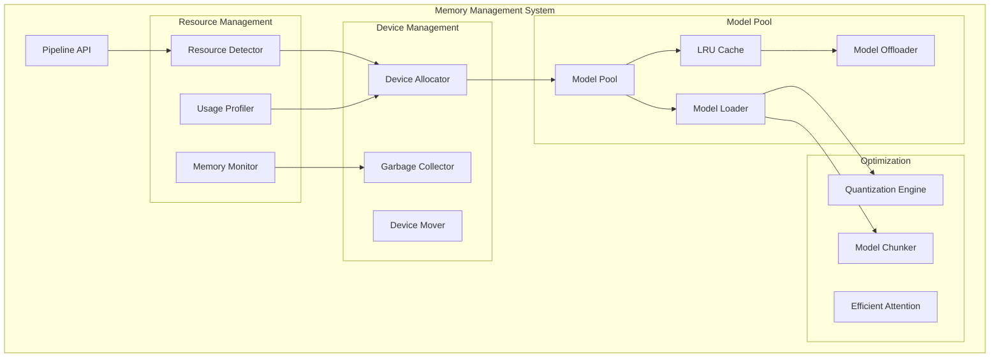

# US 14.3: Gestión Eficiente de Memoria y Model Offloading

**Épica:** 14 - Intelligent Image Generation
**Prioridad:** ⚡ CRÍTICA
**Estimación:** 24 horas
**Estado:** 📋 PENDIENTE

---

## 📋 Descripción

Como usuario con recursos limitados de VRAM, necesito que el sistema gestione inteligentemente la carga/descarga de modelos y LoRAs en memoria, permitiendo trabajar con modelos grandes en hardware limitado sin sacrificar funcionalidad.

---

## 🎯 Objetivos

1. **Model Offloading Automático**
   - Detección de VRAM disponible
   - Carga dinámica de componentes del pipeline
   - Descarga automática cuando no se usa
   - Offload a CPU/Disk según necesidad

2. **Memory Pool Management**
   - Pool compartido de modelos cargados
   - LRU eviction policy
   - Priorización por uso frecuente
   - Limpieza proactiva de cache

3. **Sequential Loading**
   - Carga de componentes bajo demanda
   - Pipeline distribuido entre CPU/GPU
   - Streaming de pasos de denoising
   - Garbage collection agresivo

4. **Optimizaciones Técnicas**
   - Quantización automática (fp16, int8)
   - Atención eficiente (xformers, flash attention)
   - Model chunking para SDXL
   - Gradient checkpointing en inference

---

## 📊 Criterios de Aceptación

### AC 1: Automatic Memory Detection

```python
memory_manager = MemoryManager()

# Detectar recursos disponibles
resources = memory_manager.detect_resources()

assert resources.total_vram_gb > 0
assert resources.available_vram_gb > 0
assert resources.total_ram_gb > 0
assert resources.has_cuda or resources.has_mps
```

### AC 2: Model Offloading

```python
offload_strategy = OffloadStrategy.AUTO

pipeline = IntelligentGenerationPipeline(
    model_id="stabilityai/stable-diffusion-xl-base-1.0",
    offload_strategy=offload_strategy,
    max_vram_usage_gb=8.0
)

# Verificar que componentes se distribuyen correctamente
assert pipeline.vae.device.type == "cpu"  # VAE a CPU
assert pipeline.unet.device.type == "cuda"  # UNet en GPU
assert pipeline.text_encoder.device.type == "cpu"  # Text encoder a CPU

# Generar imagen
result = pipeline.generate("test prompt")

# Verificar que no se excedió límite de VRAM
peak_vram = memory_manager.get_peak_vram_usage()
assert peak_vram <= 8.5  # Margen del 6%
```

### AC 3: Sequential Component Loading

```python
pipeline = IntelligentGenerationPipeline(
    model_id="sdxl-base",
    loading_strategy=LoadingStrategy.SEQUENTIAL
)

# Al inicio, nada debe estar cargado
assert not pipeline.is_loaded

# Al generar, se cargan componentes según necesidad
with memory_manager.track_usage() as tracker:
    # Paso 1: Cargar text encoder → generar embeddings
    result = pipeline.generate("anime girl", step=GenerationStep.ENCODE_PROMPT)

    # Paso 2: Descargar text encoder, cargar UNet → denoise
    result = pipeline.generate("anime girl", step=GenerationStep.DENOISE)

    # Paso 3: Descargar UNet, cargar VAE → decode
    result = pipeline.generate("anime girl", step=GenerationStep.DECODE)

# Verificar que peak fue menor que carga completa
assert tracker.peak_vram < 10.0  # vs 16GB si se carga todo
```

### AC 4: Model Pool with LRU

```python
model_pool = ModelPool(max_size_gb=20.0, eviction_policy=EvictionPolicy.LRU)

# Cargar varios modelos
model1 = model_pool.load("sdxl-base")
model2 = model_pool.load("sd15-anime")
model3 = model_pool.load("pony-diffusion")

# Usar model1 → actualiza LRU
pipeline.use_model(model1)

# Cargar modelo4 → debería evctar model2 (LRU)
model4 = model_pool.load("sdxl-turbo")  # Requiere descargar algo

# Verificar que model2 fue descargado
assert not model_pool.is_loaded("sd15-anime")
assert model_pool.is_loaded("sdxl-base")  # usado recientemente
```

### AC 5: Automatic Quantization

```python
pipeline = IntelligentGenerationPipeline(
    model_id="sdxl-base",
    dtype_policy=DTypePolicy.AUTO  # Selecciona según VRAM
)

# Con poca VRAM → int8
if resources.available_vram_gb < 8:
    assert pipeline.unet.dtype == torch.int8
elif resources.available_vram_gb < 12:
    assert pipeline.unet.dtype == torch.float16
else:
    assert pipeline.unet.dtype == torch.float32
```

---

## 🏗️ Arquitectura Técnica

### Componentes Principales



### Estructura de Clases

```python
@dataclass
class SystemResources:
    """Recursos del sistema detectados."""
    total_vram_gb: float
    available_vram_gb: float
    total_ram_gb: float
    available_ram_gb: float

    has_cuda: bool
    has_mps: bool  # Apple Silicon
    cuda_device_count: int

    compute_capability: tuple[int, int] | None  # For CUDA


class MemoryManager:
    """Gestor central de memoria."""

    def __init__(self):
        self.resources = self.detect_resources()
        self.monitors: list[MemoryMonitor] = []

    def detect_resources(self) -> SystemResources:
        """Detecta recursos del sistema."""
        if torch.cuda.is_available():
            total_vram = torch.cuda.get_device_properties(0).total_memory
            available_vram = total_vram - torch.cuda.memory_allocated(0)

            return SystemResources(
                total_vram_gb=total_vram / 1024**3,
                available_vram_gb=available_vram / 1024**3,
                total_ram_gb=psutil.virtual_memory().total / 1024**3,
                available_ram_gb=psutil.virtual_memory().available / 1024**3,
                has_cuda=True,
                has_mps=False,
                cuda_device_count=torch.cuda.device_count(),
                compute_capability=torch.cuda.get_device_capability(0)
            )
        # Similar para MPS, CPU-only
        pass

    def track_usage(self) -> MemoryMonitor:
        """Context manager para tracking de uso."""
        monitor = MemoryMonitor()
        self.monitors.append(monitor)
        return monitor

    def get_peak_vram_usage(self) -> float:
        """Obtiene peak VRAM usage."""
        if torch.cuda.is_available():
            return torch.cuda.max_memory_allocated(0) / 1024**3
        return 0.0

    def clear_cache(self):
        """Limpia cache de GPU."""
        if torch.cuda.is_available():
            torch.cuda.empty_cache()
        gc.collect()


class ModelPool:
    """Pool de modelos cargados con LRU eviction."""

    def __init__(
        self,
        max_size_gb: float = 20.0,
        eviction_policy: EvictionPolicy = EvictionPolicy.LRU
    ):
        self.max_size_gb = max_size_gb
        self.eviction_policy = eviction_policy

        self.loaded_models: dict[str, LoadedModel] = {}
        self.access_times: dict[str, float] = {}
        self.access_counts: dict[str, int] = defaultdict(int)

    def load(
        self,
        model_id: str,
        **kwargs
    ) -> nn.Module:
        """
        Carga modelo, evictando si es necesario.

        Process:
        1. Check if already loaded → return
        2. Estimate size needed
        3. Evict if necessary
        4. Load model
        5. Update tracking
        """
        # Ya cargado
        if model_id in self.loaded_models:
            self._update_access(model_id)
            return self.loaded_models[model_id].model

        # Estimar tamaño
        estimated_size = self._estimate_model_size(model_id)

        # Evict si necesario
        while self._current_size() + estimated_size > self.max_size_gb:
            self._evict_one()

        # Cargar
        model = self._load_model(model_id, **kwargs)
        self.loaded_models[model_id] = LoadedModel(
            model=model,
            size_gb=estimated_size,
            loaded_at=time.time()
        )
        self._update_access(model_id)

        return model

    def unload(self, model_id: str):
        """Descarga modelo de memoria."""
        if model_id in self.loaded_models:
            del self.loaded_models[model_id]
            self.access_times.pop(model_id, None)
            self.access_counts.pop(model_id, None)

            # Force GC
            gc.collect()
            torch.cuda.empty_cache()

    def is_loaded(self, model_id: str) -> bool:
        """Verifica si modelo está cargado."""
        return model_id in self.loaded_models

    def _evict_one(self):
        """Evict un modelo según policy."""
        if self.eviction_policy == EvictionPolicy.LRU:
            # Evict least recently used
            lru_model = min(
                self.access_times.items(),
                key=lambda x: x[1]
            )[0]
            self.unload(lru_model)

        elif self.eviction_policy == EvictionPolicy.LFU:
            # Evict least frequently used
            lfu_model = min(
                self.access_counts.items(),
                key=lambda x: x[1]
            )[0]
            self.unload(lfu_model)

    def _current_size(self) -> float:
        """Tamaño actual del pool."""
        return sum(m.size_gb for m in self.loaded_models.values())

    def _update_access(self, model_id: str):
        """Actualiza estadísticas de acceso."""
        self.access_times[model_id] = time.time()
        self.access_counts[model_id] += 1


class ModelOffloader:
    """Maneja offloading de componentes del pipeline."""

    def __init__(
        self,
        strategy: OffloadStrategy,
        max_vram_gb: float
    ):
        self.strategy = strategy
        self.max_vram_gb = max_vram_gb
        self.memory_manager = MemoryManager()

    def distribute_pipeline(
        self,
        pipeline: DiffusionPipeline
    ) -> OffloadConfig:
        """
        Distribuye componentes del pipeline entre devices.

        Strategies:
        - AUTO: Decide automáticamente según VRAM
        - SEQUENTIAL: Carga secuencial bajo demanda
        - CPU_OFFLOAD: UNet en GPU, resto en CPU
        - FULL_GPU: Todo en GPU (requiere VRAM suficiente)
        """
        if self.strategy == OffloadStrategy.AUTO:
            return self._auto_distribute(pipeline)
        elif self.strategy == OffloadStrategy.SEQUENTIAL:
            return self._sequential_config(pipeline)
        elif self.strategy == OffloadStrategy.CPU_OFFLOAD:
            return self._cpu_offload_config(pipeline)
        else:
            return self._full_gpu_config(pipeline)

    def _auto_distribute(
        self,
        pipeline: DiffusionPipeline
    ) -> OffloadConfig:
        """
        Distribución automática basada en VRAM disponible.

        Heuristics:
        - <8GB VRAM: Sequential loading
        - 8-12GB: UNet GPU, Text Encoder CPU, VAE CPU
        - 12-16GB: UNet GPU, Text Encoder GPU, VAE CPU
        - >16GB: Full GPU
        """
        vram = self.memory_manager.resources.available_vram_gb

        if vram < 8:
            return self._sequential_config(pipeline)
        elif vram < 12:
            return OffloadConfig(
                unet_device="cuda",
                text_encoder_device="cpu",
                vae_device="cpu",
                lora_device="cuda"  # LoRAs en GPU con UNet
            )
        elif vram < 16:
            return OffloadConfig(
                unet_device="cuda",
                text_encoder_device="cuda",
                vae_device="cpu",
                lora_device="cuda"
            )
        else:
            return self._full_gpu_config(pipeline)

    def move_to_device(
        self,
        model: nn.Module,
        device: str,
        dtype: torch.dtype | None = None
    ):
        """Mueve modelo a device con dtype opcional."""
        if dtype is not None:
            model = model.to(device=device, dtype=dtype)
        else:
            model = model.to(device)

        # Clear source device cache
        torch.cuda.empty_cache()

        return model


class QuantizationEngine:
    """Motor de quantización automática."""

    def quantize_model(
        self,
        model: nn.Module,
        target_dtype: torch.dtype,
        calibration_data: Any | None = None
    ) -> nn.Module:
        """
        Quantiza modelo a dtype objetivo.

        Supported:
        - float32 → float16 (simple casting)
        - float32 → int8 (requires calibration)
        - float32 → int4 (experimental)
        """
        if target_dtype == torch.float16:
            return model.half()

        elif target_dtype == torch.int8:
            return self._quantize_int8(model, calibration_data)

        elif target_dtype == torch.float8_e4m3fn:  # FP8
            return self._quantize_fp8(model)

        else:
            raise ValueError(f"Unsupported dtype: {target_dtype}")

    def _quantize_int8(
        self,
        model: nn.Module,
        calibration_data: Any
    ) -> nn.Module:
        """INT8 quantization with calibration."""
        # Use torch.quantization or bitsandbytes
        import bitsandbytes as bnb

        return bnb.nn.quantize_8bit(model)


class EfficientAttention:
    """Optimización de attention mechanism."""

    @staticmethod
    def enable_xformers():
        """Habilita xformers memory-efficient attention."""
        try:
            import xformers
            import xformers.ops
            return True
        except ImportError:
            return False

    @staticmethod
    def enable_flash_attention():
        """Habilita Flash Attention 2."""
        try:
            import flash_attn
            return True
        except ImportError:
            return False

    @staticmethod
    def enable_pytorch_sdpa():
        """Usa Scaled Dot Product Attention de PyTorch 2.0+."""
        if hasattr(torch.nn.functional, "scaled_dot_product_attention"):
            return True
        return False
```

---

## ✅ Tasks Técnicas

### Task 14.3.1: Resource Detection (4h)

- [ ] Implementar `SystemResources` detector
- [ ] Soporte para CUDA, MPS, CPU-only
- [ ] Detección de VRAM/RAM disponible
- [ ] Compute capability checking
- [ ] Tests en diferentes plataformas

```python
def test_resource_detection():
    manager = MemoryManager()
    resources = manager.resources

    assert resources.total_vram_gb > 0 or not torch.cuda.is_available()
    assert resources.total_ram_gb > 0
```

### Task 14.3.2: Model Pool with LRU (8h)

- [ ] Implementar `ModelPool` con LRU eviction
- [ ] Sistema de tracking de accesos
- [ ] Estimación de tamaño de modelos
- [ ] Eviction policies (LRU, LFU, Size-based)
- [ ] Tests de eviction

```python
def test_lru_eviction():
    pool = ModelPool(max_size_gb=10.0)

    # Cargar modelos hasta llenar
    for i in range(5):
        pool.load(f"model_{i}")

    # Verificar que oldest fue evictado
    assert pool._current_size() <= 10.0
```

### Task 14.3.3: Offload Strategies (6h)

- [ ] Implementar `ModelOffloader`
- [ ] AUTO distribution heuristics
- [ ] SEQUENTIAL loading
- [ ] CPU_OFFLOAD mode
- [ ] Tests con diferentes VRAM sizes

```python
def test_auto_offload():
    offloader = ModelOffloader(
        strategy=OffloadStrategy.AUTO,
        max_vram_gb=8.0
    )

    config = offloader.distribute_pipeline(pipeline)

    # Con 8GB, debe offload a CPU
    assert config.vae_device == "cpu"
```

### Task 14.3.4: Quantization Engine (4h)

- [ ] Float16 casting
- [ ] INT8 quantization con bitsandbytes
- [ ] Calibración para quantización
- [ ] Tests de calidad post-quantización

```python
def test_quantization():
    engine = QuantizationEngine()

    model_fp32 = load_model()
    model_fp16 = engine.quantize_model(model_fp32, torch.float16)

    assert model_fp16.dtype == torch.float16
    # Verificar que genera imágenes similares
```

### Task 14.3.5: Efficient Attention (2h)

- [ ] Integración con xformers
- [ ] Flash Attention 2 support
- [ ] PyTorch 2.0 SDPA fallback
- [ ] Benchmarks de performance

```python
def test_efficient_attention():
    if EfficientAttention.enable_xformers():
        # Verificar speedup
        pass
```

---

## 🧪 Casos de Prueba

### Test Case 1: Low VRAM Workflow

```python
def test_low_vram_generation():
    """Simula generación con solo 6GB VRAM."""
    # Mock VRAM detection
    with patch_vram(available_gb=6.0):
        pipeline = IntelligentGenerationPipeline(
            model_id="sdxl-base",
            offload_strategy=OffloadStrategy.AUTO
        )

        result = pipeline.generate("test prompt")

        # Debe completar sin OOM
        assert result.image is not None

        # Verificar que no excedió límite
        peak = torch.cuda.max_memory_allocated() / 1024**3
        assert peak < 6.5
```

### Test Case 2: Model Pool Eviction

```python
def test_model_pool_full():
    """Verifica eviction cuando pool está lleno."""
    pool = ModelPool(max_size_gb=5.0)

    # Cargar 3 modelos (2GB cada uno)
    model1 = pool.load("model_1")  # t=0
    time.sleep(0.1)
    model2 = pool.load("model_2")  # t=0.1
    time.sleep(0.1)
    model3 = pool.load("model_3")  # t=0.2

    # Usar model1 → actualiza LRU
    _ = model1

    # Cargar model4 → debe evict model2 (LRU)
    model4 = pool.load("model_4")

    assert pool.is_loaded("model_1")  # usado recientemente
    assert not pool.is_loaded("model_2")  # evictado
    assert pool.is_loaded("model_3")
    assert pool.is_loaded("model_4")
```

---

## 📚 Dependencias

### Bibliotecas Externas

```txt
torch>=2.0.0
psutil>=5.9.0  # System resource detection
bitsandbytes>=0.41.0  # INT8 quantization
xformers>=0.0.20  # Memory-efficient attention (optional)
flash-attn>=2.0.0  # Flash Attention (optional)
```

### Módulos Internos

- `ml_lib.diffusion.services.pipeline_service` - Pipeline base
- `ml_lib.diffusion.services.lora_service` - LoRA management

---

## 🔗 Referencias

- [PyTorch Memory Management](https://pytorch.org/docs/stable/notes/cuda.html#memory-management)
- [xformers Documentation](https://facebookresearch.github.io/xformers/)
- [bitsandbytes INT8 Inference](https://huggingface.co/docs/transformers/main_classes/quantization)
- [Flash Attention](https://github.com/Dao-AILab/flash-attention)

---

**Estimación Total:** 24 horas
