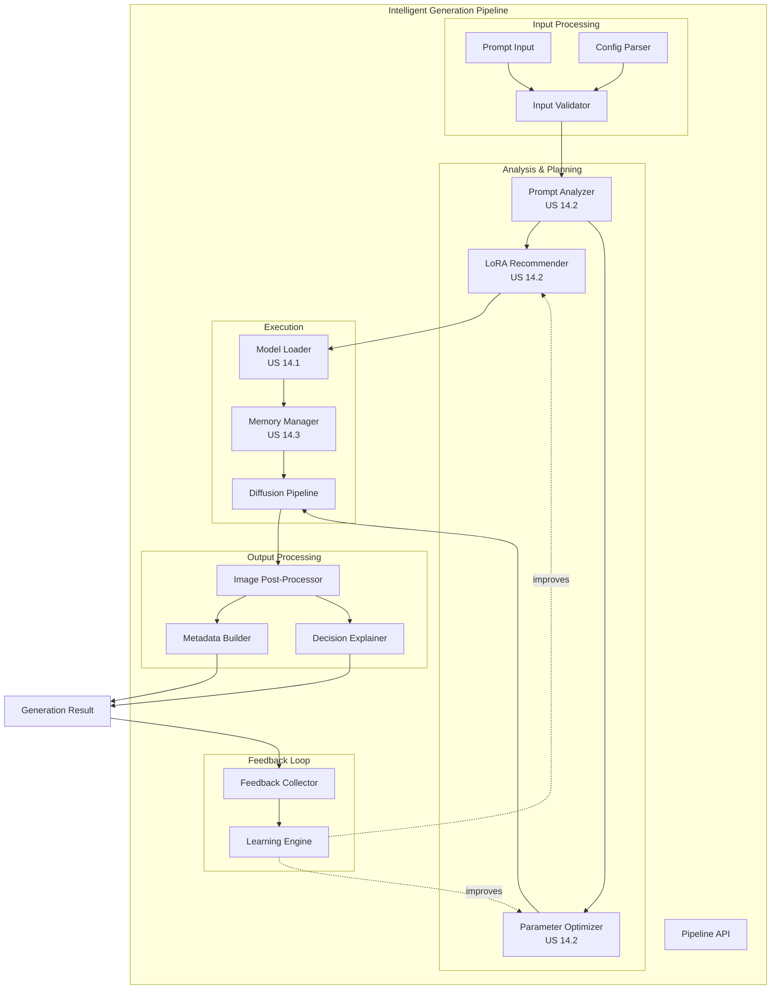

# US 14.4: Integración del Pipeline Inteligente End-to-End

**Épica:** 14 - Intelligent Image Generation
**Prioridad:** ⚡ CRÍTICA
**Estimación:** 20 horas
**Estado:** 📋 PENDIENTE

---

## 📋 Descripción

Como desarrollador, necesito un pipeline unificado que integre todos los componentes (model registry, intelligent prompting, memory management) en una API coherente y fácil de usar para generar imágenes de alta calidad con mínima configuración manual.

---

## 🎯 Objetivos

1. **Pipeline Unificado**
   - API simple para generación de imágenes
   - Configuración declarativa
   - Integración transparente de todos los subsistemas

2. **Workflow Automático**
   - Análisis → Recomendación → Optimización → Generación
   - Feedback loop integrado
   - Explicaciones de decisiones

3. **Modos de Operación**
   - Modo AUTO: decisiones completamente automáticas
   - Modo ASSISTED: sugerencias con confirmación
   - Modo MANUAL: control total del usuario

4. **Batch Processing**
   - Generación de múltiples imágenes
   - Variación de parámetros
   - Exploración de semilla (seed)

---

## 📊 Criterios de Aceptación

### AC 1: Simple Generation API

```python
# Generación más simple posible
pipeline = IntelligentGenerationPipeline()

result = pipeline.generate("anime girl with magical powers")

assert result.image is not None
assert result.metadata.loras_used  # LoRAs aplicados automáticamente
assert result.explanation  # Explica qué se hizo
```

### AC 2: Configuración Avanzada

```python
# Configuración detallada
config = PipelineConfig(
    base_model="stabilityai/sdxl-base-1.0",
    mode=OperationMode.AUTO,
    constraints=GenerationConstraints(
        max_time_seconds=60,
        max_vram_gb=8.0,
        priority=Priority.QUALITY
    ),
    lora_preferences=LoRAPreferences(
        max_loras=3,
        min_confidence=0.6,
        allow_style_mixing=True
    )
)

pipeline = IntelligentGenerationPipeline(config=config)

result = pipeline.generate(
    prompt="photorealistic portrait, cinematic lighting",
    negative_prompt="cartoon, anime",
    seed=42
)

# Verificar que respeta configuración
assert len(result.metadata.loras_used) <= 3
assert result.metadata.generation_time_seconds <= 60
```

### AC 3: Batch Generation

```python
# Generación batch con variaciones
batch_config = BatchConfig(
    num_images=4,
    variation_strategy=VariationStrategy.SEED_VARIATION,
    parallel_generation=True
)

results = pipeline.generate_batch(
    prompt="anime girl, multiple poses",
    batch_config=batch_config
)

assert len(results) == 4
assert all(r.image is not None for r in results)
# Verificar que tienen seeds diferentes
assert len(set(r.metadata.seed for r in results)) == 4
```

### AC 4: Assisted Mode

```python
# Modo asistido: pide confirmación
pipeline = IntelligentGenerationPipeline(
    config=PipelineConfig(mode=OperationMode.ASSISTED)
)

# Obtener recomendaciones sin generar
recommendations = pipeline.analyze_and_recommend(
    prompt="anime style, magical girl"
)

print(recommendations.suggested_loras)  # ["anime_style_v2", "magic_effects"]
print(recommendations.suggested_params)  # steps=35, cfg=7.5
print(recommendations.explanation)

# Usuario puede modificar antes de generar
recommendations.suggested_params.num_steps = 40

result = pipeline.generate_from_recommendations(
    prompt="anime style, magical girl",
    recommendations=recommendations
)
```

### AC 5: Workflow with Feedback

```python
# Generación con feedback
result = pipeline.generate("test prompt")

# Usuario da feedback
pipeline.provide_feedback(
    generation_id=result.id,
    rating=5,  # 1-5
    comments="Perfect! Exactly what I wanted"
)

# Sistema aprende y mejora futuras generaciones
# (feedback se almacena en learning database)
```

---

## 🏗️ Arquitectura Técnica

### Componentes Principales



### Estructura de Clases

```python
@dataclass
class PipelineConfig:
    """Configuración del pipeline."""
    base_model: str = "stabilityai/sdxl-base-1.0"
    mode: OperationMode = OperationMode.AUTO
    constraints: GenerationConstraints = field(default_factory=GenerationConstraints)
    lora_preferences: LoRAPreferences = field(default_factory=LoRAPreferences)
    memory_settings: MemorySettings = field(default_factory=MemorySettings)
    ollama_config: OllamaConfig | None = None  # Para análisis con LLM


@dataclass
class GenerationResult:
    """Resultado de una generación."""
    id: str
    image: Image.Image
    metadata: GenerationMetadata
    explanation: GenerationExplanation

    def save(self, path: Path):
        """Guarda imagen con metadata embebida."""
        pass


@dataclass
class GenerationMetadata:
    """Metadata completa de una generación."""
    prompt: str
    negative_prompt: str
    seed: int
    steps: int
    cfg_scale: float
    width: int
    height: int
    sampler: str

    # LoRAs usados
    loras_used: list[LoRAInfo]

    # Recursos
    generation_time_seconds: float
    peak_vram_gb: float

    # Modelo
    base_model_id: str
    pipeline_type: str


@dataclass
class GenerationExplanation:
    """Explicación de decisiones tomadas."""
    summary: str
    lora_reasoning: dict[str, str]
    parameter_reasoning: dict[str, str]
    performance_notes: list[str]


class IntelligentGenerationPipeline:
    """Pipeline inteligente de generación de imágenes."""

    def __init__(
        self,
        config: PipelineConfig | None = None,
        model_registry: ModelRegistry | None = None
    ):
        self.config = config or PipelineConfig()

        # Subsistemas
        self.registry = model_registry or ModelRegistry()
        self.prompt_analyzer = PromptAnalyzer(
            ollama_client=self._init_ollama() if self.config.ollama_config else None
        )
        self.lora_recommender = LoRARecommender(registry=self.registry)
        self.param_optimizer = ParameterOptimizer()
        self.memory_manager = MemoryManager()

        # Pipeline state
        self.diffusion_pipeline: DiffusionPipeline | None = None
        self.current_base_model: str | None = None

    def generate(
        self,
        prompt: str,
        negative_prompt: str = "",
        seed: int | None = None,
        **overrides
    ) -> GenerationResult:
        """
        Genera imagen con pipeline inteligente.

        Workflow:
        1. Analizar prompt
        2. Recomendar LoRAs
        3. Optimizar parámetros
        4. Configurar memory management
        5. Generar imagen
        6. Post-procesamiento
        7. Construir explicación
        """
        generation_id = str(uuid.uuid4())
        start_time = time.time()

        # 1. Análisis
        analysis = self.prompt_analyzer.analyze(prompt)

        # 2. Recomendación de LoRAs
        lora_recs = self.lora_recommender.recommend(
            prompt_analysis=analysis,
            base_model=self.config.base_model,
            max_loras=self.config.lora_preferences.max_loras
        )

        # 3. Optimización de parámetros
        params = self.param_optimizer.optimize(
            prompt_analysis=analysis,
            constraints=self.config.constraints
        )

        # Apply user overrides
        for key, value in overrides.items():
            if hasattr(params, key):
                setattr(params, key, value)

        # 4. Preparar pipeline
        self._ensure_pipeline_loaded(
            base_model=self.config.base_model,
            loras=lora_recs,
            memory_config=self.config.memory_settings
        )

        # 5. Generar
        seed = seed or random.randint(0, 2**32 - 1)
        generator = torch.Generator().manual_seed(seed)

        image = self.diffusion_pipeline(
            prompt=prompt,
            negative_prompt=negative_prompt,
            num_inference_steps=params.num_steps,
            guidance_scale=params.guidance_scale,
            width=params.width,
            height=params.height,
            generator=generator
        ).images[0]

        # 6. Metadata y explicación
        generation_time = time.time() - start_time
        peak_vram = self.memory_manager.get_peak_vram_usage()

        metadata = GenerationMetadata(
            prompt=prompt,
            negative_prompt=negative_prompt,
            seed=seed,
            steps=params.num_steps,
            cfg_scale=params.guidance_scale,
            width=params.width,
            height=params.height,
            sampler=params.sampler_name,
            loras_used=[
                LoRAInfo(name=r.lora_name, alpha=r.suggested_alpha)
                for r in lora_recs
            ],
            generation_time_seconds=generation_time,
            peak_vram_gb=peak_vram,
            base_model_id=self.config.base_model,
            pipeline_type="intelligent"
        )

        explanation = self._build_explanation(
            analysis=analysis,
            lora_recs=lora_recs,
            params=params,
            generation_time=generation_time
        )

        return GenerationResult(
            id=generation_id,
            image=image,
            metadata=metadata,
            explanation=explanation
        )

    def analyze_and_recommend(
        self,
        prompt: str
    ) -> Recommendations:
        """
        Solo analiza y recomienda sin generar.

        Útil para modo ASSISTED.
        """
        analysis = self.prompt_analyzer.analyze(prompt)

        lora_recs = self.lora_recommender.recommend(
            prompt_analysis=analysis,
            base_model=self.config.base_model
        )

        params = self.param_optimizer.optimize(
            prompt_analysis=analysis,
            constraints=self.config.constraints
        )

        explanation = self._build_explanation(analysis, lora_recs, params)

        return Recommendations(
            prompt_analysis=analysis,
            suggested_loras=lora_recs,
            suggested_params=params,
            explanation=explanation.summary
        )

    def generate_from_recommendations(
        self,
        prompt: str,
        recommendations: Recommendations,
        negative_prompt: str = "",
        seed: int | None = None
    ) -> GenerationResult:
        """Genera usando recomendaciones específicas."""
        # Similar a generate() pero usa recommendations directamente
        pass

    def generate_batch(
        self,
        prompt: str,
        batch_config: BatchConfig,
        negative_prompt: str = ""
    ) -> list[GenerationResult]:
        """
        Genera batch de imágenes.

        Strategies:
        - SEED_VARIATION: Mismos parámetros, seeds diferentes
        - PARAM_VARIATION: Variar steps, cfg, etc.
        - LORA_VARIATION: Probar diferentes LoRAs
        """
        results = []

        if batch_config.variation_strategy == VariationStrategy.SEED_VARIATION:
            # Generar análisis y recomendaciones una vez
            analysis = self.prompt_analyzer.analyze(prompt)
            lora_recs = self.lora_recommender.recommend(analysis, self.config.base_model)
            params = self.param_optimizer.optimize(analysis, self.config.constraints)

            # Generar con seeds diferentes
            for i in range(batch_config.num_images):
                seed = batch_config.base_seed + i if batch_config.base_seed else None
                result = self._generate_with_config(
                    prompt, negative_prompt, seed, lora_recs, params
                )
                results.append(result)

        elif batch_config.variation_strategy == VariationStrategy.PARAM_VARIATION:
            # Generar con parámetros variados
            param_variations = self._generate_param_variations(
                prompt, batch_config.num_images
            )
            for params in param_variations:
                result = self.generate(prompt, negative_prompt, **params)
                results.append(result)

        return results

    def provide_feedback(
        self,
        generation_id: str,
        rating: int,
        comments: str = ""
    ):
        """Registra feedback para aprendizaje."""
        feedback = FeedbackData(
            generation_id=generation_id,
            rating=rating,
            comments=comments,
            timestamp=datetime.now()
        )

        # Guardar en learning database
        self.learning_db.store_feedback(feedback)

    def _init_ollama(self) -> OllamaClient:
        """Inicializa cliente Ollama para análisis semántico."""
        from ml_lib.llm.providers import OllamaProvider

        provider = OllamaProvider(
            base_url=self.config.ollama_config.base_url,
            model=self.config.ollama_config.model
        )

        return OllamaClient(provider=provider)

    def _ensure_pipeline_loaded(
        self,
        base_model: str,
        loras: list[LoRARecommendation],
        memory_config: MemorySettings
    ):
        """Carga pipeline con modelos y LoRAs necesarios."""
        # Cargar base model si es diferente
        if self.current_base_model != base_model:
            self._load_base_model(base_model, memory_config)

        # Aplicar LoRAs
        self._apply_loras(loras)

    def _load_base_model(self, model_id: str, memory_config: MemorySettings):
        """Carga modelo base con memory management."""
        offloader = ModelOffloader(
            strategy=memory_config.offload_strategy,
            max_vram_gb=memory_config.max_vram_gb
        )

        self.diffusion_pipeline = DiffusionPipeline.from_pretrained(
            model_id,
            torch_dtype=torch.float16,
            variant="fp16"
        )

        # Aplicar offload strategy
        offload_config = offloader.distribute_pipeline(self.diffusion_pipeline)
        self._apply_offload_config(offload_config)

        self.current_base_model = model_id

    def _apply_loras(self, lora_recs: list[LoRARecommendation]):
        """Aplica LoRAs recomendados al pipeline."""
        for rec in lora_recs:
            lora_path = self.registry.get_model(rec.lora_name).local_path

            self.diffusion_pipeline.load_lora_weights(
                str(lora_path),
                adapter_name=rec.lora_name
            )
            self.diffusion_pipeline.set_adapters(
                [rec.lora_name],
                adapter_weights=[rec.suggested_alpha]
            )

    def _build_explanation(
        self,
        analysis: PromptAnalysis,
        lora_recs: list[LoRARecommendation],
        params: OptimizedParameters,
        generation_time: float | None = None
    ) -> GenerationExplanation:
        """Construye explicación de decisiones."""
        # Summary
        summary_parts = []

        # LoRAs
        if lora_recs:
            lora_names = ", ".join(
                f"{r.lora_name} (α={r.suggested_alpha:.2f})"
                for r in lora_recs
            )
            summary_parts.append(f"Selected LoRAs: {lora_names}")

        # Parámetros
        summary_parts.append(
            f"Parameters: {params.num_steps} steps, CFG {params.guidance_scale}, "
            f"{params.width}×{params.height}"
        )

        # Complejidad
        summary_parts.append(
            f"Prompt complexity: {analysis.complexity_category.value}"
        )

        summary = " | ".join(summary_parts)

        # Reasoning detallado
        lora_reasoning = {
            rec.lora_name: rec.reasoning
            for rec in lora_recs
        }

        param_reasoning = {
            "steps": f"Set to {params.num_steps} based on {analysis.complexity_category.value} complexity",
            "cfg_scale": f"Set to {params.guidance_scale} for {analysis.intent.artistic_style.value} style",
            "resolution": f"{params.width}×{params.height} based on content type"
        }

        # Performance notes
        performance_notes = []
        if generation_time:
            performance_notes.append(f"Generated in {generation_time:.2f}s")
        if params.estimated_vram_gb:
            performance_notes.append(f"Estimated VRAM: {params.estimated_vram_gb:.2f}GB")

        return GenerationExplanation(
            summary=summary,
            lora_reasoning=lora_reasoning,
            parameter_reasoning=param_reasoning,
            performance_notes=performance_notes
        )
```

---

## ✅ Tasks Técnicas

### Task 14.4.1: Pipeline Core (8h)

- [ ] Implementar `IntelligentGenerationPipeline`
- [ ] Workflow de generación end-to-end
- [ ] Integración con subsistemas (US 14.1, 14.2, 14.3)
- [ ] Mode switching (AUTO, ASSISTED, MANUAL)

### Task 14.4.2: Batch Processing (4h)

- [ ] Implementar `generate_batch()`
- [ ] Estrategias de variación
- [ ] Paralelización opcional
- [ ] Progress tracking

### Task 14.4.3: Explanation System (4h)

- [ ] Decision explainer
- [ ] Metadata builder
- [ ] Exportación de metadata (PNG, JSON)

### Task 14.4.4: Feedback Loop (4h)

- [ ] Feedback collection
- [ ] Learning database
- [ ] Integration con recommender system

---

**Estimación Total:** 20 horas
