# Pipeline Service - Documentación Técnica (Continuación)

## 2.2 Modelo de Configuración (Continuación)

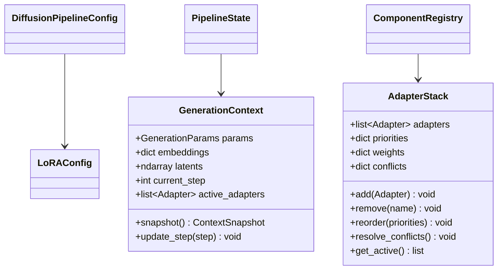

---

## 3. Componentes de Integración {#componentes}

### 3.1 Inicialización del Pipeline

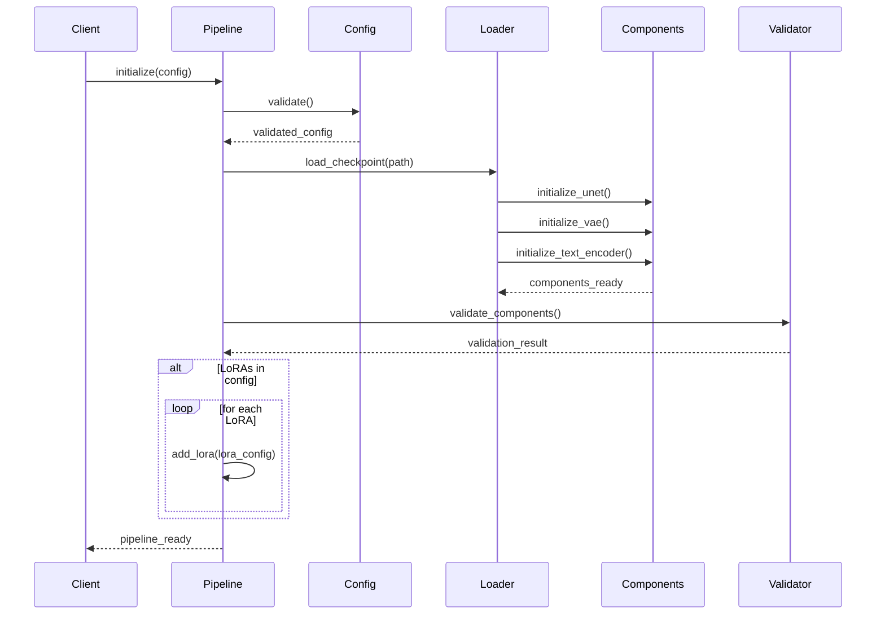

### 3.2 Gestión de Adaptadores

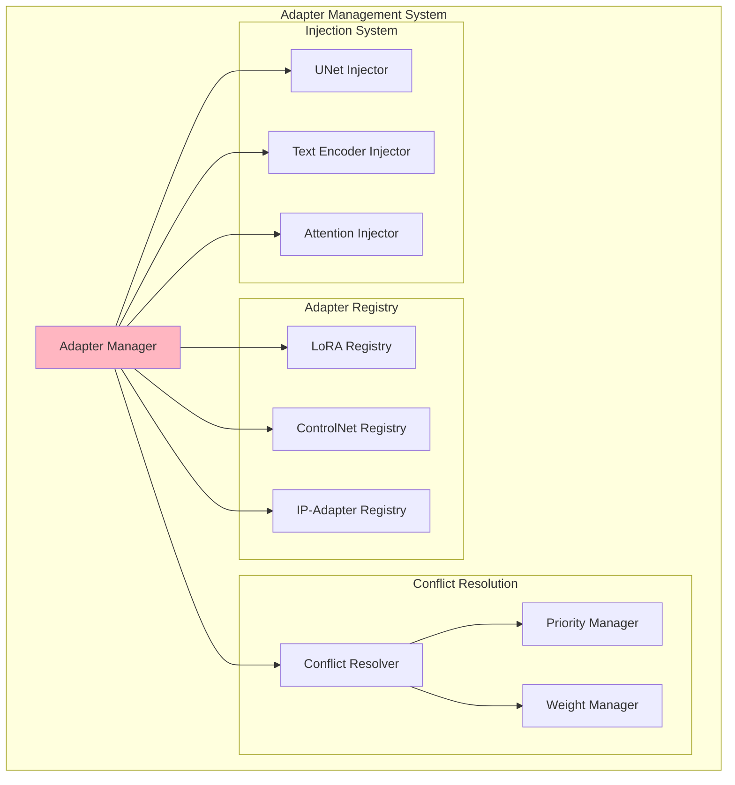

**Responsabilidades del Adapter Manager:**

- Registro y seguimiento de adaptadores activos
- Resolución de conflictos entre adaptadores
- Gestión de prioridades de aplicación
- Coordinación de inyección de pesos
- Control de escala y activación dinámica

### 3.3 Ciclo de Vida de Adaptadores

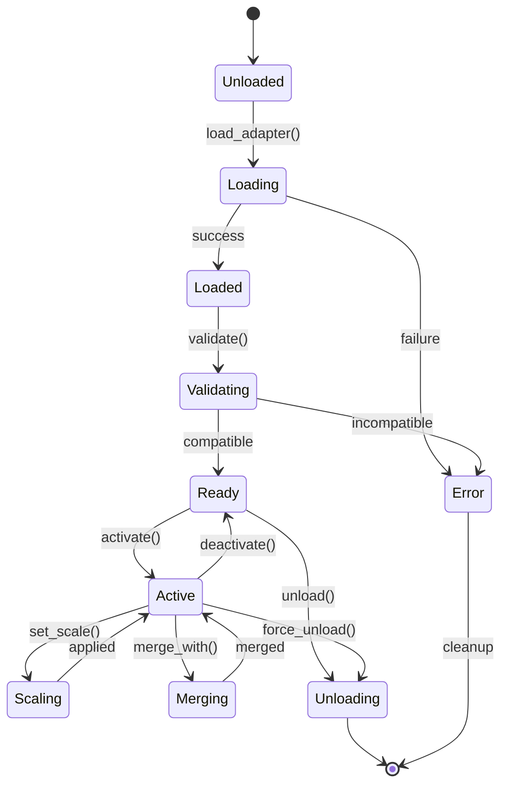

---

## 4. Flujos de Generación {#flujos}

### 4.1 Flujo Completo de Generación

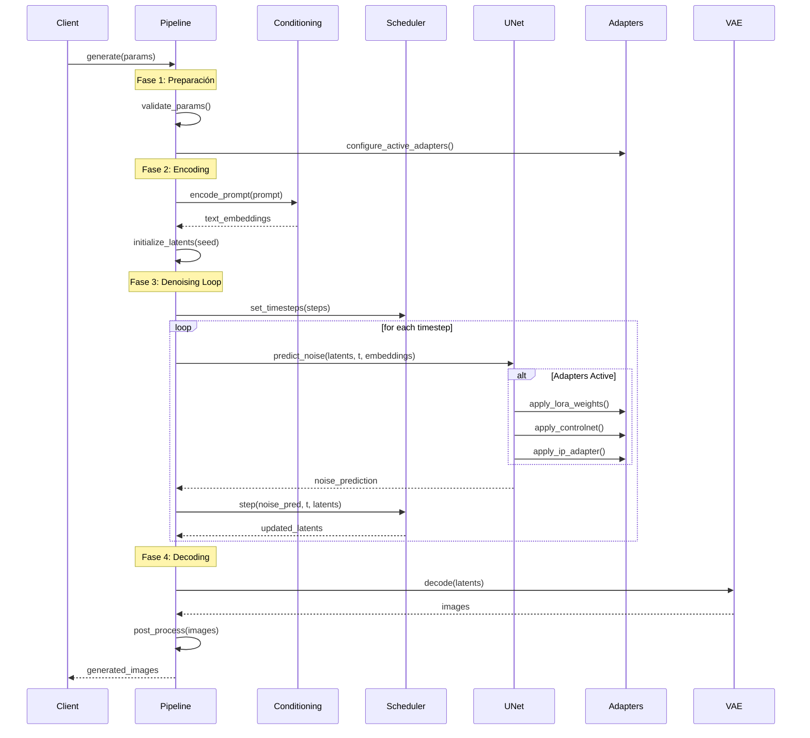

### 4.2 Flujo de Inyección de LoRA

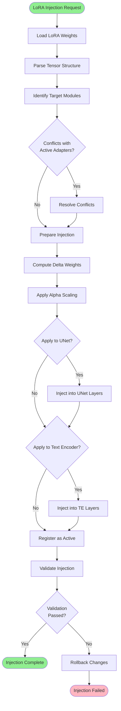

### 4.3 Fusión de Múltiples LoRAs

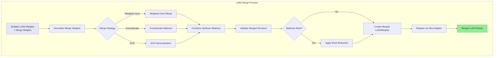

---

## 5. Gestión de Estado {#estado}

### 5.1 Estado del Pipeline

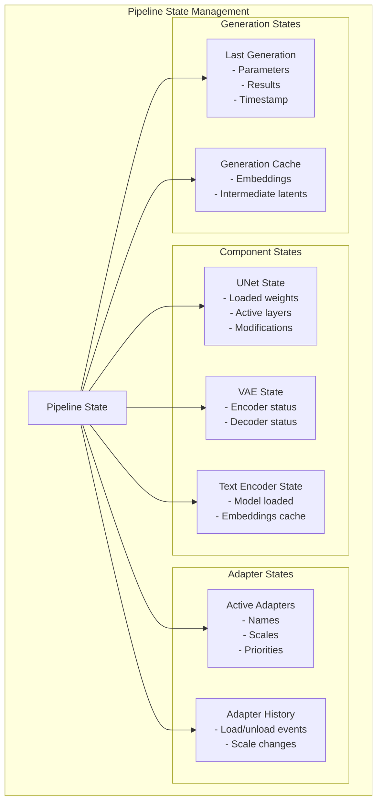

### 5.2 Transiciones de Estado

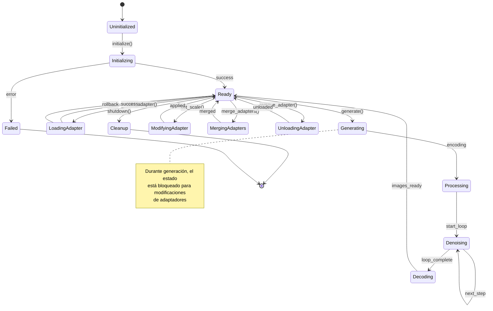

### 5.3 Caché y Optimizaciones

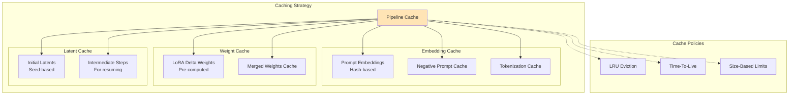

---

## 6. Optimizaciones {#optimizaciones}

### 6.1 Estrategias de Optimización

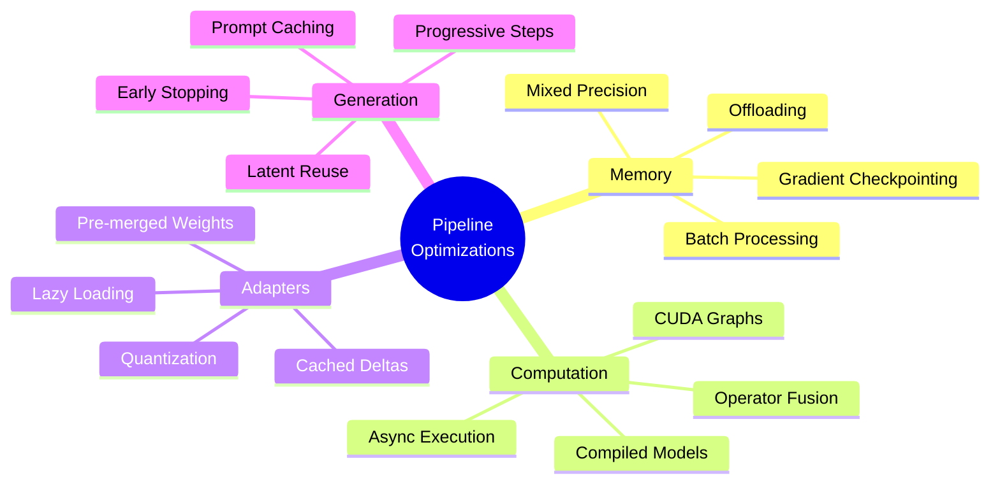

### 6.2 Gestión de Memoria

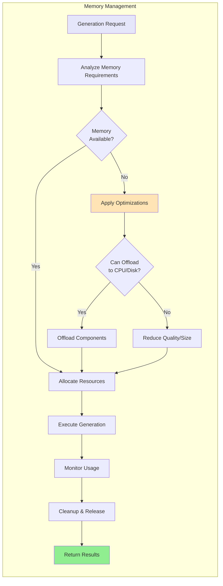

### 6.3 Optimización de Adaptadores

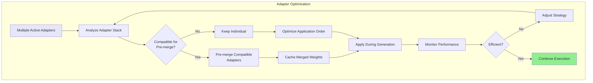

---

## 7. Patterns de Uso

### 7.1 Patrón: Generación Simple

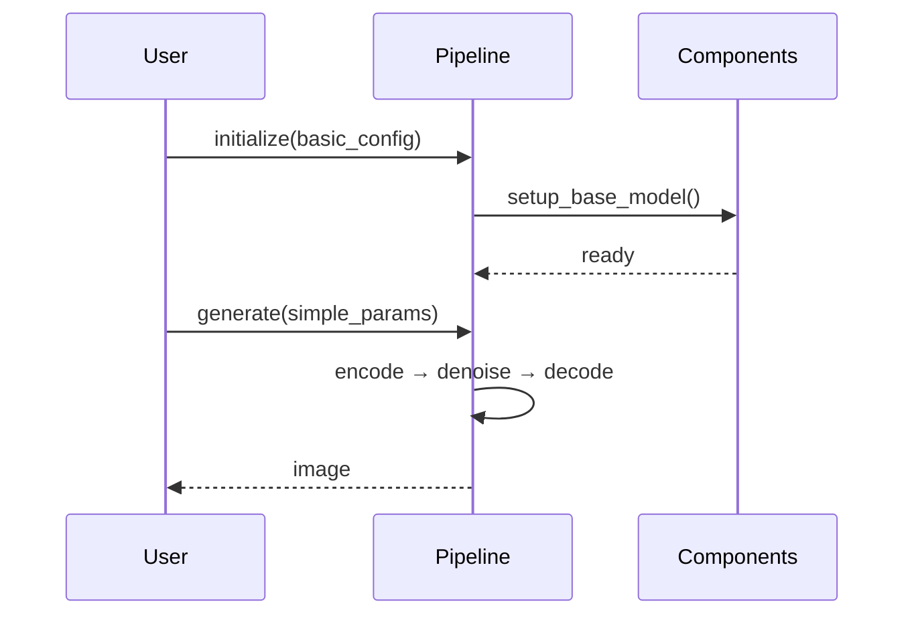

### 7.2 Patrón: Multi-LoRA Dinámico

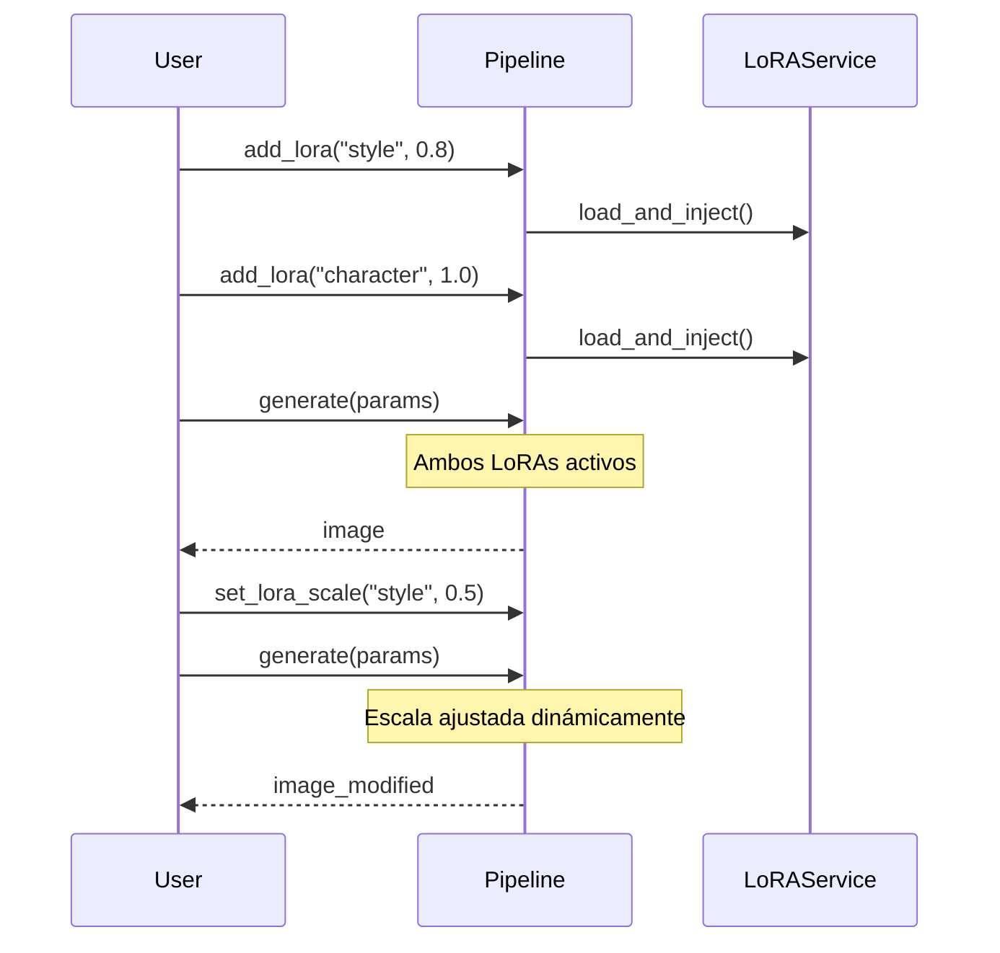

### 7.3 Patrón: Fusión y Reutilización

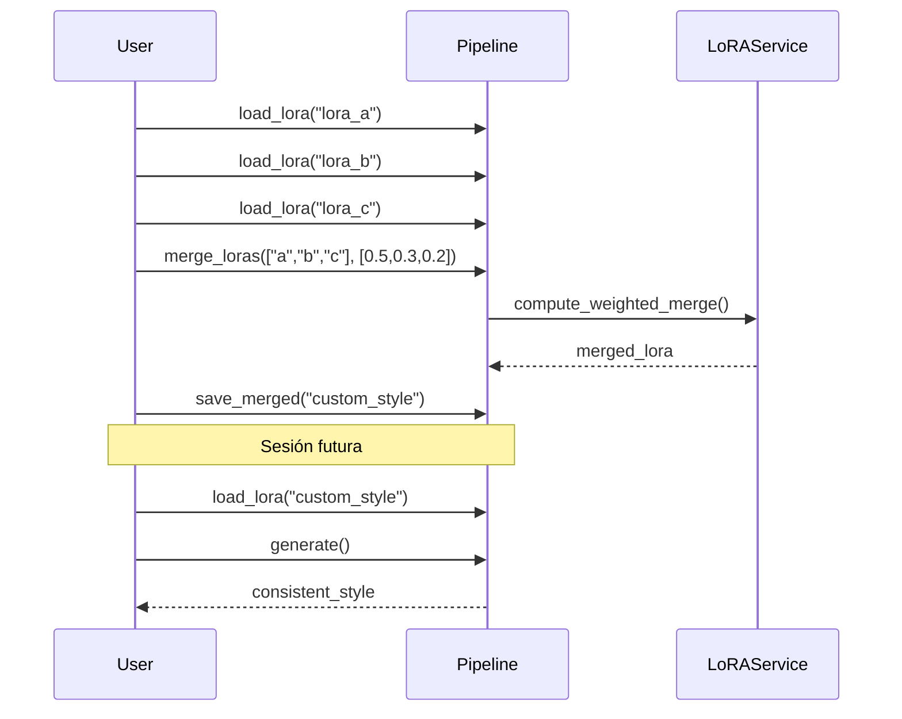

---

## 8. Manejo de Errores

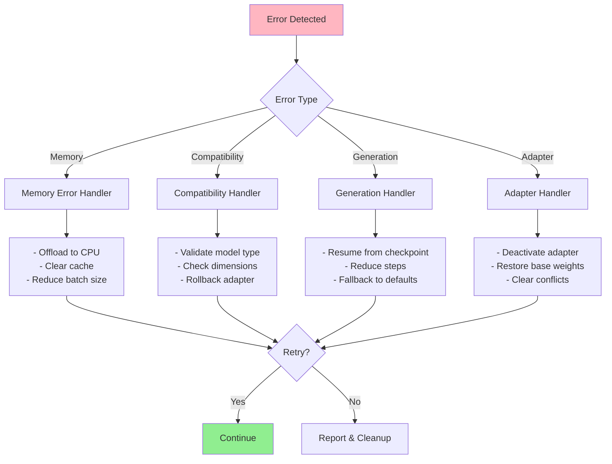

---

## 9. Métricas y Monitoreo

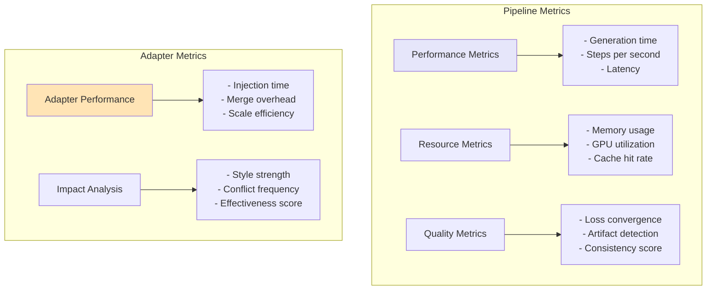

# Pipeline Service - Documentación Técnica (Continuación)

## 2.2 Modelo de Configuración (Continuación)


---

## 3. Componentes de Integración {#componentes}

### 3.1 Inicialización del Pipeline


### 3.2 Gestión de Adaptadores

```mermaid
graph TB
    subgraph "Adapter Management System"
        AM[Adapter Manager]

        subgraph "Adapter Registry"
            LoRAR[LoRA Registry]
            CNR[ControlNet Registry]
            IPAR[IP-Adapter Registry]
        end

        subgraph "Conflict Resolution"
            CR[Conflict Resolver]
            PM[Priority Manager]
            WM[Weight Manager]
        end

        subgraph "Injection System"
            UI[UNet Injector]
            TEI[Text Encoder Injector]
            AI[Attention Injector]
        end

        AM --> LoRAR
        AM --> CNR
        AM --> IPAR

        AM --> CR
        CR --> PM
        CR --> WM

        AM --> UI
        AM --> TEI
        AM --> AI
    end

    style AM fill:#FFB6C1
```

**Responsabilidades del Adapter Manager:**

- Registro y seguimiento de adaptadores activos
- Resolución de conflictos entre adaptadores
- Gestión de prioridades de aplicación
- Coordinación de inyección de pesos
- Control de escala y activación dinámica

### 3.3 Ciclo de Vida de Adaptadores

```mermaid
stateDiagram-v2
    [*] --> Unloaded

    Unloaded --> Loading: load_adapter()
    Loading --> Loaded: success
    Loading --> Error: failure

    Loaded --> Validating: validate()
    Validating --> Ready: compatible
    Validating --> Error: incompatible

    Ready --> Active: activate()
    Active --> Ready: deactivate()

    Active --> Scaling: set_scale()
    Scaling --> Active: applied

    Active --> Merging: merge_with()
    Merging --> Active: merged

    Ready --> Unloading: unload()
    Active --> Unloading: force_unload()
    Unloading --> [*]

    Error --> [*]: cleanup
```

---

## 4. Flujos de Generación {#flujos}

### 4.1 Flujo Completo de Generación

```mermaid
sequenceDiagram
    participant Client
    participant Pipeline
    participant Conditioning
    participant Scheduler
    participant UNet
    participant Adapters
    participant VAE

    Client->>Pipeline: generate(params)

    Note over Pipeline: Fase 1: Preparación
    Pipeline->>Pipeline: validate_params()
    Pipeline->>Adapters: configure_active_adapters()

    Note over Pipeline: Fase 2: Encoding
    Pipeline->>Conditioning: encode_prompt(prompt)
    Conditioning-->>Pipeline: text_embeddings
    Pipeline->>Pipeline: initialize_latents(seed)

    Note over Pipeline: Fase 3: Denoising Loop
    Pipeline->>Scheduler: set_timesteps(steps)

    loop for each timestep
        Pipeline->>UNet: predict_noise(latents, t, embeddings)

        alt Adapters Active
            UNet->>Adapters: apply_lora_weights()
            UNet->>Adapters: apply_controlnet()
            UNet->>Adapters: apply_ip_adapter()
        end

        UNet-->>Pipeline: noise_prediction
        Pipeline->>Scheduler: step(noise_pred, t, latents)
        Scheduler-->>Pipeline: updated_latents
    end

    Note over Pipeline: Fase 4: Decoding
    Pipeline->>VAE: decode(latents)
    VAE-->>Pipeline: images

    Pipeline->>Pipeline: post_process(images)
    Pipeline-->>Client: generated_images
```

### 4.2 Flujo de Inyección de LoRA

```mermaid
graph TB
    Start([LoRA Injection Request])

    Start --> Load[Load LoRA Weights]
    Load --> Parse[Parse Tensor Structure]
    Parse --> Identify[Identify Target Modules]

    Identify --> CheckConflict{Conflicts with<br/>Active Adapters?}

    CheckConflict -->|Yes| Resolve[Resolve Conflicts]
    CheckConflict -->|No| Prepare[Prepare Injection]
    Resolve --> Prepare

    Prepare --> ComputeDelta[Compute Delta Weights]
    ComputeDelta --> Scale[Apply Alpha Scaling]

    Scale --> InjectUNet{Apply to UNet?}
    InjectUNet -->|Yes| UNetInject[Inject into UNet Layers]
    InjectUNet -->|No| InjectTE{Apply to Text Encoder?}

    UNetInject --> InjectTE
    InjectTE -->|Yes| TEInject[Inject into TE Layers]
    InjectTE -->|No| Register
    TEInject --> Register

    Register[Register as Active]
    Register --> Validate[Validate Injection]

    Validate --> Success{Validation<br/>Passed?}
    Success -->|Yes| Complete([Injection Complete])
    Success -->|No| Rollback[Rollback Changes]
    Rollback --> Error([Injection Failed])

    style Start fill:#90EE90
    style Complete fill:#90EE90
    style Error fill:#FFB6C1
```

### 4.3 Fusión de Múltiples LoRAs

```mermaid
graph TB
    subgraph "LoRA Merge Process"
        Input[Multiple LoRA Weights<br/>+ Merge Weights]

        Input --> Normalize[Normalize Merge Weights]
        Normalize --> Strategy{Merge Strategy}

        Strategy -->|Weighted Sum| WS[Weighted Sum Merge]
        Strategy -->|Concatenate| Concat[Concatenate Matrices]
        Strategy -->|SVD| SVD[SVD Decomposition]

        WS --> Combine[Combine Up/Down Matrices]
        Concat --> Combine
        SVD --> Combine

        Combine --> Validate[Validate Merged Structure]
        Validate --> Optimize{Optimize Rank?}

        Optimize -->|Yes| RankOpt[Apply Rank Reduction]
        Optimize -->|No| Create
        RankOpt --> Create

        Create[Create Merged LoRAWeights]
        Create --> Register[Register as New Adapter]
        Register --> Output[Merged LoRA Ready]
    end

    style Input fill:#E6E6FA
    style Output fill:#90EE90
```

---

## 5. Gestión de Estado {#estado}

### 5.1 Estado del Pipeline

```mermaid
graph TB
    subgraph "Pipeline State Management"
        PS[Pipeline State]

        subgraph "Component States"
            UNetState[UNet State<br/>- Loaded weights<br/>- Active layers<br/>- Modifications]
            VAEState[VAE State<br/>- Encoder status<br/>- Decoder status]
            TEState[Text Encoder State<br/>- Model loaded<br/>- Embeddings cache]
        end

        subgraph "Adapter States"
            ActiveAdapters[Active Adapters<br/>- Names<br/>- Scales<br/>- Priorities]
            AdapterHistory[Adapter History<br/>- Load/unload events<br/>- Scale changes]
        end

        subgraph "Generation States"
            LastGen[Last Generation<br/>- Parameters<br/>- Results<br/>- Timestamp]
            GenCache[Generation Cache<br/>- Embeddings<br/>- Intermediate latents]
        end

        PS --> UNetState
        PS --> VAEState
        PS --> TEState
        PS --> ActiveAdapters
        PS --> AdapterHistory
        PS --> LastGen
        PS --> GenCache
    end
```

### 5.2 Transiciones de Estado

```mermaid
stateDiagram-v2
    [*] --> Uninitialized

    Uninitialized --> Initializing: initialize()
    Initializing --> Ready: success
    Initializing --> Failed: error

    Ready --> LoadingAdapter: add_adapter()
    LoadingAdapter --> Ready: success
    LoadingAdapter --> Ready: rollback

    Ready --> Generating: generate()
    Generating --> Processing: encoding
    Processing --> Denoising: start_loop
    Denoising --> Denoising: next_step
    Denoising --> Decoding: loop_complete
    Decoding --> Ready: images_ready

    Ready --> ModifyingAdapter: set_scale()
    ModifyingAdapter --> Ready: applied

    Ready --> MergingAdapters: merge_adapters()
    MergingAdapters --> Ready: merged

    Ready --> UnloadingAdapter: remove_adapter()
    UnloadingAdapter --> Ready: unloaded

    Ready --> Cleanup: shutdown()
    Cleanup --> [*]

    Failed --> [*]

    note right of Generating
        Durante generación, el estado
        está bloqueado para modificaciones
        de adaptadores
    end note
```

### 5.3 Caché y Optimizaciones

```mermaid
graph TB
    subgraph "Caching Strategy"
        Cache[Pipeline Cache]

        subgraph "Embedding Cache"
            PromptCache[Prompt Embeddings<br/>Hash-based]
            NegCache[Negative Prompt Cache]
            TokenCache[Tokenization Cache]
        end

        subgraph "Weight Cache"
            LoRACache[LoRA Delta Weights<br/>Pre-computed]
            MergeCache[Merged Weights Cache]
        end

        subgraph "Latent Cache"
            InitCache[Initial Latents<br/>Seed-based]
            IntermediateCache[Intermediate Steps<br/>For resuming]
        end

        Cache --> PromptCache
        Cache --> NegCache
        Cache --> TokenCache
        Cache --> LoRACache
        Cache --> MergeCache
        Cache --> InitCache
        Cache --> IntermediateCache
    end

    subgraph "Cache Policies"
        LRU[LRU Eviction]
        TTL[Time-To-Live]
        Size[Size-Based Limits]
    end

    Cache -.-> LRU
    Cache -.-> TTL
    Cache -.-> Size

    style Cache fill:#FFE4B5
```

---

## 6. Optimizaciones {#optimizaciones}

### 6.1 Estrategias de Optimización

```mermaid
mindmap
    root((Pipeline<br/>Optimizations))
        Memory
            Gradient Checkpointing
            Mixed Precision
            Offloading
            Batch Processing
        Computation
            CUDA Graphs
            Operator Fusion
            Async Execution
            Compiled Models
        Adapters
            Pre-merged Weights
            Cached Deltas
            Lazy Loading
            Quantization
        Generation
            Prompt Caching
            Latent Reuse
            Progressive Steps
            Early Stopping
```

### 6.2 Gestión de Memoria

```mermaid
graph LR
    subgraph "Memory Management"
        Input[Generation Request]

        Input --> Analyze[Analyze Memory Requirements]
        Analyze --> Available{Memory<br/>Available?}

        Available -->|Yes| Allocate[Allocate Resources]
        Available -->|No| Optimize[Apply Optimizations]

        Optimize --> Offload{Can Offload<br/>to CPU/Disk?}
        Offload -->|Yes| OffloadOp[Offload Components]
        Offload -->|No| Reduce[Reduce Quality/Size]

        OffloadOp --> Allocate
        Reduce --> Allocate

        Allocate --> Execute[Execute Generation]
        Execute --> Monitor[Monitor Usage]

        Monitor --> Cleanup[Cleanup & Release]
        Cleanup --> Output[Return Results]
    end

    style Input fill:#E6E6FA
    style Output fill:#90EE90
    style Optimize fill:#FFE4B5
```

### 6.3 Optimización de Adaptadores

```mermaid
graph TB
    subgraph "Adapter Optimization"
        Start[Multiple Active Adapters]

        Start --> Analyze[Analyze Adapter Stack]
        Analyze --> Compatible{Compatible for<br/>Pre-merge?}

        Compatible -->|Yes| PreMerge[Pre-merge Compatible<br/>Adapters]
        Compatible -->|No| Individual[Keep Individual]

        PreMerge --> Cache[Cache Merged Weights]
        Individual --> Optimize[Optimize Application Order]

        Cache --> Apply[Apply During Generation]
        Optimize --> Apply

        Apply --> Monitor[Monitor Performance]
        Monitor --> Efficient{Efficient?}

        Efficient -->|No| Reoptimize[Adjust Strategy]
        Efficient -->|Yes| Continue[Continue Execution]

        Reoptimize --> Analyze
    end

    style Start fill:#E6E6FA
    style Continue fill:#90EE90
```

---

## 7. Patterns de Uso

### 7.1 Patrón: Generación Simple

```mermaid
sequenceDiagram
    participant User
    participant Pipeline
    participant Components

    User->>Pipeline: initialize(basic_config)
    Pipeline->>Components: setup_base_model()
    Components-->>Pipeline: ready

    User->>Pipeline: generate(simple_params)
    Pipeline->>Pipeline: encode → denoise → decode
    Pipeline-->>User: image
```

### 7.2 Patrón: Multi-LoRA Dinámico

```mermaid
sequenceDiagram
    participant User
    participant Pipeline
    participant LoRAService

    User->>Pipeline: add_lora("style", 0.8)
    Pipeline->>LoRAService: load_and_inject()

    User->>Pipeline: add_lora("character", 1.0)
    Pipeline->>LoRAService: load_and_inject()

    User->>Pipeline: generate(params)
    Note over Pipeline: Ambos LoRAs activos
    Pipeline-->>User: image

    User->>Pipeline: set_lora_scale("style", 0.5)
    User->>Pipeline: generate(params)
    Note over Pipeline: Escala ajustada dinámicamente
    Pipeline-->>User: image_modified
```

### 7.3 Patrón: Fusión y Reutilización

```mermaid
sequenceDiagram
    participant User
    participant Pipeline
    participant LoRAService

    User->>Pipeline: load_lora("lora_a")
    User->>Pipeline: load_lora("lora_b")
    User->>Pipeline: load_lora("lora_c")

    User->>Pipeline: merge_loras(["a","b","c"], [0.5,0.3,0.2])
    Pipeline->>LoRAService: compute_weighted_merge()
    LoRAService-->>Pipeline: merged_lora

    User->>Pipeline: save_merged("custom_style")

    Note over User,Pipeline: Sesión futura
    User->>Pipeline: load_lora("custom_style")
    User->>Pipeline: generate()
    Pipeline-->>User: consistent_style
```

---

## 8. Manejo de Errores

```mermaid
graph TB
    Error[Error Detected]

    Error --> Type{Error Type}

    Type -->|Memory| MemHandler[Memory Error Handler]
    Type -->|Compatibility| CompatHandler[Compatibility Handler]
    Type -->|Generation| GenHandler[Generation Handler]
    Type -->|Adapter| AdapterHandler[Adapter Handler]

    MemHandler --> MemActions[- Offload to CPU<br/>- Clear cache<br/>- Reduce batch size]
    CompatHandler --> CompatActions[- Validate model type<br/>- Check dimensions<br/>- Rollback adapter]
    GenHandler --> GenActions[- Resume from checkpoint<br/>- Reduce steps<br/>- Fallback to defaults]
    AdapterHandler --> AdapterActions[- Deactivate adapter<br/>- Restore base weights<br/>- Clear conflicts]

    MemActions --> Retry{Retry?}
    CompatActions --> Retry
    GenActions --> Retry
    AdapterActions --> Retry

    Retry -->|Yes| Success[Continue]
    Retry -->|No| Fail[Report & Cleanup]

    style Error fill:#FFB6C1
    style Success fill:#90EE90
```

---

## 9. Métricas y Monitoreo

```mermaid
graph TB
    subgraph "Pipeline Metrics"
        Perf[Performance Metrics]
        Resource[Resource Metrics]
        Quality[Quality Metrics]

        Perf --> PerfItems[- Generation time<br/>- Steps per second<br/>- Latency]
        Resource --> ResItems[- Memory usage<br/>- GPU utilization<br/>- Cache hit rate]
        Quality --> QualItems[- Loss convergence<br/>- Artifact detection<br/>- Consistency score]
    end

    subgraph "Adapter Metrics"
        AdapterPerf[Adapter Performance]
        AdapterImpact[Impact Analysis]

        AdapterPerf --> APItems[- Injection time<br/>- Merge overhead<br/>- Scale efficiency]
        AdapterImpact --> AIItems[- Style strength<br/>- Conflict frequency<br/>- Effectiveness score]
    end

    style Perf fill:#E6E6FA
    style AdapterPerf fill:#FFE4B5
```
