# Text Encoder Service - Documentación Técnica Detallada

## Tabla de Contenidos

1. [Visión General](#vision-general)
2. [Arquitectura del Servicio](#arquitectura)
3. [Procesamiento de Prompts](#prompts)
4. [Modelos de Encoding](#modelos)
5. [Optimizaciones y Caché](#optimizaciones)
6. [Técnicas Avanzadas](#avanzadas)

---

## 1. Visión General {#vision-general}

### Propósito

El Text Encoder convierte prompts de texto en embeddings numéricos que el UNet puede utilizar para condicionar la generación de imágenes. Actúa como puente entre el lenguaje natural y el espacio de representación del modelo de difusión.

### Responsabilidades

- **Tokenización**: Conversión de texto a tokens
- **Embedding**: Mapeo de tokens a vectores densos
- **Encoding**: Procesamiento contextual mediante transformer
- **Pooling**: Generación de representaciones globales
- **Caché**: Optimización de embeddings frecuentes
- **Prompt Engineering**: Soporte para técnicas avanzadas

### Relación con Otros Servicios

```mermaid
graph TB
    TE[Text Encoder Service<br/>CLIP/T5]

    subgraph "Input Processing"
        PromptInput[Text Prompt<br/>Natural language]
        NegPrompt[Negative Prompt]
        Weights[Prompt Weights<br/>(keyword:weight)]
    end

    subgraph "Encoding Pipeline"
        Tokenizer[Tokenizer<br/>Text → Tokens]
        Embedding[Embedding Layer<br/>Tokens → Vectors]
        Transformer[Transformer Layers<br/>Contextual encoding]
        Pooler[Pooler<br/>Global representation]
    end

    subgraph "Output Targets"
        UNet[UNet Service<br/>Cross-attention]
        Conditioning[Conditioning Service<br/>Management]
    end

    PromptInput --> Tokenizer
    NegPrompt --> Tokenizer
    Weights --> Tokenizer

    Tokenizer --> Embedding
    Embedding --> Transformer
    Transformer --> Pooler

    Pooler --> UNet
    Pooler --> Conditioning

    style TE fill:#FFD700
    style Transformer fill:#87CEEB
```

---

## 2. Arquitectura del Servicio {#arquitectura}

### 2.1 Estructura General

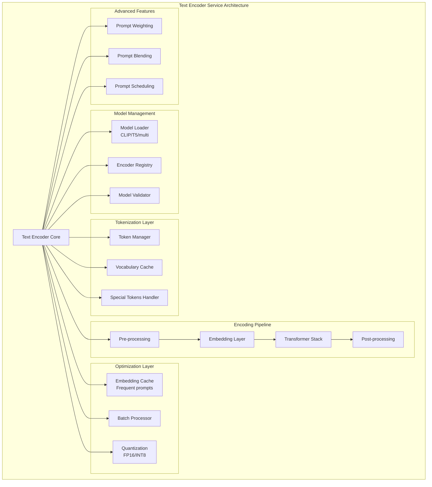

### 2.2 Modelo de Datos

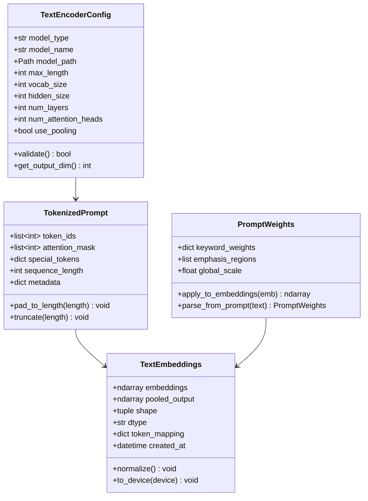

---

## 3. Procesamiento de Prompts {#prompts}

### 3.1 Pipeline Completo de Encoding

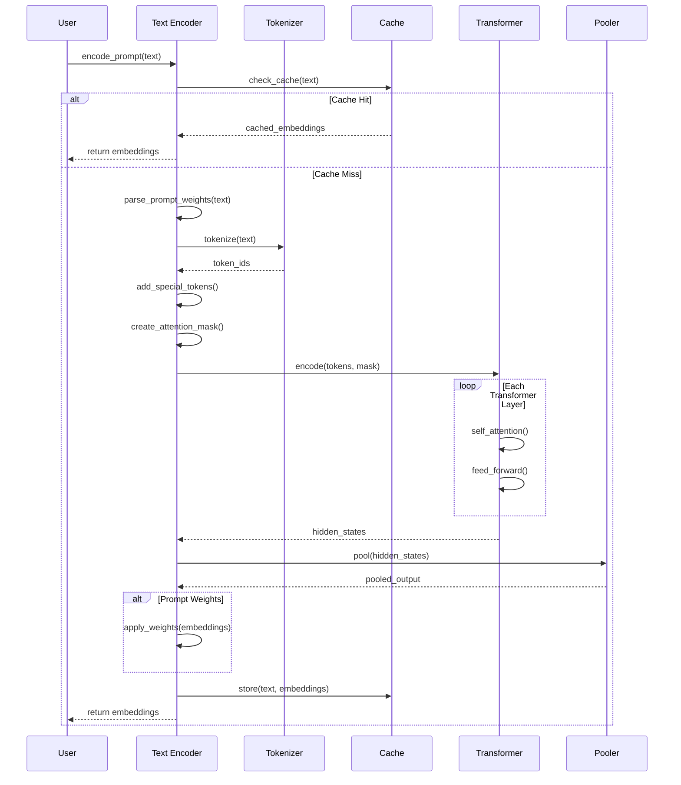

### 3.2 Tokenización Detallada

```mermaid
graph TB
    Input[Raw Text Prompt]

    Input --> Clean[Clean & Normalize<br/>- Lowercase<br/>- Remove extra spaces<br/>- Handle unicode]

    Clean --> Parse{Special<br/>Syntax?}

    Parse -->|Weights| ExtractWeights[Extract Weights<br/>(keyword:1.5)]
    Parse -->|Emphasis| ExtractEmphasis[Extract Emphasis<br/>((keyword))]
    Parse -->|No| Standard

    ExtractWeights --> Standard[Standard Tokenization]
    ExtractEmphasis --> Standard

    Standard --> Tokenize[BPE/WordPiece<br/>Tokenization]

    Tokenize --> AddSpecial[Add Special Tokens<br/>[CLS] text [SEP] [PAD]]

    AddSpecial --> LenCheck{Length<br/>Check}

    LenCheck -->|Too Long| Truncate[Truncate to<br/>max_length]
    LenCheck -->|Too Short| Pad[Pad to<br/>max_length]
    LenCheck -->|OK| CreateMask

    Truncate --> CreateMask[Create Attention Mask<br/>1=real, 0=padding]
    Pad --> CreateMask

    CreateMask --> Output[Token IDs +<br/>Attention Mask]

    style Input fill:#E8F5E9
    style Output fill:#C8E6C9
```

### 3.3 Manejo de Prompts Largos

**Estrategia de Truncación**:

- **Head Truncation**: Mantiene el final del prompt (menos común)
- **Tail Truncation**: Mantiene el inicio del prompt (estándar)
- **Sliding Window**: Procesa el prompt en ventanas solapadas
- **Hierarchical Encoding**: Resume primero, luego codifica

**Ejemplo de Prompt Largo**:

```
Original (150 tokens): "A beautiful sunset over mountains with..."
↓ Truncación a 77 tokens
Truncado: "A beautiful sunset over mountains with..."
↓ Tokens especiales
Final: "[CLS] A beautiful sunset... [SEP] [PAD] [PAD]"
```

---

## 4. Modelos de Encoding {#modelos}

### 4.1 CLIP Text Encoder

**Arquitectura**:

```
Input Text (77 tokens max)
    ↓
Token Embedding (768/1024 dim)
    ↓
Positional Encoding
    ↓
12 Transformer Layers (CLIP-L) / 24 Layers (CLIP-G)
    ├─ Multi-Head Self-Attention (12/16 heads)
    ├─ Layer Normalization
    ├─ Feed-Forward Network (4x hidden_size)
    └─ Residual Connections
    ↓
Final Layer Norm
    ↓
Output: [batch, 77, 768/1024]
    ├─ Hidden States (para cross-attention)
    └─ Pooled Output (token [EOS])
```

**Características**:

- **Vocabulario**: ~49,408 tokens (BPE)
- **Longitud máxima**: 77 tokens
- **Dimensión oculta**: 768 (CLIP-L) / 1024 (CLIP-G)
- **Capas**: 12 (CLIP-L) / 24 (CLIP-G)
- **Attention heads**: 12 (CLIP-L) / 16 (CLIP-G)

### 4.2 T5 Text Encoder

**Arquitectura**:

```
Input Text (512 tokens max)
    ↓
SentencePiece Tokenization
    ↓
Token + Position Embeddings (1024 dim)
    ↓
24 Encoder Layers (T5-XXL)
    ├─ Self-Attention (64 heads)
    ├─ Cross-Attention (opcional)
    ├─ Layer Norm (RMSNorm)
    ├─ Feed-Forward (Gated)
    └─ Relative Position Bias
    ↓
Final Projection
    ↓
Output: [batch, 512, 4096]
```

**Características**:

- **Vocabulario**: ~32,000 tokens (SentencePiece)
- **Longitud máxima**: 512 tokens
- **Dimensión oculta**: 4096 (T5-XXL)
- **Capas**: 24 (T5-XXL)
- **Attention heads**: 64
- **Ventaja**: Mayor contexto y comprensión semántica

### 4.3 Comparación de Modelos

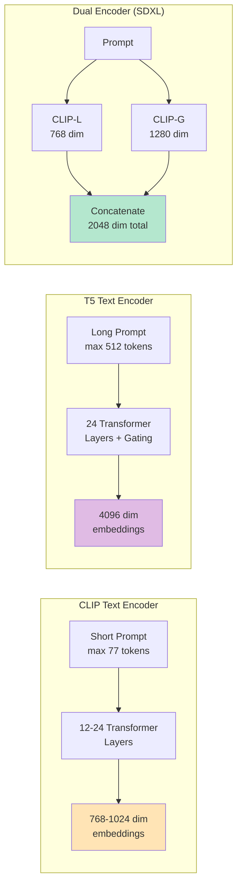

**Tabla Comparativa**:

| Característica  | CLIP-L | CLIP-G | T5-XXL   |
| --------------- | ------ | ------ | -------- |
| **Tokens máx**  | 77     | 77     | 512      |
| **Vocabulario** | 49K    | 49K    | 32K      |
| **Dimensión**   | 768    | 1024   | 4096     |
| **Capas**       | 12     | 24     | 24       |
| **Heads**       | 12     | 16     | 64       |
| **Parámetros**  | 123M   | 354M   | 4.7B     |
| **Uso típico**  | SD 1.x | SDXL   | SD3/Flux |

---

## 5. Optimizaciones y Caché {#optimizaciones}

### 5.1 Sistema de Caché de Embeddings

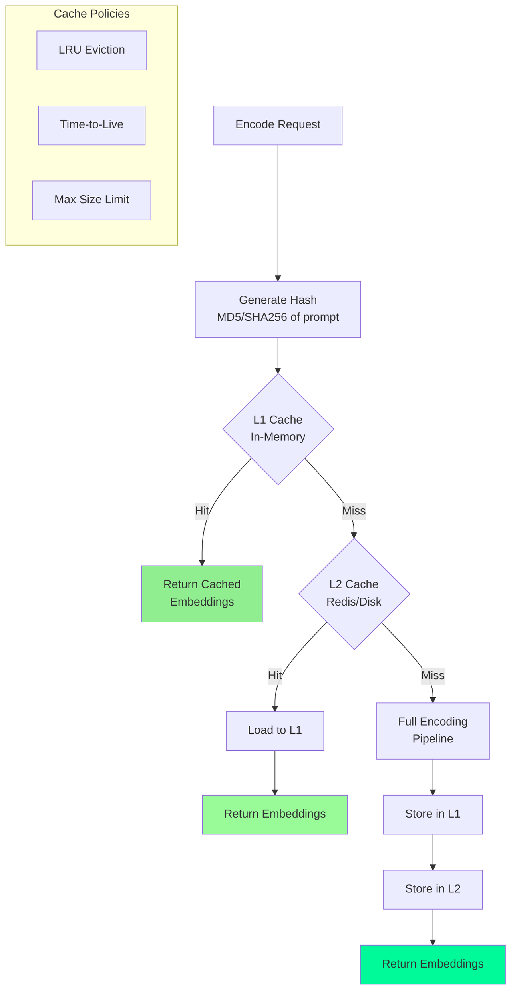

**Estrategia de Caché**:

1. **L1 - Caché en Memoria**:

   - Embeddings recientes en RAM
   - Tamaño: 100-1000 prompts
   - Latencia: <1ms
   - Política: LRU

2. **L2 - Caché Persistente**:

   - Disco o Redis
   - Tamaño: 10,000+ prompts
   - Latencia: 5-10ms
   - Compresión: FP16/INT8

3. **Invalidación**:
   - Cambio de modelo
   - Cambio de configuración
   - TTL (Time-to-Live)

### 5.2 Optimización de Batch Processing

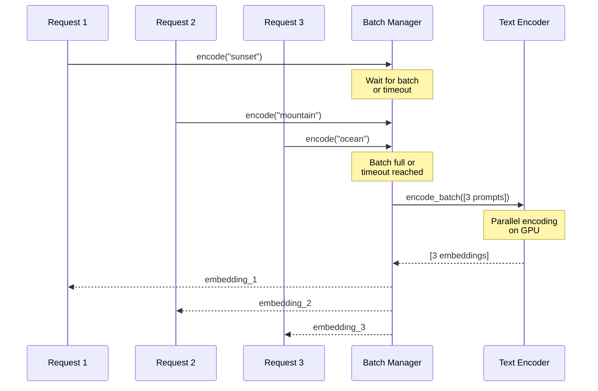

**Parámetros de Batching**:

- **Batch Size**: 4-32 prompts
- **Timeout**: 50-100ms
- **Beneficio**: 3-5x throughput
- **Trade-off**: Latencia vs throughput

### 5.3 Cuantización de Modelos

**Estrategias de Cuantización**:

```
FP32 (Baseline)
├─ Size: 100%
├─ Speed: 1x
└─ Accuracy: 100%

FP16 (Half Precision)
├─ Size: 50%
├─ Speed: 1.5-2x
└─ Accuracy: 99.9%

INT8 (Integer)
├─ Size: 25%
├─ Speed: 2-3x
└─ Accuracy: 98-99%

INT4 (Aggressive)
├─ Size: 12.5%
├─ Speed: 3-4x
└─ Accuracy: 95-97%
```

**Trade-offs**:

- FP16: Mejor balance para producción
- INT8: Para dispositivos con recursos limitados
- Calibración necesaria para INT8/INT4

---

## 6. Técnicas Avanzadas {#avanzadas}

### 6.1 Prompt Weighting

**Sintaxis**:

```
(keyword)       → peso 1.1
((keyword))     → peso 1.21 (1.1²)
(keyword:1.5)   → peso 1.5
[keyword]       → peso 0.9
```

**Implementación**:

```mermaid
graph TB
    Parse[Parse Prompt<br/>"(sunset:1.5), ocean"]

    Parse --> Extract[Extract Keywords<br/>sunset: 1.5<br/>ocean: 1.0]

    Extract --> Encode[Encode Full Prompt]

    Encode --> Identify[Identify Token<br/>Positions]

    Identify --> Apply[Apply Weights<br/>to Embeddings]

    Apply --> Output[Weighted Embeddings]

    subgraph "Weight Application"
        TokenEmbed[Token Embeddings<br/>[batch, seq, dim]]
        WeightMask[Weight Mask<br/>[batch, seq, 1]]
        Multiply[Element-wise<br/>Multiplication]

        TokenEmbed --> Multiply
        WeightMask --> Multiply
    end
```

**Ejemplo Matemático**:

```
Original embedding:    [0.5, 0.3, -0.2, 0.8]
Weight: 1.5
Weighted embedding:    [0.75, 0.45, -0.3, 1.2]
```

### 6.2 Prompt Blending

**Combinación de Múltiples Prompts**:

```mermaid
graph LR
    P1[Prompt 1<br/>"sunset"]
    P2[Prompt 2<br/>"ocean"]

    P1 --> E1[Encode]
    P2 --> E2[Encode]

    E1 --> Emb1[Embeddings 1<br/>768-dim]
    E2 --> Emb2[Embeddings 2<br/>768-dim]

    Emb1 --> Blend[Weighted Blend<br/>α×E1 + (1-α)×E2]
    Emb2 --> Blend

    Blend --> Final[Blended<br/>Embeddings]

    style Final fill:#DDA0DD
```

**Fórmula**:

```
E_blended = α₁×E₁ + α₂×E₂ + ... + αₙ×Eₙ

donde: Σαᵢ = 1
```

**Casos de Uso**:

- Transiciones suaves entre conceptos
- Exploración de espacio latente
- Prompt interpolation

### 6.3 Prompt Scheduling

**Cambio de Prompt Durante Generación**:

```mermaid
gantt
    title Prompt Scheduling During Denoising
    dateFormat X
    axisFormat %s

    section Step 0-10
    "sunset" :0, 10

    section Step 10-20
    "sunset → twilight" :10, 20

    section Step 20-30
    "twilight → night" :20, 30
```

**Implementación**:

```
Steps 0-10:   E = encode("bright sunset")
Steps 10-20:  E = 0.7×encode("sunset") + 0.3×encode("twilight")
Steps 20-30:  E = 0.3×encode("twilight") + 0.7×encode("night")
```

### 6.4 Negative Prompt Conditioning

**Pipeline de Condicionamiento**:

```mermaid
graph TB
    Positive[Positive Prompt<br/>"beautiful sunset"]
    Negative[Negative Prompt<br/>"blurry, low quality"]

    Positive --> EncPos[Encode Positive]
    Negative --> EncNeg[Encode Negative]

    EncPos --> EmbPos[Positive<br/>Embeddings]
    EncNeg --> EmbNeg[Negative<br/>Embeddings]

    EmbPos --> UNet[UNet Denoising]
    EmbNeg --> UNet

    UNet --> CFG[Classifier-Free<br/>Guidance]

    CFG --> Output[Conditioned<br/>Noise Prediction]

    subgraph "CFG Formula"
        Formula["ε̃ = ε_uncond + s × (ε_cond - ε_uncond)<br/>donde s = guidance_scale"]
    end

    style EmbPos fill:#90EE90
    style EmbNeg fill:#FFB6C1
```

**Matemática del CFG**:

```
ε̃_θ(x_t, c_pos, c_neg) = ε_θ(x_t, c_neg) + s × [ε_θ(x_t, c_pos) - ε_θ(x_t, c_neg)]

Donde:
- ε̃_θ: predicción final
- ε_θ(x_t, c_neg): predicción con prompt negativo
- ε_θ(x_t, c_pos): predicción con prompt positivo
- s: guidance scale (típicamente 7-15)
```

### 6.5 Textual Inversion y Embeddings Personalizados

**Concepto**:

```mermaid
graph TB
    Concept[Nuevo Concepto<br/>"<my-style>"]

    Concept --> Images[Imágenes de<br/>Entrenamiento]

    Images --> Optimize[Optimizar<br/>Embedding]

    Optimize --> Learn[Aprender Vector<br/>768-dim]

    Learn --> Store[Almacenar en<br/>Vocabulario]

    Store --> Use[Usar en Prompts<br/>"photo in <my-style>"]

    subgraph "Optimization"
        Loss["Loss = ||I_gen - I_target||"]
        Backprop[Backpropagate<br/>to embedding]

        Loss --> Backprop
    end
```

**Proceso de Entrenamiento**:

1. Inicializar embedding aleatorio para token `<concept>`
2. Generar imágenes con ese embedding
3. Calcular pérdida vs imágenes objetivo
4. Actualizar solo el embedding (congelar resto del modelo)
5. Repetir 1000-5000 pasos

---

## 7. Patrones de Integración

### 7.1 Integración con UNet

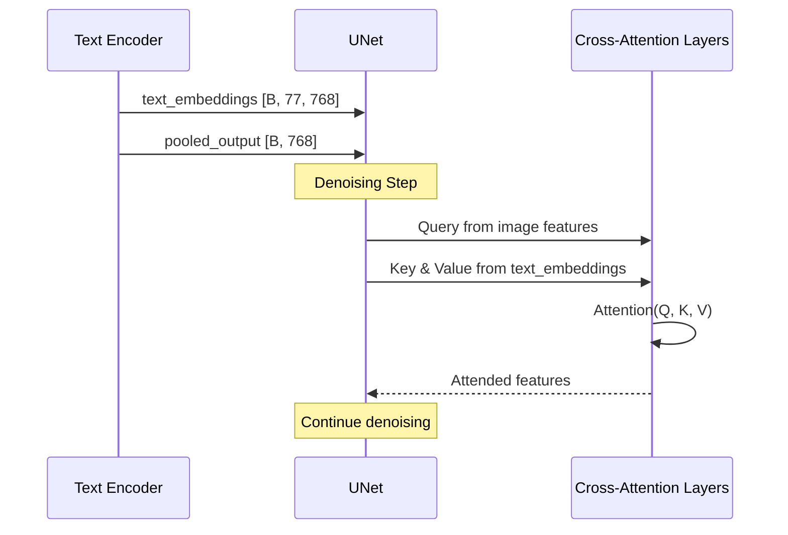

**Formato de Datos**:

```
text_embeddings:
    shape: [batch_size, max_length, hidden_dim]
    dtype: float16/float32
    use: Cross-attention conditioning

pooled_output:
    shape: [batch_size, hidden_dim]
    dtype: float16/float32
    use: AdaLayerNorm conditioning (SDXL)
```

### 7.2 Multi-Modal Conditioning (SDXL)

```mermaid
graph TB
    subgraph "SDXL Text Encoding"
        Prompt[User Prompt]

        Prompt --> CLIP_L[CLIP-L Encoder<br/>768 dim]
        Prompt --> CLIP_G[CLIP-G Encoder<br/>1280 dim]

        CLIP_L --> Pool_L[Pooled Output L<br/>768 dim]
        CLIP_G --> Pool_G[Pooled Output G<br/>1280 dim]

        CLIP_L --> Hidden_L[Hidden States L<br/>[77, 768]]
        CLIP_G --> Hidden_G[Hidden States G<br/>[77, 1280]]

        Hidden_L --> Concat1[Concatenate<br/>[77, 2048]]
        Hidden_G --> Concat1

        Pool_L --> Concat2[Concatenate<br/>[2048]]
        Pool_G --> Concat2

        Concat1 --> CrossAttn[Cross-Attention<br/>Conditioning]
        Concat2 --> AdaLN[AdaLayerNorm<br/>Conditioning]
    end

    style Concat1 fill:#B4E7CE
    style Concat2 fill:#FFD4A3
```

---

## 8. Monitoreo y Métricas

### 8.1 Métricas Clave

**Performance**:

```
- Encoding Latency: tiempo para convertir texto a embeddings
  * P50: <50ms
  * P95: <100ms
  * P99: <200ms

- Throughput: prompts procesados por segundo
  * Target: >100 prompts/s con batching

- Cache Hit Rate: porcentaje de embeddings en caché
  * Target: >70% para producción

- GPU Utilization: uso de GPU durante encoding
  * Target: >80% con batching
```

**Quality**:

```
- Embedding Similarity: cosine similarity entre prompts similares
  * "sunset" vs "sunrise": >0.85
  * "cat" vs "dog": 0.60-0.75

- Token Coverage: % de tokens en vocabulario
  * Target: >95% para dominio objetivo

- Truncation Rate: % de prompts truncados
  * Target: <5%
```

### 8.2 Dashboard de Monitoreo

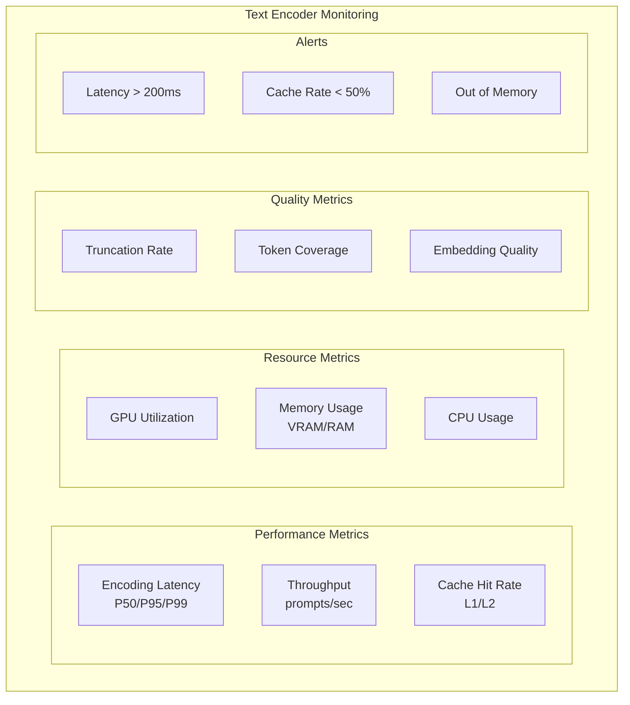

---

## 9. Troubleshooting

### 9.1 Problemas Comunes

**1. Prompt Truncado**:

```
Síntoma: Imagen no refleja toda la descripción
Causa: Prompt excede max_length (77/512 tokens)
Solución:
  - Reducir longitud del prompt
  - Usar modelo con mayor contexto (T5)
  - Priorizar keywords importantes al inicio
```

**2. Baja Calidad de Embeddings**:

```
Síntoma: Imágenes no siguen el prompt
Causa: Modelo de encoder incorrecto o corrupto
Solución:
  - Verificar compatibilidad de modelo
  - Re-descargar checkpoints
  - Validar dimensiones de output
```

**3. Out of Memory (OOM)**:

```
Síntoma: Crash durante encoding de batch
Causa: Batch size muy grande para VRAM disponible
Solución:
  - Reducir batch size
  - Usar FP16 en lugar de FP32
  - Habilitar gradient checkpointing
```

**4. Lentitud en Encoding**:

```
Síntoma: Latencia alta (>500ms)
Causa: Caché deshabilitado o batching ineficiente
Solución:
  - Habilitar L1/L2 cache
  - Ajustar batch size y timeout
  - Considerar cuantización a FP16/INT8
```

### 9.2 Debugging Guide

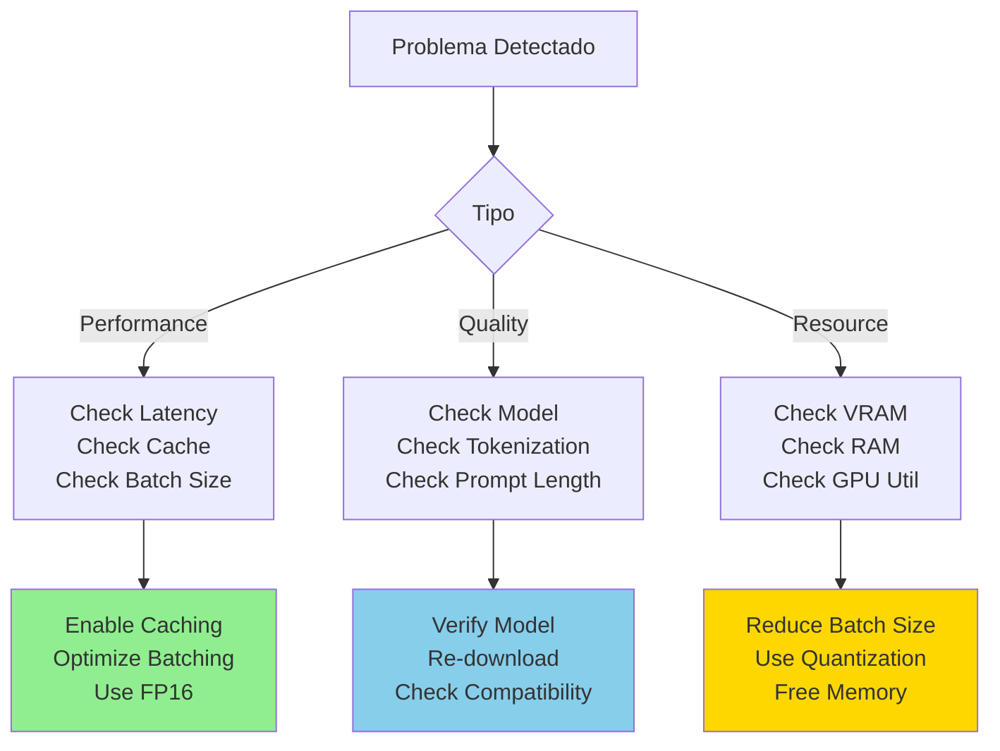

---

## 10. Best Practices

### 10.1 Optimización de Prompts

✅ **Do**:

- Usar descripciones claras y específicas
- Priorizar keywords importantes al inicio
- Usar weights para énfasis selectivo
- Mantener prompts concisos (<77 tokens para CLIP)
- Usar negative prompts para evitar elementos indeseados

❌ **Don't**:

- Prompts excesivamente largos sin necesidad
- Exceso de weights (distorsiona distribución)
- Contradicciones en el prompt
- Usar tokens desconocidos o raros

### 10.2 Configuración de Producción

```yaml
text_encoder:
  # Model Selection
  model_type: "clip" # clip, t5, dual
  model_variant: "clip-vit-large-patch14"

  # Performance
  batch_size: 8
  batch_timeout_ms: 100
  dtype: "float16" # float32, float16, int8

  # Caching
  cache_enabled: true
  cache_l1_size: 1000
  cache_l2_enabled: true
  cache_l2_path: "/data/cache/text_embeddings"

  # Optimization
  use_attention_slicing: false
  gradient_checkpointing: false

  # Monitoring
  enable_metrics: true
  log_slow_queries: true
  slow_query_threshold_ms: 200
```

### 10.3 Escalabilidad

**Estrategias**:

1. **Horizontal Scaling**:

   ```
   Load Balancer
      ├─ Text Encoder Instance 1
      ├─ Text Encoder Instance 2
      ├─ Text Encoder Instance 3
      └─ Text Encoder Instance N
   ```

2. **Caching Distribuido**:

   ```
   Redis Cluster
      ├─ Node 1: Frequent prompts
      ├─ Node 2: Recent prompts
      └─ Node 3: Overflow
   ```

3. **Model Sharding** (para T5-XXL):
   ```
   GPU 0: Layers 0-11
   GPU 1: Layers 12-23
   ```

---

## 11. Roadmap y Evolución

### 11.1 Futuras Mejoras

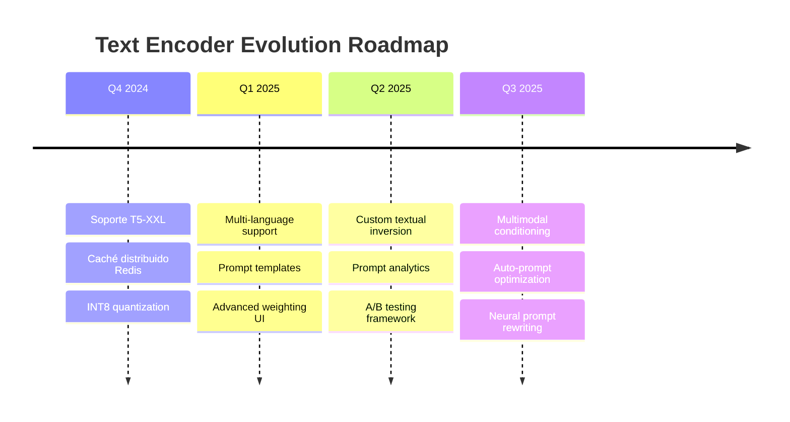

### 11.2 Investigación Activa

- **Longer Context Models**: Extender más allá de 512 tokens
- **Semantic Compression**: Representar prompts largos eficientemente
- **Adaptive Encoding**: Ajustar profundidad según complejidad del prompt
- **Cross-lingual Encoding**: Soporte nativo multiidioma
- **Learned Tokenization**: Vocabulario optimizado por dominio

---

## 12. Referencias y Recursos

### 12.1 Papers Fundamentales

1. **CLIP** (Radford et al., 2021)

   - "Learning Transferable Visual Models From Natural Language Supervision"
   - https://arxiv.org/abs/2103.00020

2. **T5** (Raffel et al., 2020)

   - "Exploring the Limits of Transfer Learning with a Unified Text-to-Text Transformer"
   - https://arxiv.org/abs/1910.10683

3. **Textual Inversion** (Gal et al., 2022)
   - "An Image is Worth One Word: Personalizing Text-to-Image Generation"
   - https://arxiv.org/abs/2208.01618

### 12.2 Implementaciones de Referencia

- **HuggingFace Transformers**: `transformers.CLIPTextModel`
- **OpenCLIP**: Implementación CLIP open-source
- **Stability AI**: SDXL text encoder implementation

### 12.3 Herramientas y Utilidades

- **Tokenizer Playground**: Visualizar tokenización
- **Embedding Inspector**: Analizar y comparar embeddings
- **Prompt Analyzer**: Detectar problemas en prompts
- **Cache Monitor**: Dashboard de caché hits/misses

---

## Glosario

**BPE (Byte-Pair Encoding)**: Algoritmo de tokenización que agrupa bytes frecuentes

**Cross-Attention**: Mecanismo que permite al UNet atender a embeddings de texto

**Embedding**: Representación vectorial densa de un token o secuencia

**Pooling**: Reducción de secuencia de embeddings a un único vector

**Textual Inversion**: Técnica para aprender nuevos conceptos mediante embeddings

**CFG (Classifier-Free Guidance)**: Método para amplificar adherencia al prompt

**Prompt Weighting**: Técnica para dar más importancia a ciertas palabras

**Token**: Unidad básica de texto después de tokenización

---

**Última actualización**: Octubre 2024  
**Versión del documento**: 2.0  
**Autor**: Equipo de Arquitectura de Stable Diffusion
