# Módulo de Extracción de Documentos (`pyintelcivil.src.infrastructure.extractors`)

Este módulo proporciona una interfaz unificada, flexible y extensible para extraer contenido de diversos tipos de documentos, utilizando diferentes librerías como Docling y MarkItDown.

## Características Principales

-   **Interfaz Extensible**: Permite agregar nuevos extractores fácilmente.
-   **Tipado Completo**: Asegura la consistencia y robustez de los parámetros.
-   **Detección Automática de Tipo**: Identifica automáticamente el tipo de documento para aplicar la estrategia de extracción adecuada.
-   **Estrategias de Fallback Automático**: Permite la selección automática de la mejor estrategia de extracción o el uso de alternativas si una falla.
-   **Extracción Detallada**: Capacidad para extraer texto, metadatos, imágenes y tablas.
-   **Configuración Flexible**: Permite personalizar el proceso de extracción según las necesidades.

## Clases del Módulo

### Entities

-   `CustomParameters`: Parámetros personalizados para extractores.
-   `DocumentFormatMapping`: Mapea un tipo de documento a un formato de entrada.
-   `DocumentMetadata`: Metadatos extraídos del documento.
-   `DocumentStructure`: Estructura del documento extraído.
-   `ExtensionMapEntry`: Mapea una extensión de archivo a un tipo de documento.
-   `ExtensionMapping`: Mapea extensiones de archivo a tipos de documento.
-   `ExtractedContent`: Contenido extraído de un documento.
-   `ExtractionCapabilities`: Capacidades de un extractor.
-   `ExtractionConfig`: Configuración para la extracción de documentos.
-   `ExtractionError`: Excepción personalizada para errores de extracción.
-   `ExtractorRegistration`: Registra un extractor con su estrategia.
-   `ImageInfo`: Información sobre una imagen extraída.
-   `MimeTypeMapEntry`: Mapea un tipo MIME a un tipo de documento.
-   `MimeTypeMapping`: Mapea tipos MIME a tipos de documento.
-   `StructuralElement`: Elemento estructural del documento.
-   `TableInfo`: Información sobre una tabla extraída.

### Enums

-   `DocumentType`: Tipos de documentos soportados.
-   `ExtractionStrategy`: Estrategias de extracción disponibles.
-   `OutputFormat`: Formatos de salida disponibles.

### Handlers

-   `ContentCleaner`: Limpia y procesa contenido extraído.
-   `DoclingExtractor`: Extractor de documentos usando la librería Docling.
-   `DoclingFormatMapper`: Mapea tipos de documento a formatos de Docling.
-   `DocumentTypeDetector`: Detecta tipos de documento basado en extensión y contenido.
-   `ExtractorRegistry`: Registro de extractores disponibles.
-   `FileValidator`: Valida archivos para extracción.
-   `MarkdownParser`: Parser para extraer información de texto markdown.
-   `MarkItDownExtractor`: Extractor de documentos usando la librería MarkItDown.
-   `TextCleaner`: Limpia texto extraído.

### Interfaces

-   `BaseDocumentExtractor`: Clase base abstracta para extractores de documentos.
-   `DocumentExtractor`: Protocolo que define la interfaz para extractores de documentos.

### Services

-   `DocumentExtractorFactory`: Factory para crear y gestionar extractores de documentos.

## Diagrama de Clases

```mermaid
classDiagram
    direction BT

    class DocumentExtractorFactory {
        +registry: ExtractorRegistry
        +extract_document(file_path, config): ExtractedContent
        +get_supported_types(): list~ExtractorRegistration~
        +register_custom_extractor(strategy, extractor)
        +set_extraction_priority(order)
    }

    class ExtractorRegistry {
        +extractors: list~ExtractorRegistration~
        +fallback_order: list~ExtractionStrategy~
        +register_extractor(strategy, extractor)
        +get_extractor(strategy): BaseDocumentExtractor
        +get_available_strategies(): list~ExtractionStrategy~
        +get_best_extractor_for_type(document_type): BaseDocumentExtractor
        +set_fallback_order(order)
    }

    class BaseDocumentExtractor {
        <<abstract>>
        +name: str
        +can_extract(file_path, document_type): bool
        +extract(file_path, config): ExtractedContent
        +get_capabilities(): ExtractionCapabilities
        +get_supported_types(): list~DocumentType~
    }

    class DoclingExtractor {
        +FORMAT_MAP: dict~DocumentType, InputFormat~
    }

    class MarkItDownExtractor {
        +SUPPORTED_TYPES: list~DocumentType~
    }

    class DocumentTypeDetector {
        +extension_mapping: ExtensionMapping
        +mime_mapping: MimeTypeMapping
        +detect_type(file_path): DocumentType
    }

    class ContentCleaner {
        +text_cleaner: TextCleaner
        +markdown_parser: MarkdownParser
        +clean_text(text): str
        +extract_structure(text): DocumentStructure
        +markdown_to_text(markdown_text): str
    }

    class FileValidator {
        +validate_file(file_path, max_size_mb)
    }

    class MarkdownParser {
        +extract_headers(text): list~StructuralElement~
        +extract_lists(text): list~StructuralElement~
        +count_markdown_elements(text): DocumentStructure
    }

    class TextCleaner {
        +clean_whitespace(text): str
        +remove_empty_lines(text): str
        +clean_text(text): str
    }

    class DocumentFormatMapping {
        +document_type: DocumentType
        +input_format: InputFormat
    }

    class ExtensionMapEntry {
        +extension: str
        +document_type: DocumentType
    }

    class MimeTypeMapEntry {
        +mime_type: str
        +document_type: DocumentType
    }

    class ExtractorRegistration {
        +strategy: ExtractionStrategy
        +extractor: BaseDocumentExtractor
    }

    class DocumentMetadata {
        +file_path: Path
        +file_size: int
        +document_type: DocumentType
        +title: str
        +author: str
        +creator: str
        +subject: str
        +keywords: list~str~
        +creation_date: datetime
        +modification_date: datetime
        +page_count: int
        +word_count: int
        +language: str
        +has_custom_metadata: bool
        +custom_metadata_preview: str
    }

    class ExtractedContent {
        +text: str
        +metadata: DocumentMetadata
        +images: list~ImageInfo~
        +tables: list~TableInfo~
        +structure: DocumentStructure
        +extraction_time: float
        +extraction_strategy: ExtractionStrategy
        +success: bool
        +error_message: str
    }

    class ImageInfo {
        +index: int
        +image_type: str
        +width: int
        +height: int
        +format_type: str
        +alt_text: str
        +url: str
        +position: int
        +data_available: bool
    }

    class TableInfo {
        +index: int
        +table_type: str
        +rows: int
        +columns: int
        +start_line: int
        +headers: list~str~
        +has_data: bool
        +data_preview: str
    }

    class DocumentStructure {
        +line_count: int
        +word_count: int
        +character_count: int
        +paragraph_count: int
        +header_count: int
        +list_count: int
        +code_block_count: int
        +link_count: int
        +bold_text_count: int
        +italic_text_count: int
        +elements: list~StructuralElement~
    }

    class StructuralElement {
        +element_type: str
        +text_content: str
        +page_number: int
        +position: int
        +level: int
    }

    class ExtractionConfig {
        +strategy: ExtractionStrategy
        +preserve_formatting: bool
        +extract_images: bool
        +extract_tables: bool
        +extract_metadata: bool
        +output_format: OutputFormat
        +max_file_size_mb: int
        +timeout_seconds: int
        +custom_params: CustomParameters
    }

    class CustomParameters {
        +docling_extract_links: bool
        +docling_process_images: bool
        +docling_table_extraction: bool
        +markitdown_preserve_links: bool
        +markitdown_clean_html: bool
        +additional_options: str
    }

    class ExtractionCapabilities {
        +supported_types: list~DocumentType~
        +can_extract_images: bool
        +can_extract_tables: bool
        +can_extract_metadata: bool
        +can_preserve_formatting: bool
        +supports_ocr: bool
        +max_file_size_mb: int
    }

    class DocumentType {
        <<enum>>
    }

    class ExtractionStrategy {
        <<enum>>
    }

    class OutputFormat {
        <<enum>>
    }

    DocumentExtractorFactory "1" *-- "1" ExtractorRegistry
    DocumentExtractorFactory "1" *-- "1" DocumentTypeDetector
    DocumentExtractorFactory "1" *-- "1" FileValidator

    ExtractorRegistry "1" *-- "*" ExtractorRegistration
    ExtractorRegistration "1" *-- "1" BaseDocumentExtractor
    ExtractorRegistration "1" *-- "1" ExtractionStrategy

    BaseDocumentExtractor <|-- DoclingExtractor
    BaseDocumentExtractor <|-- MarkItDownExtractor

    DoclingExtractor "1" *-- "1" ContentCleaner
    DoclingExtractor "1" *-- "1" DocumentTypeDetector
    DoclingExtractor "1" *-- "1" DocumentMetadata
    DoclingExtractor "1" *-- "1" ExtractedContent
    DoclingExtractor "1" *-- "1" ExtractionConfig
    DoclingExtractor "1" *-- "1" ImageInfo
    DoclingExtractor "1" *-- "1" TableInfo
    DoclingExtractor "1" *-- "1" DocumentStructure
    DoclingExtractor "1" *-- "1" StructuralElement

    MarkItDownExtractor "1" *-- "1" ContentCleaner
    MarkItDownExtractor "1" *-- "1" DocumentTypeDetector
    MarkItDownExtractor "1" *-- "1" DocumentMetadata
    MarkItDownExtractor "1" *-- "1" ExtractedContent
    MarkItDownExtractor "1" *-- "1" ExtractionConfig
    MarkItDownExtractor "1" *-- "1" ImageInfo
    MarkItDownExtractor "1" *-- "1" TableInfo
    MarkItDownExtractor "1" *-- "1" DocumentStructure
    MarkItDownExtractor "1" *-- "1" StructuralElement

    DocumentTypeDetector "1" *-- "1" ExtensionMapping
    DocumentTypeDetector "1" *-- "1" MimeTypeMapping
    ExtensionMapping "1" *-- "*" ExtensionMapEntry
    MimeTypeMapping "1" *-- "*" MimeTypeMapEntry

    ContentCleaner "1" *-- "1" TextCleaner
    ContentCleaner "1" *-- "1" MarkdownParser
    MarkdownParser "1" *-- "1" StructuralElement
    MarkdownParser "1" *-- "1" DocumentStructure

    ExtractedContent "1" *-- "1" DocumentMetadata
    ExtractedContent "1" *-- "*" ImageInfo
    ExtractedContent "1" *-- "*" TableInfo
    ExtractedContent "1" *-- "1" DocumentStructure
    ExtractedContent "1" *-- "1" ExtractionStrategy

    DocumentMetadata "1" *-- "1" DocumentType
    DocumentStructure "1" *-- "*" StructuralElement
    ExtractionConfig "1" *-- "1" ExtractionStrategy
    ExtractionConfig "1" *-- "1" OutputFormat
    ExtractionConfig "1" *-- "1" CustomParameters
    ExtractionCapabilities "1" *-- "*" DocumentType

    DocumentFormatMapping "1" *-- "1" DocumentType
    DoclingFormatMapper "1" *-- "*" DocumentFormatMapping

    DocumentType <.. DocumentFormatMapping
    DocumentType <.. ExtensionMapEntry
    DocumentType <.. MimeTypeMapEntry
    DocumentType <.. ExtractionCapabilities
    DocumentType <.. DocumentMetadata
    DocumentType <.. DoclingExtractor
    DocumentType <.. MarkItDownExtractor
    DocumentType <.. DocumentTypeDetector
    DocumentType <.. ExtractorRegistry

    ExtractionStrategy <.. ExtractorRegistration
    ExtractionStrategy <.. ExtractionConfig
    ExtractionStrategy <.. ExtractedContent
    ExtractionStrategy <.. ExtractorRegistry
    ExtractionStrategy <.. DocumentExtractorFactory

    OutputFormat <.. ExtractionConfig

    DocumentExtractor <|.. BaseDocumentExtractor
```

## Diagrama de Secuencia (Flujo Principal de Extracción de Documentos)

