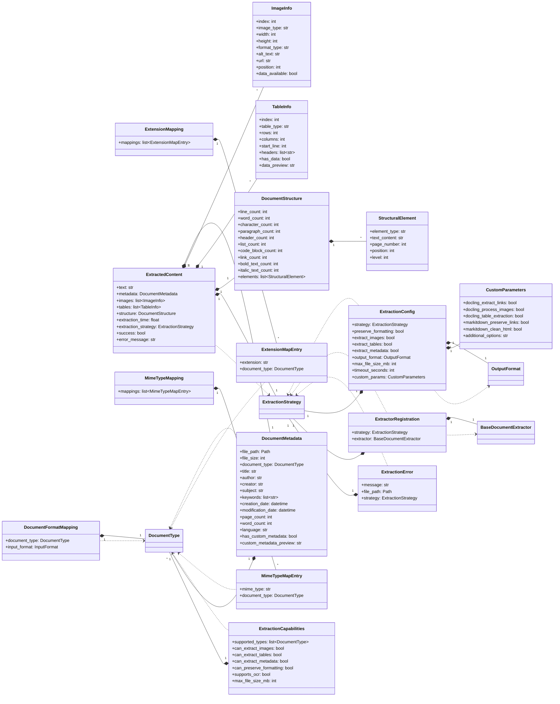

# Módulo de Entidades (`pyintelcivil.src.infrastructure.extractors.entities`)

Este módulo define las estructuras de datos (dataclasses) utilizadas en el proceso de extracción de documentos. Estas entidades aseguran un tipado estricto y una representación clara de la información extraída y la configuración del extractor.

## Clases

-   `CustomParameters`: Parámetros personalizados para extractores.
-   `DocumentFormatMapping`: Mapea un tipo de documento a un formato de entrada.
-   `DocumentMetadata`: Metadatos extraídos del documento.
-   `DocumentStructure`: Estructura del documento extraído.
-   `ExtensionMapEntry`: Mapea una extensión de archivo a un tipo de documento.
-   `ExtensionMapping`: Mapea extensiones de archivo a tipos de documento.
-   `ExtractedContent`: Contenido extraído de un documento.
-   `ExtractionCapabilities`: Capacidades de un extractor.
-   `ExtractionConfig`: Configuración para la extracción de documentos.
-   `ExtractionError`: Excepción personalizada para errores de extracción.
-   `ExtractorRegistration`: Registra un extractor con su estrategia.
-   `ImageInfo`: Información sobre una imagen extraída.
-   `MimeTypeMapEntry`: Mapea un tipo MIME a un tipo de documento.
-   `MimeTypeMapping`: Mapea tipos MIME a tipos de documento.
-   `StructuralElement`: Elemento estructural del documento.
-   `TableInfo`: Información sobre una tabla extraída.

## Diagrama de Clases

