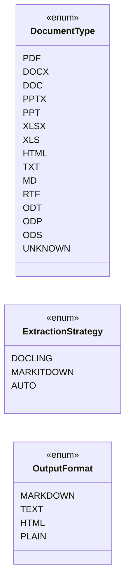

# Módulo de Enumeraciones (`pyintelcivil.src.infrastructure.extractors.enums`)

Este módulo contiene las enumeraciones clave utilizadas en el módulo de extracción de documentos. Estas enumeraciones proporcionan un conjunto de valores predefinidos para tipos de documentos, estrategias de extracción y formatos de salida, mejorando la legibilidad y la robustez del código.

## Clases

-   `DocumentType`: Tipos de documentos soportados.
-   `ExtractionStrategy`: Estrategias de extracción disponibles.
-   `OutputFormat`: Formatos de salida disponibles.

## Diagrama de Clases

