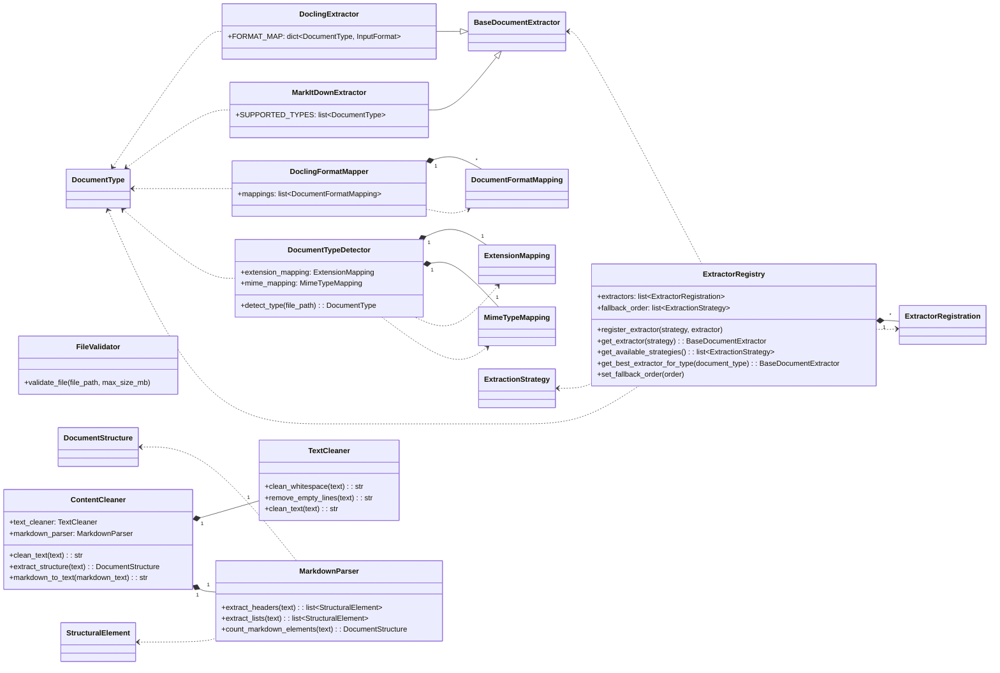
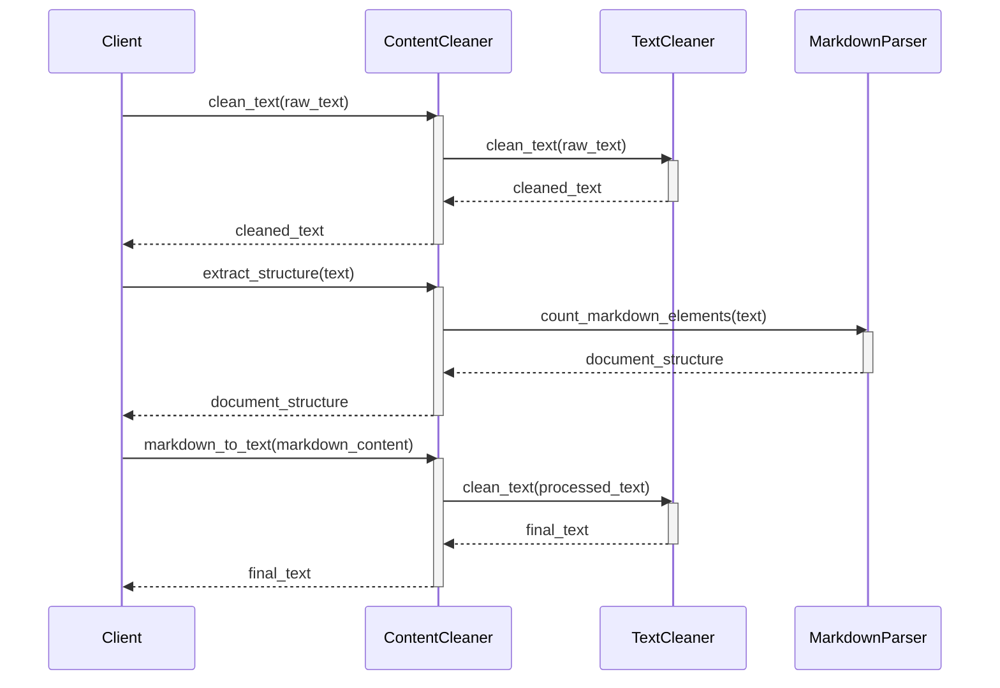

# Módulo de Handlers (`pyintelcivil.src.infrastructure.extractors.handlers`)

Este módulo contiene las implementaciones concretas de los extractores de documentos, así como utilidades y lógicas de procesamiento que soportan el proceso de extracción. Aquí se encuentran las clases que interactúan directamente con librerías externas y realizan las tareas de limpieza, detección y registro.

## Clases

-   `ContentCleaner`: Limpia y procesa contenido extraído.
-   `DoclingExtractor`: Extractor de documentos usando la librería Docling.
-   `DoclingFormatMapper`: Mapea tipos de documento a formatos de Docling.
-   `DocumentTypeDetector`: Detecta tipos de documento basado en extensión y contenido.
-   `ExtractorRegistry`: Registro de extractores disponibles.
-   `FileValidator`: Valida archivos para extracción.
-   `MarkdownParser`: Parser para extraer información de texto markdown.
-   `MarkItDownExtractor`: Extractor de documentos usando la librería MarkItDown.
-   `TextCleaner`: Limpia texto extraído.

## Diagrama de Clases

## Diagrama de Secuencia (ContentCleaner)

