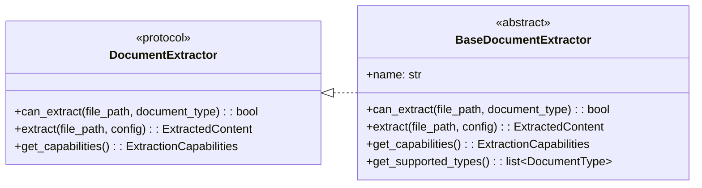

# Módulo de Interfaces (`pyintelcivil.src.infrastructure.extractors.interfaces`)

Este módulo define las interfaces y clases base abstractas para los extractores de documentos. Establece los contratos que deben cumplir los extractores concretos, promoviendo la extensibilidad y la interoperabilidad dentro del sistema de extracción.

## Clases

-   `BaseDocumentExtractor`: Clase base abstracta para extractores de documentos.
-   `DocumentExtractor`: Protocolo que define la interfaz para extractores de documentos.

## Diagrama de Clases

