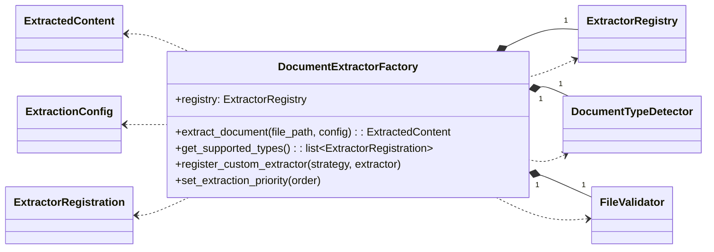
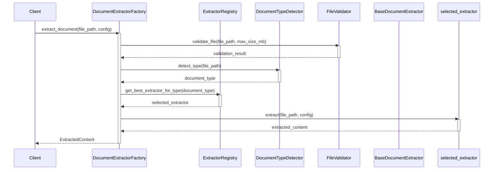

# Módulo de Servicios (`pyintelcivil.src.infrastructure.extractors.services`)

Este módulo contiene la lógica de orquestación y gestión de los extractores de documentos. La clase principal aquí es el `DocumentExtractorFactory`, que se encarga de seleccionar el extractor adecuado y coordinar el proceso de extracción, incluyendo estrategias de fallback.

## Clases

-   `DocumentExtractorFactory`: Factory para crear y gestionar extractores de documentos.

## Diagrama de Clases

## Diagrama de Secuencia

