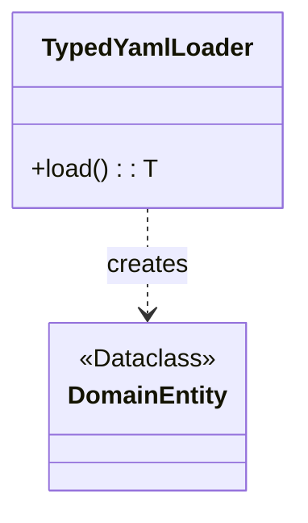

# Módulo de Carga de Datos (`infrastructure/data_loaders`)

Este módulo de infraestructura es responsable de cargar datos desde diversas fuentes (como archivos YAML, bases de datos, etc.) y transformarlos en las entidades tipadas del dominio. Su función principal es actuar como un puente entre el mundo exterior (datos crudos) y el núcleo del dominio (entidades validadas y estructuradas).

## Submódulos

-   **[services](./services/README.md)**: Contiene los servicios concretos de carga de datos, como el `TypedYamlLoader`.

## Arquitectura General

La principal responsabilidad de este módulo es asegurar que cualquier dato que ingrese al sistema se adhiera a los contratos definidos en el dominio. Esto se logra mediante cargadores especializados que entienden formatos de datos específicos y los mapean a `dataclasses` del dominio.

## Diagrama de Clases de Alto Nivel

