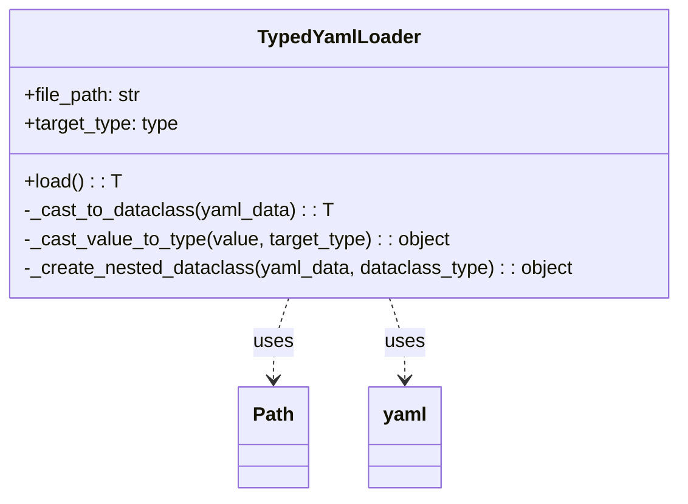
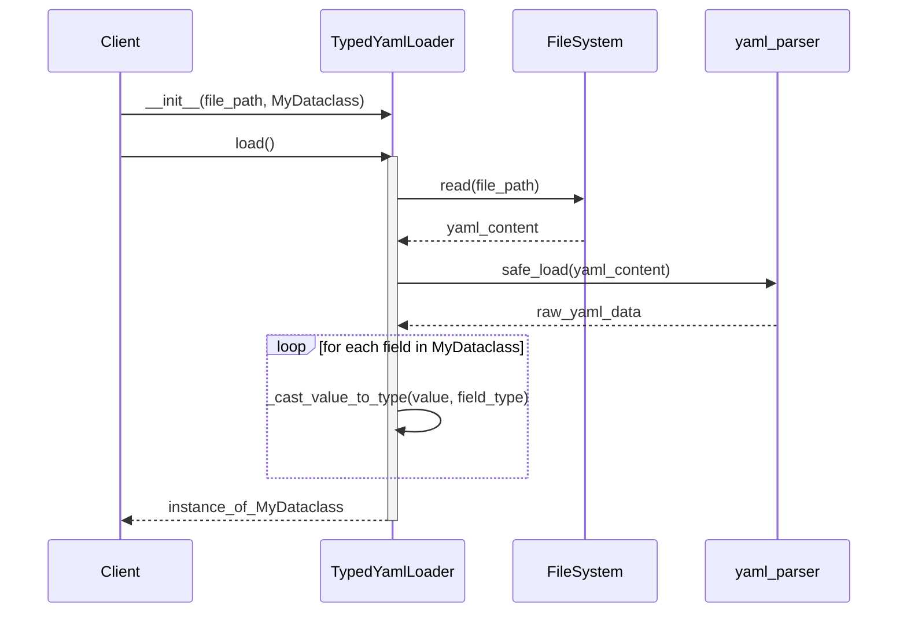

# Módulo de Servicios de Carga de Datos (`data_loaders/services`)

Este módulo proporciona servicios para cargar datos desde diferentes fuentes y formatos, convirtiéndolos en objetos de dominio tipados y validados. El objetivo es asegurar que los datos que entran al sistema sean consistentes y cumplan con los contratos definidos en el dominio.

## `TypedYamlLoader`

El componente principal de este módulo es `TypedYamlLoader`. Esta clase se especializa en cargar archivos YAML y convertirlos de manera inteligente y recursiva en instancias de `dataclasses` de Python. Esto elimina la necesidad de manejar diccionarios genéricos y asegura que los datos se cargan con los tipos correctos desde el principio.

### Características

-   **Casting Inteligente**: Utiliza la introspección de tipos de Python para convertir los datos del YAML a los tipos definidos en los `dataclasses`.
-   **Soporte para Tipos Anidados**: Maneja `dataclasses` anidados y listas de `dataclasses` (`List[MyDataclass]`) de forma recursiva.
-   **Validación Estricta**: No permite el uso de `dict`, `Any` o `tuple` en las firmas, forzando el uso de tipos concretos.
-   **Cero Dependencias del Dominio**: Es una utilidad de infraestructura pura que no tiene conocimiento del dominio de negocio.

### `load()`

El método `load()` es el punto de entrada principal. Orquesta la lectura del archivo YAML y el proceso de conversión al `dataclass` especificado.

## Diagrama de Clases

## Diagrama de Secuencia

Este diagrama ilustra el proceso de carga de un archivo YAML y su conversión a un `dataclass` tipado.

