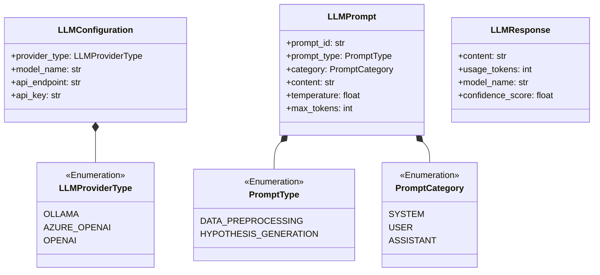
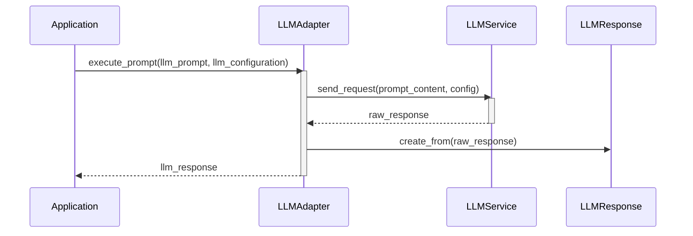

# Módulo de Entidades de LLM (`llm/entities`)

Este módulo define las entidades de datos necesarias para interactuar con Modelos de Lenguaje Grandes (LLMs) de una manera estructurada y agnóstica del proveedor. Estas entidades encapsulan la información para la configuración, los prompts y las respuestas de los LLMs.

## Descripción General

El objetivo de este módulo es estandarizar la comunicación con los servicios de LLM, permitiendo que el resto del sistema no necesite conocer los detalles de implementación de un proveedor específico. Las entidades aquí definidas son utilizadas por la capa de aplicación y los adaptadores de infraestructura.

## Entidades Principales

### `LLMConfiguration`

Contiene la configuración necesaria para conectarse a un proveedor de LLM. Incluye el tipo de proveedor, el nombre del modelo, el endpoint de la API, la clave de API y otros parámetros como el timeout y los reintentos.

### `LLMPrompt`

Representa un prompt estructurado para ser enviado a un LLM. Contiene el contenido del prompt, su tipo, categoría, y parámetros de la inferencia como la temperatura y el número máximo de tokens.

### `LLMResponse`

Encapsula la respuesta de un LLM. Incluye el contenido de la respuesta, el uso de tokens, el nombre del modelo y un puntaje de confianza.

## Enumeraciones

-   **`LLMProviderType`**: Define los proveedores de LLM soportados (e.g., `OLLAMA`, `AZURE_OPENAI`, `OPENAI`).
-   **`PromptCategory`**: Define las categorías de prompts según su función (e.g., `SYSTEM`, `USER`, `ASSISTANT`).
-   **`PromptType`**: Define los tipos de prompts para las diferentes fases del análisis (e.g., `DATA_PREPROCESSING`, `HYPOTHESIS_GENERATION`).

## Diagrama de Clases

## Diagrama de Secuencia

Este diagrama ilustra una interacción típica con un servicio de LLM utilizando estas entidades.

