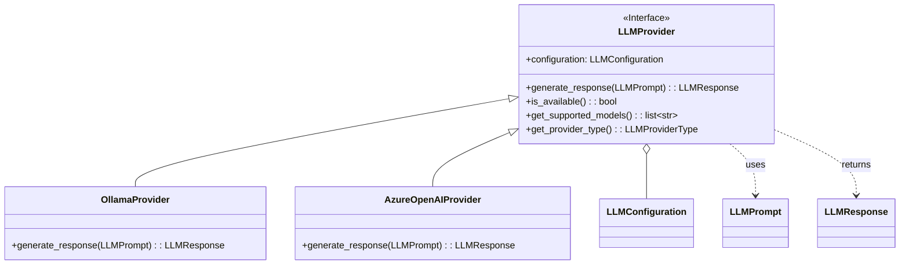
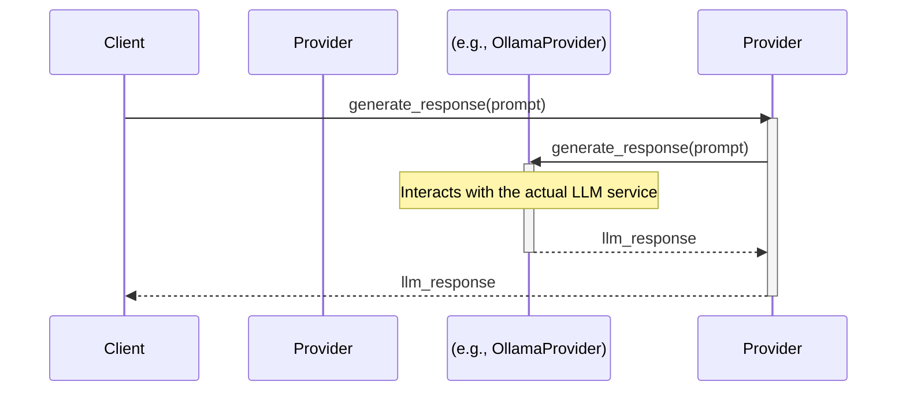

# Módulo de Interfaces de LLM (`llm/interfaces`)

Este módulo define las interfaces abstractas para interactuar con proveedores de Modelos de Lenguaje Grandes (LLMs). El objetivo es desacoplar la lógica de la aplicación de las implementaciones concretas de los clientes de LLM, permitiendo un sistema más modular y extensible.

## `LLMProvider`

La interfaz principal de este módulo es `LLMProvider`. Es una clase base abstracta que define el contrato que todos los adaptadores de proveedores de LLM deben implementar. Esto asegura que, sin importar si se está utilizando Ollama, Azure OpenAI o cualquier otro servicio, la interacción desde la capa de aplicación sea consistente.

### Métodos de la Interfaz

-   `__init__(configuration)`: Inicializa el proveedor con una `LLMConfiguration` específica.
-   `generate_response(prompt) -> LLMResponse`: El método central que toma un `LLMPrompt` y retorna una `LLMResponse` estructurada.
-   `is_available() -> bool`: Verifica si el proveedor está accesible y correctamente configurado.
-   `get_supported_models() -> list[str]`: Retorna una lista de los modelos de lenguaje que el proveedor soporta.
-   `get_provider_type() -> LLMProviderType`: Retorna el tipo de proveedor, como se define en la enumeración `LLMProviderType`.

## Diagrama de Clases

## Diagrama de Secuencia

Este diagrama ilustra cómo un cliente (e.g., un servicio de aplicación) interactúa con un proveedor de LLM a través de la interfaz `LLMProvider`.

