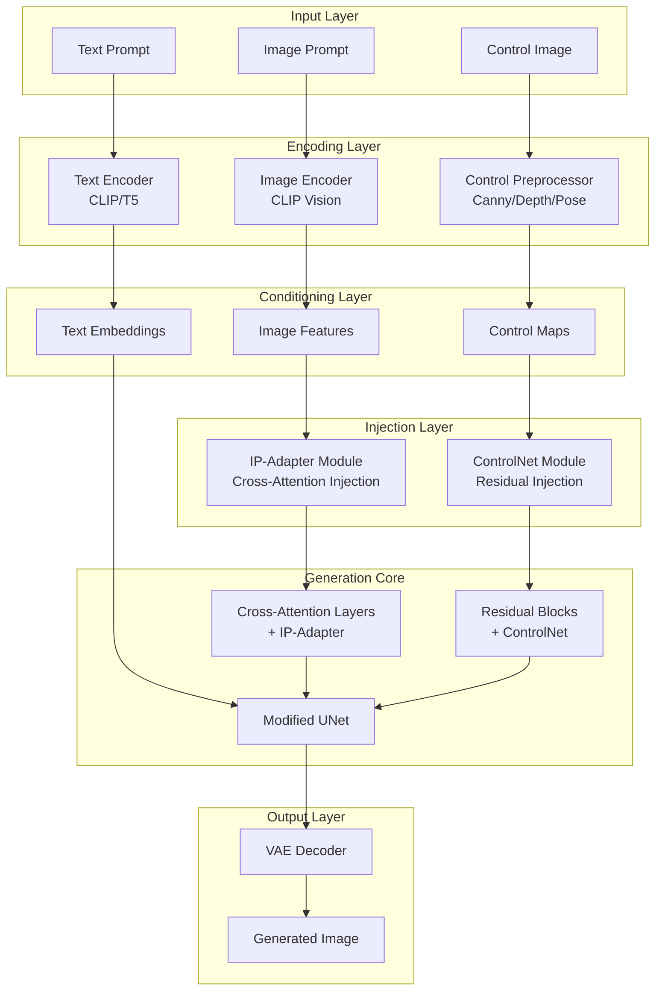
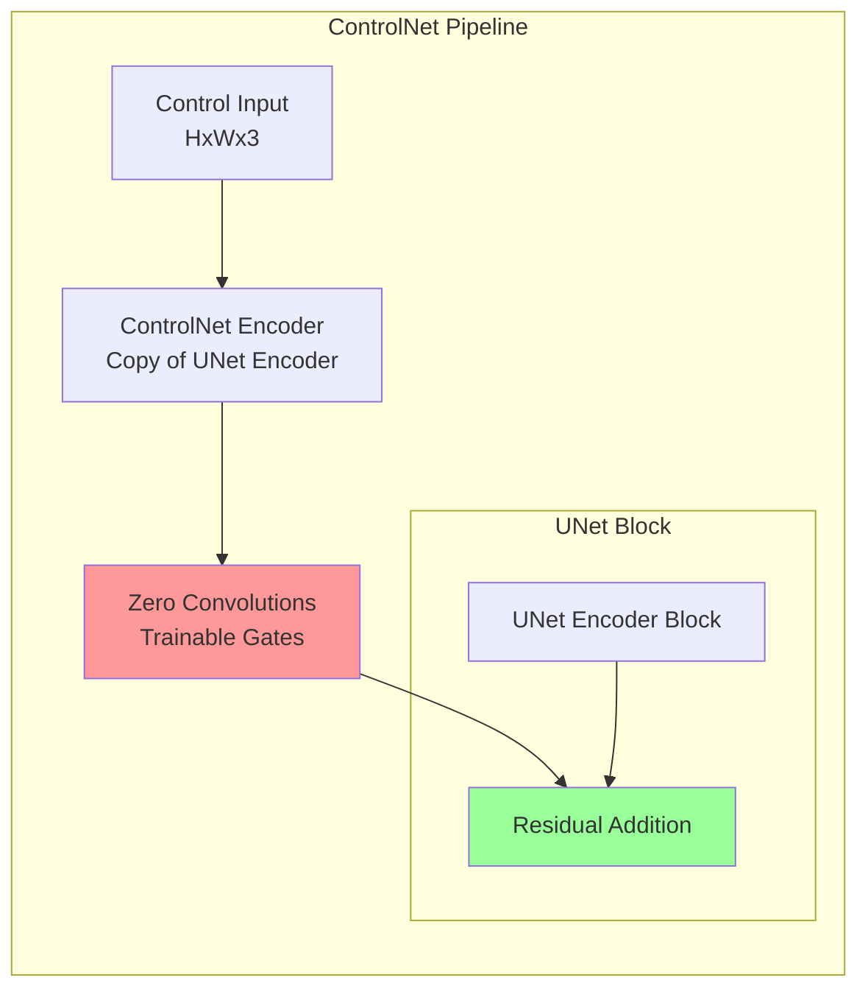
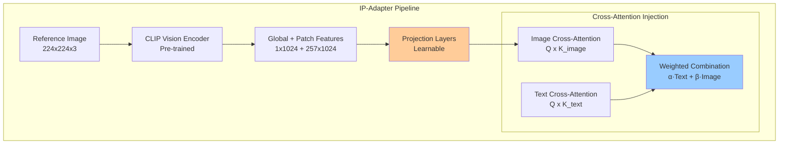
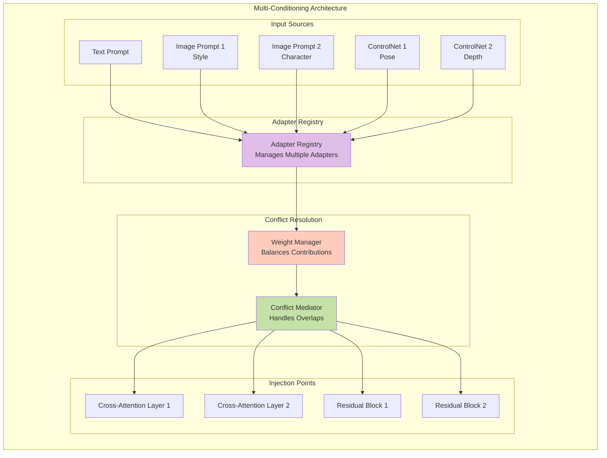
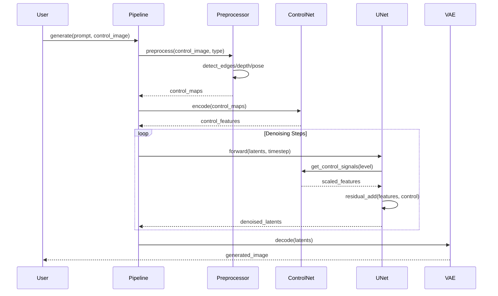
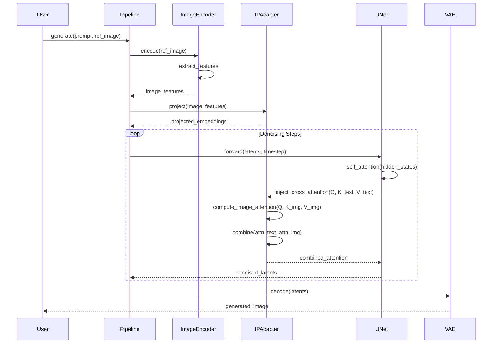
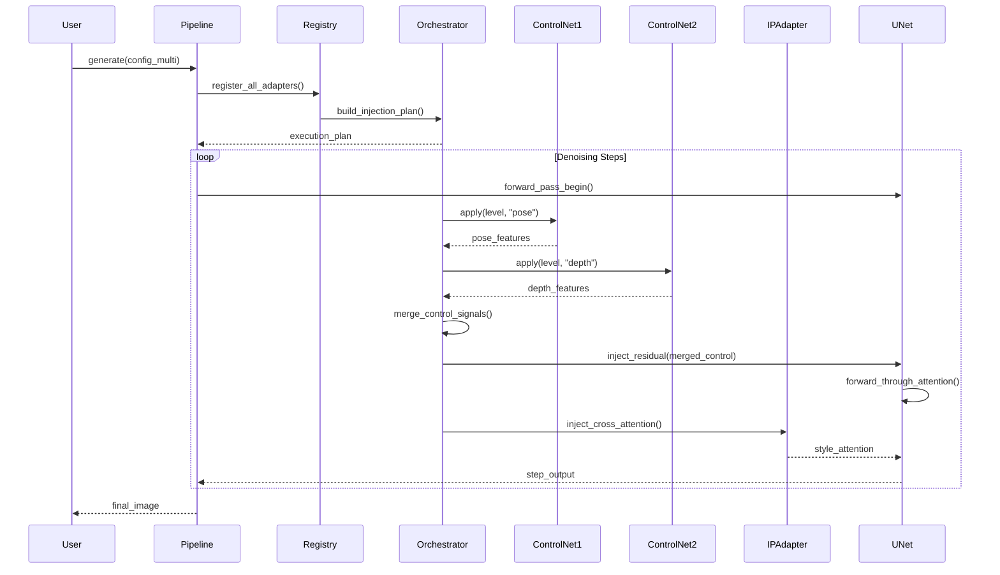

# Documento de Diseño de Arquitectura: ControlNet + IP-Adapter

## Tabla de Contenidos
1. [Visión General del Sistema](#visión-general)
2. [Diagramas de Arquitectura](#diagramas)
3. [Estructura de Módulos](#estructura-módulos)
4. [Descripción Detallada de Componentes](#componentes)
5. [Flujos de Procesamiento](#flujos)
6. [Patrones de Integración](#integracion)

---

## 1. Visión General del Sistema {#visión-general}

### Propósito
Extensión del módulo de difusión para soportar control espacial preciso (ControlNet) y condicionamiento por imagen (IP-Adapter), permitiendo generación de imágenes con control fino sobre composición, estilo y estructura.

### Conceptos Clave

**ControlNet**: Red neuronal adicional que condiciona la generación mediante mapas de control espacial (edges, depth, pose, segmentation). Se inyecta en las capas del UNet mediante conexiones residuales.

**IP-Adapter**: Adaptador que permite usar imágenes como prompts mediante cross-attention modificado. Extrae features visuales y las inyecta en el mecanismo de atención del modelo.

**Diferencias Fundamentales**:
- **ControlNet**: Control estructural/espacial → Inyección en bloques residuales del UNet
- **IP-Adapter**: Control de estilo/contenido → Inyección en cross-attention layers
- **Compatibilidad**: Pueden usarse simultáneamente sin conflictos

---

## 2. Diagramas de Arquitectura {#diagramas}

### 2.1 Arquitectura General del Sistema



### 2.2 Flujo de Inyección de ControlNet



### 2.3 Flujo de Inyección de IP-Adapter



### 2.4 Arquitectura de Integración Múltiple



---

## 3. Estructura de Módulos {#estructura-módulos}

### 3.1 Módulo ControlNet

```
ml_library/diffusion/controlnet/
│
├── services/
│   ├── controlnet_service.py
│   ├── preprocessor_service.py
│   ├── multi_controlnet_service.py
│   └── control_weight_service.py
│
├── handlers/
│   ├── zero_convolution_handler.py
│   ├── residual_injection_handler.py
│   ├── control_scale_handler.py
│   └── preprocessor_pipeline_handler.py
│
├── interfaces/
│   ├── controlnet_interface.py
│   ├── preprocessor_interface.py
│   ├── control_model_interface.py
│   └── injection_strategy_interface.py
│
├── models/
│   ├── controlnet_model.py
│   ├── control_config.py
│   ├── preprocessor_output.py
│   ├── control_weights.py
│   └── injection_point.py
│
└── preprocessors/
    ├── canny_preprocessor.py
    ├── depth_preprocessor.py
    ├── pose_preprocessor.py
    ├── segmentation_preprocessor.py
    ├── normal_preprocessor.py
    └── scribble_preprocessor.py
```

### 3.2 Módulo IP-Adapter

```
ml_library/diffusion/ip_adapter/
│
├── services/
│   ├── ip_adapter_service.py
│   ├── image_encoder_service.py
│   ├── projection_service.py
│   └── multi_ip_service.py
│
├── handlers/
│   ├── cross_attention_injection_handler.py
│   ├── feature_extraction_handler.py
│   ├── attention_weight_handler.py
│   └── image_preprocessing_handler.py
│
├── interfaces/
│   ├── ip_adapter_interface.py
│   ├── image_encoder_interface.py
│   ├── projection_interface.py
│   └── attention_injector_interface.py
│
├── models/
│   ├── ip_adapter_model.py
│   ├── ip_config.py
│   ├── image_features.py
│   ├── projection_weights.py
│   └── attention_injection_state.py
│
└── variants/
    ├── ip_adapter_base.py
    ├── ip_adapter_plus.py
    ├── ip_adapter_faceid.py
    └── ip_adapter_full_face.py
```

### 3.3 Módulo de Integración

```
ml_library/diffusion/integration/
│
├── services/
│   ├── adapter_registry_service.py
│   ├── multi_condition_service.py
│   ├── conflict_resolution_service.py
│   └── weight_balancing_service.py
│
├── handlers/
│   ├── injection_orchestrator_handler.py
│   ├── priority_manager_handler.py
│   ├── attention_merger_handler.py
│   └── residual_merger_handler.py
│
├── interfaces/
│   ├── adapter_registry_interface.py
│   ├── condition_combiner_interface.py
│   ├── conflict_resolver_interface.py
│   └── injection_orchestrator_interface.py
│
└── models/
    ├── adapter_registration.py
    ├── injection_config.py
    ├── conflict_resolution_policy.py
    └── combined_condition_state.py
```

---

## 4. Descripción Detallada de Componentes {#componentes}

### 4.1 ControlNet Components

#### **controlnet_service.py**
**Responsabilidad**: Gestión principal del ciclo de vida de ControlNet.

**Interfaces Clave**:
- `ControlNetInterface`: Contrato para modelos ControlNet
- `PreprocessorInterface`: Contrato para preprocesadores

**Funcionalidades**:
- Carga y gestión de modelos ControlNet
- Coordinación entre preprocesador y modelo
- Aplicación de control guides durante generación
- Gestión de múltiples ControlNets simultáneos

---

#### **preprocessor_service.py**
**Responsabilidad**: Orquestación de preprocesadores de imágenes de control.

**Funcionalidades**:
- Detección automática de tipo de control necesario
- Pipeline de preprocesamiento (resize, normalize, detect)
- Cache de resultados de preprocesamiento
- Validación de compatibilidad control-modelo

**Preprocesadores Soportados**:
- **Canny Edge**: Detección de bordes mediante gradientes
- **Depth**: Estimación de profundidad (MiDaS, ZoeDepth)
- **OpenPose**: Detección de esqueleto humano
- **Segmentation**: Mapas semánticos de segmentación
- **Normal Map**: Estimación de normales de superficie
- **Scribble**: Conversión de dibujos a guías

---

#### **zero_convolution_handler.py**
**Responsabilidad**: Gestión de convoluciones zero-initialized.

**Concepto**: Las zero convolutions actúan como "gates" entrenables que controlan la influencia de ControlNet. Inicializadas a cero para no afectar el modelo preentrenado al inicio.

**Funcionalidades**:
- Inicialización de capas con pesos en cero
- Actualización gradual durante entrenamiento
- Monitoreo de convergencia de gates
- Pruning de gates con baja influencia

---

#### **residual_injection_handler.py**
**Responsabilidad**: Inyección de señales de control en bloques residuales del UNet.

**Mecanismo**: 
```
output = unet_block(x) + zero_conv(controlnet_block(control_image))
```

**Funcionalidades**:
- Identificación de puntos de inyección en UNet
- Gestión de conexiones skip entre encoder/decoder
- Control de escala de inyección por bloque
- Estrategias de fusión (add, concat, gated)

---

#### **control_scale_handler.py**
**Responsabilidad**: Control dinámico de intensidad de condicionamiento.

**Funcionalidades**:
- Escalado global de influencia de ControlNet
- Escalado por timestep (más control en pasos iniciales)
- Escalado por capa (diferentes intensidades por nivel)
- Curvas de scheduling personalizables

---

### 4.2 IP-Adapter Components

#### **ip_adapter_service.py**
**Responsabilidad**: Gestión principal de IP-Adapters.

**Interfaces Clave**:
- `IPAdapterInterface`: Contrato para adaptadores de imagen
- `ImageEncoderInterface`: Contrato para encoders visuales

**Funcionalidades**:
- Carga de modelos IP-Adapter (base, plus, FaceID)
- Extracción de features de imágenes de referencia
- Inyección en mecanismo de cross-attention
- Composición de múltiples IP-Adapters

---

#### **image_encoder_service.py**
**Responsabilidad**: Encoding de imágenes de referencia a features.

**Encoders Soportados**:
- **CLIP Vision**: Features generales de imagen (ViT-L/14)
- **CLIP-G**: Modelo más grande para IP-Adapter Plus
- **FaceID Encoder**: Especializado en features faciales
- **DINOv2**: Features self-supervised de alta calidad

**Funcionalidades**:
- Preprocesamiento de imágenes (resize, normalize, augment)
- Extracción de features globales y por patches
- Pooling strategies (global average, CLS token, weighted)
- Cache de embeddings para eficiencia

---

#### **projection_service.py**
**Responsabilidad**: Proyección de features visuales a espacio de cross-attention.

**Mecanismo**:
```
projected_features = Linear(image_features)
cross_attention_keys = concat(text_keys, projected_features)
```

**Funcionalidades**:
- Proyección lineal de dimensiones
- Normalización de features proyectadas
- Aprendizaje de representaciones específicas
- Gestión de diferentes espacios latentes (SD1.5 vs SDXL)

---

#### **cross_attention_injection_handler.py**
**Responsabilidad**: Modificación del mecanismo de cross-attention para incluir features de imagen.

**Estrategias de Inyección**:

1. **Concatenation**: Concatena keys/values de texto e imagen
   ```
   K_combined = [K_text, K_image]
   V_combined = [V_text, V_image]
   ```

2. **Addition**: Suma ponderada de atenciones
   ```
   attn = α·softmax(Q·K_text) + β·softmax(Q·K_image)
   ```

3. **Gated Fusion**: Red que aprende a combinar
   ```
   gate = sigmoid(W·[attn_text, attn_image])
   attn = gate·attn_text + (1-gate)·attn_image
   ```

**Funcionalidades**:
- Hook en forward pass de attention layers
- Gestión de múltiples fuentes de condicionamiento
- Balance automático de contribuciones
- Detección y resolución de conflictos

---

#### **attention_weight_handler.py**
**Responsabilidad**: Control fino de pesos de atención.

**Funcionalidades**:
- Escalado dinámico de influencia de imagen
- Máscaras de atención espacial
- Schedulers de peso por timestep
- Análisis de attribution maps

---

### 4.3 Integration Components

#### **adapter_registry_service.py**
**Responsabilidad**: Registro centralizado de todos los adaptadores activos.

**Funcionalidades**:
- Registro de ControlNets y IP-Adapters
- Asignación de prioridades
- Detección de incompatibilidades
- Gestión de ciclo de vida (load/unload/swap)

**Modelo de Datos**:
```
AdapterRegistration:
  - adapter_id: str
  - adapter_type: ControlNet | IPAdapter | LoRA
  - priority: int
  - target_layers: list[str]
  - active: bool
  - weight: float
  - metadata: dict
```

---

#### **multi_condition_service.py**
**Responsabilidad**: Orquestación de múltiples condiciones simultáneas.

**Funcionalidades**:
- Coordinación de N ControlNets + M IP-Adapters + K LoRAs
- Resolución de prioridades
- Estrategias de fusión multi-modal
- Optimización de orden de aplicación

**Estrategias de Combinación**:
- **Sequential**: Aplica adaptadores en orden de prioridad
- **Parallel**: Procesa adaptadores independientemente y fusiona
- **Hierarchical**: Agrupa por tipo y fusiona jerárquicamente

---

#### **conflict_resolution_service.py**
**Responsabilidad**: Resolución de conflictos entre adaptadores.

**Tipos de Conflictos**:
1. **Target Layer Overlap**: Múltiples adaptadores modifican misma capa
2. **Attention Saturation**: Demasiadas fuentes de condicionamiento
3. **Style Contradiction**: Estilos incompatibles de IP-Adapters
4. **Structure Override**: ControlNet vs LoRA modifican estructura

**Políticas de Resolución**:
- **Priority-Based**: Adaptador con mayor prioridad prevalece
- **Weighted Blend**: Promedio ponderado de influencias
- **Adaptive**: Aprende a resolver basado en métricas de calidad
- **Manual**: Usuario especifica estrategia por conflicto

---

#### **injection_orchestrator_handler.py**
**Responsabilidad**: Coordinación de inyecciones en orden correcto.

**Funcionalidades**:
- Construcción de grafo de dependencias
- Scheduling de inyecciones
- Gestión de side effects entre adaptadores
- Rollback en caso de errores

**Orden de Inyección Típico**:
1. ControlNet en residual blocks (estructura)
2. IP-Adapter en cross-attention (estilo/contenido)
3. LoRA en pesos de modelo (fine-tuning)
4. Normalización y estabilización final

---

#### **weight_balancing_service.py**
**Responsabilidad**: Balance automático de pesos entre adaptadores.

**Funcionalidades**:
- Análisis de contribución relativa
- Normalización de influencias
- Auto-tuning de pesos
- Prevención de dominancia de un adaptador

**Algoritmos**:
- **Gradient-based**: Ajusta pesos para maximizar métricas
- **Heuristic**: Reglas basadas en experiencia
- **Learned**: Red que predice pesos óptimos
- **User-guided**: Ajuste manual con sugerencias

---

### 4.4 Models Data Structures

#### **controlnet_model.py**
```
ControlNetModel:
  - model_id: str
  - control_type: CannyEdge | Depth | Pose | ...
  - encoder_blocks: list[EncoderBlock]
  - zero_convolutions: list[ZeroConv]
  - conditioning_scale: float
  - target_unet_layers: list[str]
  - preprocessor_config: PreprocessorConfig
  - metadata: dict
```

#### **ip_adapter_model.py**
```
IPAdapterModel:
  - model_id: str
  - variant: Base | Plus | FaceID | FullFace
  - image_encoder: ImageEncoder
  - projection_layers: list[Layer]
  - target_attention_layers: list[str]
  - scale: float
  - num_tokens: int (4 for base, 16 for plus)
  - metadata: dict
```

#### **adapter_registration.py**
```
AdapterRegistration:
  - registration_id: UUID
  - adapter_name: str
  - adapter_type: AdapterType
  - model_reference: BaseModel
  - priority: int [0-100]
  - active: bool
  - injection_points: list[InjectionPoint]
  - weight: float [0.0-2.0]
  - dependencies: list[str]
  - conflicts_with: list[str]
  - performance_metrics: MetricsSnapshot
```

#### **injection_point.py**
```
InjectionPoint:
  - point_id: str
  - layer_name: str
  - injection_type: Residual | CrossAttention | SelfAttention
  - stage: Encoder | Decoder | Middle
  - level: int [0-3]
  - registered_adapters: list[str]
  - fusion_strategy: FusionStrategy
  - weight_distribution: dict[str, float]
```

---

## 5. Flujos de Procesamiento {#flujos}

### 5.1 Flujo de Generación con ControlNet



### 5.2 Flujo de Generación con IP-Adapter



### 5.3 Flujo Multi-Condición Completo



---

## 6. Patrones de Integración {#integracion}

### 6.1 Patrón de Registro de Adaptadores

**Propósito**: Gestión dinámica de múltiples adaptadores sin acoplamiento fuerte.

**Componentes**:
- **Registry**: Diccionario centralizado de adaptadores activos
- **Factory**: Creación de instancias según tipo
- **Validator**: Verificación de compatibilidad
- **Lifecycle Manager**: Gestión de carga/descarga

**Ventajas**:
- Añadir/remover adaptadores en runtime
- Sin modificar código core del pipeline
- Facilita testing y debugging
- Soporta plugins externos

---

### 6.2 Patrón de Inyección en Hooks

**Propósito**: Modificar comportamiento de UNet sin alterar código original.

**Mecanismo**:
```python
# Pseudo-código
def forward_with_hooks(self, x, timestep):
    # Pre-hooks
    for hook in self.pre_hooks:
        x = hook.apply(x, context)
    
    # Original forward
    output = self.original_forward(x, timestep)
    
    # Post-hooks
    for hook in self.post_hooks:
        output = hook.apply(output, context)
    
    return output
```

**Tipos de Hooks**:
- **Pre-Attention**: Modifica inputs antes de attention
- **Post-Attention**: Modifica outputs después de attention
- **Residual**: Añade señales en conexiones skip
- **Final**: Ajustes antes de retornar

---

### 6.3 Patrón de Weight Scheduling

**Propósito**: Control dinámico de influencia de adaptadores durante generación.

**Estrategias**:

1. **Linear Decay**: 
   - Alta influencia al inicio (estructura)
   - Baja influencia al final (detalles)

2. **Cosine Schedule**:
   - Transición suave
   - Evita cambios abruptos

3. **Step Function**:
   - Control en fases específicas
   - Útil para compositing

4. **Learned Schedule**:
   - Red aprende schedule óptimo
   - Específico por tipo de contenido

---

### 6.4 Patrón de Conflict Resolution

**Propósito**: Manejar conflictos entre adaptadores que modifican mismas capas.

**Estrategias**:

1. **Priority Override**: 
   - Adaptador de mayor prioridad gana
   - Simple pero puede perder información

2. **Weighted Blend**:
   - Promedio ponderado de influencias
   - Preserva contribuciones de todos

3. **Selective Masking**:
   - Cada adaptador afecta diferentes regiones espaciales
   - Útil para composición multi-objeto

4. **Hierarchical Fusion**:
   - Fusiona por capas según jerarquía semántica
   - Balance entre control y calidad

---

## 7. Consideraciones de Implementación

### 7.1 Performance

**Optimizaciones Clave**:
- Cache de preprocessor outputs
- Batch processing de múltiples adaptadores
- Lazy loading de modelos pesados
- Quantization de pesos (int8/fp16)
- Fused kernels para inyección

**Benchmarks Esperados**:
- ControlNet solo: +15% tiempo vs baseline
- IP-Adapter solo: +10% tiempo vs baseline
- ControlNet + IP-Adapter: +25% tiempo vs baseline
- 3x ControlNet + 2x IP-Adapter: +50% tiempo vs baseline

---

### 7.2 Compatibilidad

**Modelos Base Soportados**:
- Stable Diffusion 1.5
- Stable Diffusion 2.1
- SDXL Base + Refiner
- Pony Diffusion
- SD3 (con adaptaciones)

**Versiones de Adaptadores**:
- ControlNet v1.0, v1.1, XS
- IP-Adapter base, plus, FaceID
- Custom adapters vía plugin system

---

### 7.3 Testing Strategy

**Niveles de Testing**:
1. **Unit Tests**: Cada componente aislado
2. **Integration Tests**: Combinaciones de adaptadores
3. **Performance Tests**: Benchmarks de latencia/memoria
4. **Visual Tests**: Validación de calidad de output
5. **Stress Tests**: Límites de número de adaptadores

**Métricas de Calidad**:
- Control accuracy (IoU con control guide)
- Style fidelity (CLIP similarity)
- Prompt adherence (CLIP text-image score)
- Visual quality (FID, IS, LPIPS)

---

## 8. Roadmap de Implementación

### Fase 1: Base Infrastructure (Semanas 1-2)
- [ ] Estructura de módulos y carpetas
- [ ] Interfaces base para adaptadores
- [ ] Sistema de registro básico
- [ ] Pipeline modificado con hooks

### Fase 2: ControlNet Core (Semanas 3-4)
- [ ] Servicio principal de ControlNet
- [ ] Preprocesadores básicos (Canny, Depth)
- [ ] Inyección residual
- [ ] Testing de ControlNet individual

### Fase 3: IP-Adapter Core (Semanas 5-6)
- [ ] Servicio principal de IP-Adapter
- [ ] Image encoder integration
- [ ] Cross-attention injection