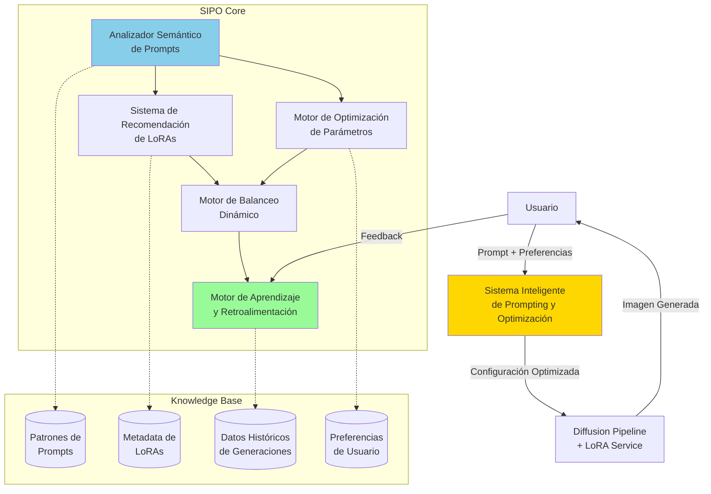
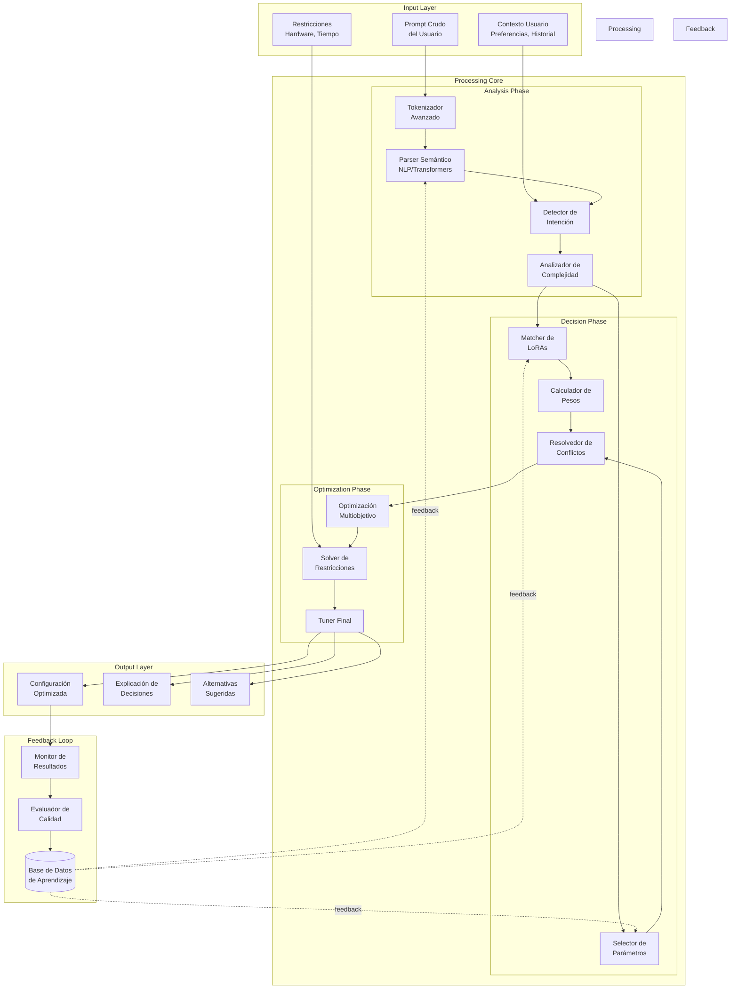
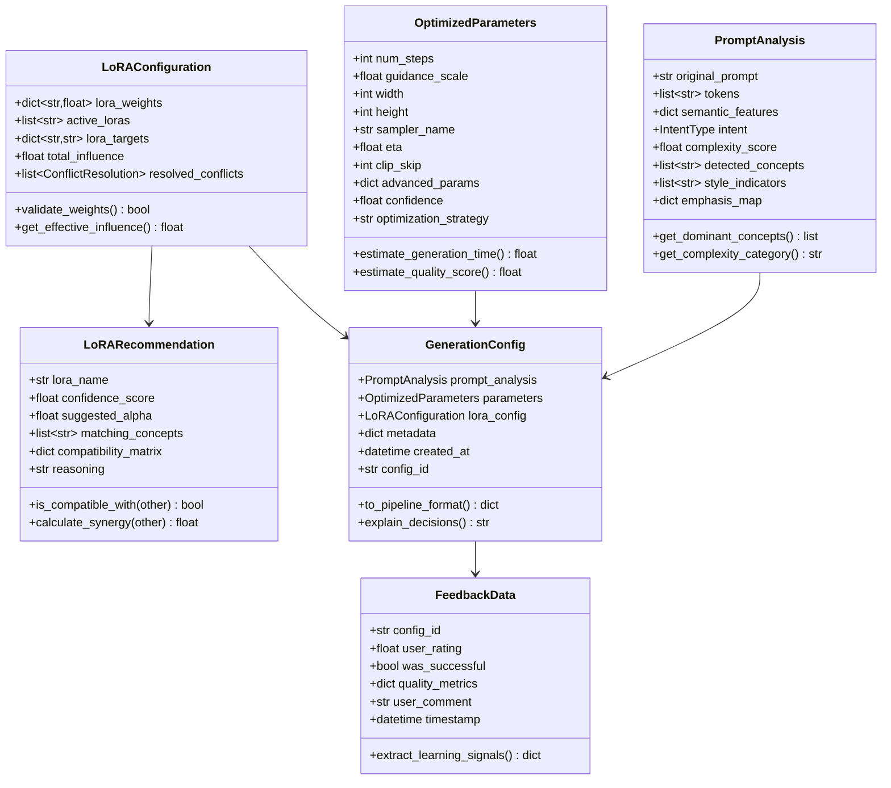
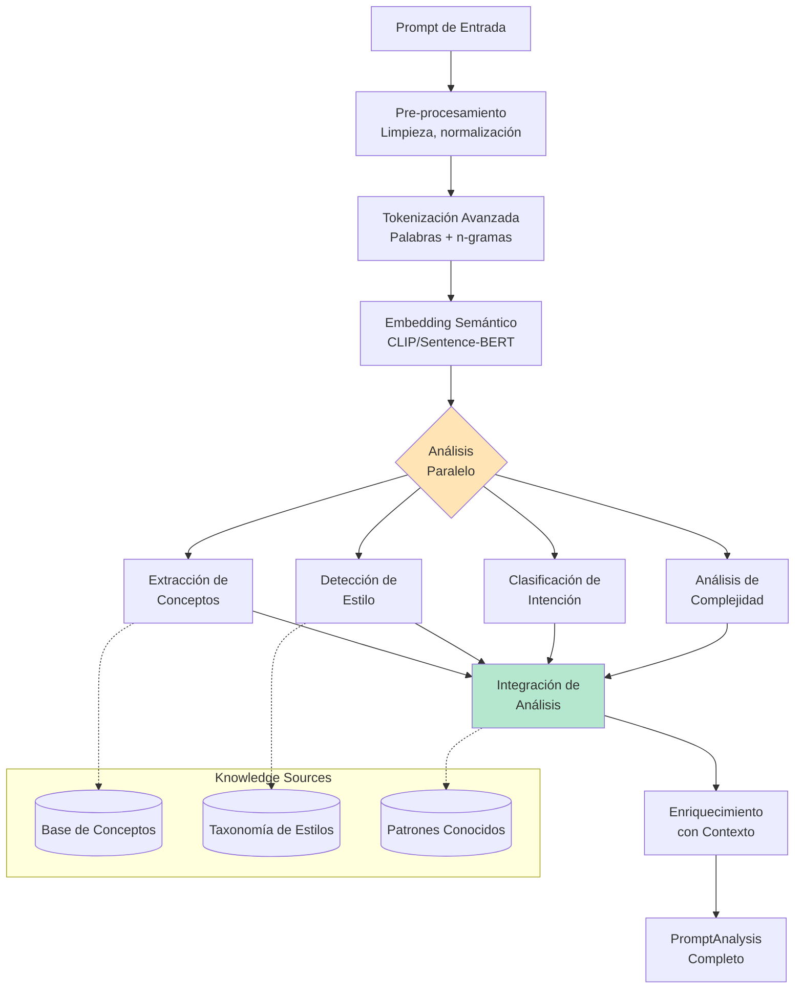
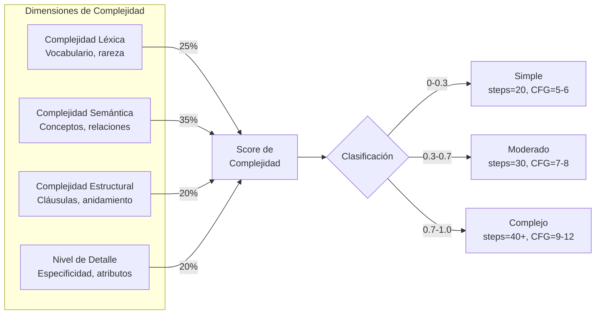
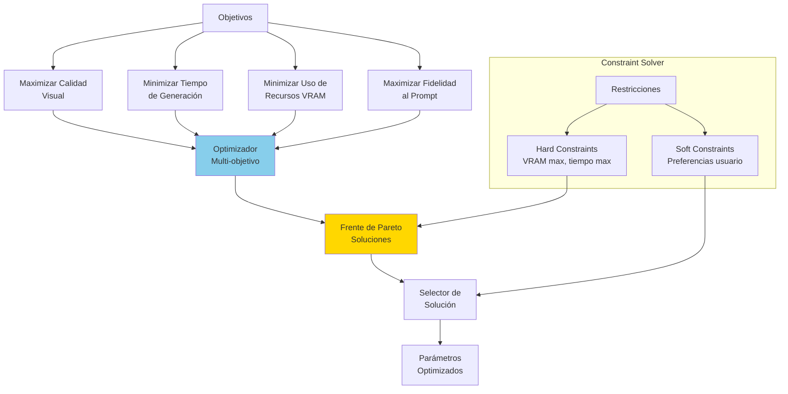
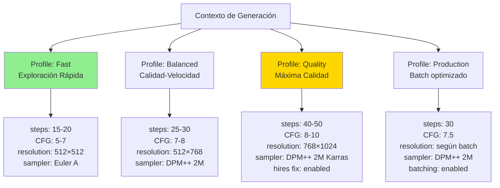
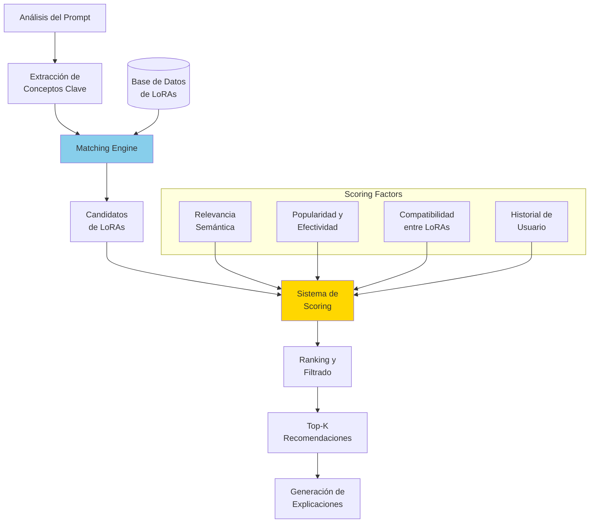

# Sistema Inteligente de Prompting y Optimización de Parámetros
## Arquitectura para Stable Diffusion con LoRA

**Versión**: 1.0  
**Fecha**: Octubre 2024  
**Estado**: Diseño Arquitectónico

---

## Tabla de Contenidos

1. [Visión General](#1-visión-general)
2. [Problemática Actual](#2-problemática-actual)
3. [Arquitectura del Sistema](#3-arquitectura-del-sistema)
4. [Analizador Semántico de Prompts](#4-analizador-semántico-de-prompts)
5. [Motor de Optimización de Parámetros](#5-motor-de-optimización-de-parámetros)
6. [Sistema de Recomendación de LoRAs](#6-sistema-de-recomendación-de-loras)
7. [Motor de Balanceo Dinámico](#7-motor-de-balanceo-dinámico)
8. [Aprendizaje y Retroalimentación](#8-aprendizaje-y-retroalimentación)
9. [Flujos de Operación](#9-flujos-de-operación)
10. [Casos de Uso](#10-casos-de-uso)

---

## 1. Visión General

### 1.1 Propósito

El **Sistema Inteligente de Prompting y Optimización** (SIPO) es una capa de inteligencia que se sitúa entre el usuario y el pipeline de difusión, con el objetivo de:

- **Analizar semánticamente** los prompts para entender intención y contexto
- **Optimizar automáticamente** parámetros de generación (steps, CFG, dimensiones)
- **Recomendar y seleccionar** LoRAs relevantes basándose en el contenido del prompt
- **Balancear dinámicamente** los pesos (alpha) de múltiples LoRAs
- **Aprender continuamente** de generaciones exitosas y feedback del usuario

### 1.2 Arquitectura de Alto Nivel



### 1.3 Principios de Diseño

1. **Inteligencia Contextual**: Entender el contexto completo del prompt, no solo keywords
2. **Optimización Multiobjetivo**: Balancear calidad, velocidad y recursos
3. **Aprendizaje Continuo**: Mejorar con cada generación y feedback
4. **Transparencia**: Explicar decisiones tomadas al usuario
5. **Adaptabilidad**: Ajustarse a diferentes estilos y preferencias de usuario

---

## 2. Problemática Actual

### 2.1 Limitaciones del Sistema Manual

**Selección de LoRAs**:
```
❌ Problema Actual:
Usuario: "1girl, anime style, magical powers, detailed background"

Sistema Manual:
- Usuario debe elegir manualmente: anime_lora, magic_lora, detail_lora
- No sabe qué pesos usar (¿0.7? ¿1.0? ¿1.5?)
- Puede haber conflictos entre LoRAs no detectados
- Prueba y error para encontrar combinación óptima

✅ Sistema Inteligente:
- Detecta automáticamente: estilo anime + concepto mágico + énfasis en detalles
- Recomienda: anime_style_lora (α=0.8), magic_effects_lora (α=0.6), detail_enhancer_lora (α=0.4)
- Detecta que magic_effects podría conflictuar con detail_enhancer → ajusta pesos
- Optimiza basándose en generaciones similares exitosas
```

**Parámetros de Generación**:
```
❌ Problema Actual:
- Valores por defecto genéricos (steps=30, CFG=7.5)
- No considera complejidad del prompt
- No adapta según estilo solicitado
- Desperdicia recursos o genera baja calidad

✅ Sistema Inteligente:
- Prompt simple ("cat") → steps=20, CFG=5.0 (rápido, suficiente)
- Prompt complejo ("detailed Victorian mansion...") → steps=40, CFG=9.0 (mayor fidelidad)
- Estilo fotorealista → CFG=8-10
- Estilo anime → CFG=6-8
```

### 2.2 Matriz de Decisiones Actual vs Inteligente

| Aspecto | Sistema Manual | Sistema Inteligente |
|---------|---------------|-------------------|
| **Selección LoRA** | Lista fija por usuario | Análisis semántico + recomendación |
| **Pesos LoRA** | Valores estáticos | Balanceo dinámico contextual |
| **Steps** | Default o manual | Optimizado por complejidad |
| **CFG Scale** | Fijo (7.5) | Ajustado por estilo/contenido |
| **Resolución** | Usuario decide | Sugerida según prompt |
| **Sampler** | Por defecto | Seleccionado por características |
| **Feedback** | Ninguno | Aprendizaje continuo |

---

## 3. Arquitectura del Sistema

### 3.1 Componentes Principales



### 3.2 Modelo de Datos del Sistema



---

## 4. Analizador Semántico de Prompts

### 4.1 Pipeline de Análisis



### 4.2 Detección de Intención

**Taxonomía de Intenciones**:

```
Intención Artística:
├─ Fotorealismo
│  ├─ Fotografía profesional
│  ├─ Render 3D realista
│  └─ Hiperrealismo
├─ Estilizado
│  ├─ Anime/Manga
│  ├─ Cartoon/Comic
│  ├─ Arte conceptual
│  └─ Pintura digital
├─ Artístico Tradicional
│  ├─ Óleo
│  ├─ Acuarela
│  └─ Carboncillo
└─ Experimental
   ├─ Surrealista
   ├─ Abstracto
   └─ Glitch art

Intención de Contenido:
├─ Retrato/Personaje
├─ Paisaje/Escenario
├─ Objeto/Producto
├─ Concepto/Idea
└─ Narrativa/Escena

Intención de Calidad:
├─ Alta fidelidad (masterpiece, detailed)
├─ Estándar
└─ Rápida/Exploratoria
```

**Algoritmo de Detección**:

```
1. Análisis de Keywords Dominantes:
   - Identificar términos clave por categoría
   - Calcular frecuencia ponderada
   - Detectar modificadores de énfasis

2. Análisis Semántico:
   - Embedding del prompt completo
   - Similitud coseno con prototipos de intención
   - Clasificación multi-label

3. Análisis Estructural:
   - Longitud y complejidad sintáctica
   - Presencia de calificadores
   - Estructura de cláusulas

4. Scoring Final:
   Intent_Score = 0.4×Keywords + 0.4×Semantic + 0.2×Structural
```

### 4.3 Análisis de Complejidad

**Métricas de Complejidad**:



**Ejemplos de Clasificación**:

| Prompt | Score | Clasificación | Reasoning |
|--------|-------|---------------|-----------|
| "cat" | 0.1 | Simple | Concepto único, sin detalles |
| "anime girl, blue eyes" | 0.3 | Simple-Moderado | 2 conceptos, modificador simple |
| "1girl, anime style, magical girl, detailed outfit, glowing effects, fantasy background" | 0.6 | Moderado | Múltiples conceptos, algunos detalles |
| "photorealistic portrait of a Victorian-era noble woman, intricate lace details, soft natural lighting, shallow depth of field, Rembrandt lighting, 85mm lens, f/1.4" | 0.9 | Complejo | Alto nivel técnico, múltiples atributos específicos |

### 4.4 Extracción de Conceptos y Taxonomía

**Estructura de Conceptos**:

```
Concepto Base:
├─ Categoría (character, object, scene, style, quality)
├─ Subcategoría
├─ Atributos
│  ├─ Visuales (color, forma, textura)
│  ├─ Semánticos (emoción, contexto)
│  └─ Técnicos (iluminación, composición)
├─ Relaciones con otros conceptos
└─ LoRAs compatibles
```

**Ejemplo de Extracción**:

```
Prompt: "1girl, silver hair, blue eyes, maid outfit, elegant pose, indoor cafe, soft lighting"

Conceptos Extraídos:
1. Character:
   - Type: girl
   - Attributes:
     * hair_color: silver (confidence: 1.0)
     * eye_color: blue (confidence: 1.0)
   - Compatible LoRAs: character_detail_lora, hair_quality_lora

2. Clothing:
   - Type: maid outfit
   - Style: elegant
   - Compatible LoRAs: clothing_detail_lora, outfit_variety_lora

3. Pose:
   - Type: elegant pose
   - Compatible LoRAs: pose_helper_lora

4. Setting:
   - Type: indoor
   - Specific: cafe
   - Compatible LoRAs: background_detail_lora, indoor_lighting_lora

5. Lighting:
   - Type: soft lighting
   - Compatible LoRAs: lighting_enhancer_lora
```

---

## 5. Motor de Optimización de Parámetros

### 5.1 Estrategia de Optimización Multiobjetivo



### 5.2 Parámetros a Optimizar

**1. Número de Steps**:

```
Función de Decisión:

steps = base_steps + complexity_bonus + quality_bonus - speed_penalty

Donde:
- base_steps = 20 (default)
- complexity_bonus = complexity_score × 30
- quality_bonus = quality_intent × 10
- speed_penalty = speed_priority × 10

Rangos:
- Mínimo: 15 steps (exploración rápida)
- Estándar: 20-30 steps
- Alta calidad: 35-50 steps
- Máximo: 60 steps (solo casos especiales)

Heurísticas:
IF prompt.complexity > 0.7 AND quality_intent = "high":
    steps >= 40
    
IF speed_priority = "high":
    steps = min(25, calculated_steps)
    
IF photorealistic_style:
    steps += 5  # Requiere más refinamiento
```

**2. Guidance Scale (CFG)**:

```
Función de Decisión:

cfg_scale = base_cfg + style_adjustment + complexity_adjustment

Donde:
- base_cfg = 7.5
- style_adjustment:
  * fotorealismo: +1.5 to +3.0
  * anime: -0.5 to +0.5
  * artístico: +0.5 to +1.5
- complexity_adjustment:
  * Simple: -1.0
  * Complejo: +1.5

Rangos por Estilo:
- Anime/Cartoon: 5.0 - 8.0
- Fotorealismo: 8.0 - 12.0
- Arte conceptual: 7.0 - 10.0
- Abstracto: 4.0 - 7.0

Reglas:
IF negative_prompt is empty:
    cfg_scale = max(5.0, cfg_scale - 1.0)
    
IF multiple_concepts > 5:
    cfg_scale += 0.5  # Mayor adherencia necesaria
```

**3. Resolución (Width × Height)**:

```
Función de Decisión:

1. Detectar Aspect Ratio del prompt:
   - Portrait: ratio ~= 0.75 (e.g., 512×768)
   - Landscape: ratio ~= 1.5 (e.g., 768×512)
   - Square: ratio = 1.0 (e.g., 512×512)
   - Panorama: ratio >= 2.0 (e.g., 1024×512)

2. Ajustar por Modelo:
   - SD 1.5: base = 512×512
   - SDXL: base = 1024×1024
   - SD3: base = 1024×1024

3. Ajustar por Detalle:
   IF detail_level = "high":
       resolution *= 1.5
   
4. Ajustar por Hardware:
   IF available_vram < 8GB:
       resolution = min(resolution, 768×768)

Sugerencias Comunes:
- Retrato: 512×768, 768×1024 (SDXL)
- Paisaje: 768×512, 1024×768 (SDXL)
- Producto: 512×512, 1024×1024 (SDXL)
```

**4. Sampler Selection**:

```
Matriz de Decisión:

Sampler por Características:

DPM++ 2M Karras:
  - Uso: General purpose, buena calidad
  - Velocidad: Media
  - Calidad: Alta
  - Mejor para: Fotorealismo, detalles

Euler A:
  - Uso: Creatividad, variación
  - Velocidad: Rápida
  - Calidad: Media-Alta
  - Mejor para: Arte conceptual, exploración

DDIM:
  - Uso: Coherencia, reproducibilidad
  - Velocidad: Media
  - Calidad: Media
  - Mejor para: Composiciones específicas

LMS Karras:
  - Uso: Suavidad, balance
  - Velocidad: Media-Lenta
  - Calidad: Alta
  - Mejor para: Retratos, personajes

Reglas de Selección:
IF style = "photorealistic":
    sampler = "DPM++ 2M Karras" or "DPM++ SDE Karras"
ELIF style = "anime":
    sampler = "Euler A" or "DPM++ 2M"
ELIF priority = "speed":
    sampler = "Euler A"
ELIF priority = "quality":
    sampler = "DPM++ 2M Karras"
```

### 5.3 Optimización Dinámica por Contexto

**Profiles de Optimización**:



---

## 6. Sistema de Recomendación de LoRAs

### 6.1 Arquitectura del Recommender



### 6.2 Metadata de LoRAs

**Estructura de Metadata**:

```
LoRA Metadata Schema:

{
  "lora_id": "anime_style_v2",
  "name": "Anime Style Enhancer v2",
  "version": "2.0",
  "base_model": "sdxl",
  "type": "style",
  
  "semantic_tags": {
    "primary": ["anime", "manga", "2d"],
    "secondary": ["cel_shading", "lineart", "vibrant_colors"],
    "concepts": ["character", "portrait", "illustration"]
  },
  
  "training_info": {
    "dataset_size": 5000,
    "dataset_description": "High-quality anime artwork",
    "trigger_words": ["anime style", "anime", "manga style"],
    "recommended_weight": 0.7,
    "weight_range": [0.4, 1.2]
  },
  
  "compatibility": {
    "works_well_with": ["detail_enhancer", "background_blur"],
    "conflicts_with": ["photorealistic_lora", "3d_render_lora"],
    "complementary": ["lineart_lora", "color_pop_lora"]
  },
  
  "performance": {
    "avg_user_rating": 4.7,
    "usage_count": 15000,
    "success_rate": 0.89,
    "avg_generation_time_impact": 1.05
  },
  
  "technical": {
    "rank": 64,
    "target_modules": ["attention", "mlp"],
    "size_mb": 144,
    "precision": "fp16"
  }
}
```

### 6.3 Algoritmo de Matching

**Multi-Stage Matching Pipeline**:

```
Stage 1: Filtrado Inicial (Hard Filters)
├─ Compatibilidad con modelo base
├─ Disponibilidad del LoRA
└─ Restricciones de