# LoRA Service - Documentación Técnica Detallada

## Tabla de Contenidos
1. [Visión General](#vision-general)
2. [Arquitectura del Servicio](#arquitectura)
3. [Componentes Principales](#componentes)
4. [Flujos de Procesamiento](#flujos)
5. [Estructura de Datos](#datos)
6. [Algoritmos Clave](#algoritmos)
7. [Casos de Uso](#casos-uso)

---

## 1. Visión General {#vision-general}

### Propósito
Servicio central para la gestión completa del ciclo de vida de adaptadores LoRA (Low-Rank Adaptation) en modelos de difusión. Maneja carga, fusión, inyección y manipulación de pesos LoRA.

### Responsabilidades Principales
- Carga de archivos LoRA desde formatos safetensors/pickle
- Parsing y validación de estructuras de pesos
- Fusión de múltiples LoRAs con diferentes estrategias
- Gestión de memoria y cache de LoRAs cargados
- Cálculo de pesos delta para inyección
- Compatibilidad entre arquitecturas (SD1.5, SDXL, Pony)

### Conceptos Fundamentales de LoRA

**¿Qué es LoRA?**
LoRA descompone actualizaciones de pesos en matrices de bajo rango:
```
W_new = W_original + (alpha/rank) * (A @ B)
```
Donde:
- `A`: Matriz down-projection (d × r)
- `B`: Matriz up-projection (r × d)
- `r`: Rango (típicamente 4-128)
- `alpha`: Factor de escala (típicamente 1.0-32.0)

**Ventajas**:
- Reducción drástica de parámetros entrenables (~0.1% del modelo)
- Entrenamiento rápido y eficiente en memoria
- Fácil composición de múltiples estilos
- Sin degradación del modelo base

---

## 2. Arquitectura del Servicio {#arquitectura}

### Diagrama de Componentes

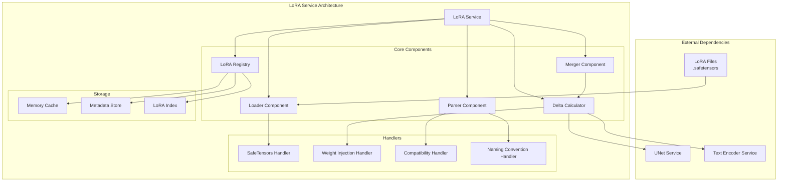

### Estructura de Clases

```python
class LoRAService:
    """Servicio principal de gestión de LoRAs."""
    
    def __init__(
        self,
        safetensors_handler: SafeTensorsHandler,
        weight_injection_handler: WeightInjectionHandler,
        compatibility_handler: CompatibilityHandler,
        naming_handler: NamingConventionHandler
    ):
        self.safetensors_handler = safetensors_handler
        self.weight_injection = weight_injection_handler
        self.compatibility = compatibility_handler
        self.naming = naming_handler
        
        # Storage interno
        self._loaded_loras: dict[str, LoRAWeights] = {}
        self._lora_cache: LRUCache = LRUCache(maxsize=50)
        self._metadata_index: dict[str, LoRAMetadata] = {}
        
        # Configuración
        self._auto_detect_rank: bool = True
        self._auto_detect_alpha: bool = True
        self._strict_validation: bool = True
```

---

## 3. Componentes Principales {#componentes}

### 3.1 Loader Component

**Responsabilidad**: Carga física de archivos LoRA desde disco.

```python
class LoRALoader:
    """Carga archivos LoRA desde múltiples formatos."""
    
    def load_from_file(
        self,
        path: Path,
        format: Literal["safetensors", "pickle", "auto"] = "auto"
    ) -> dict[str, np.ndarray]:
        """
        Carga tensores desde archivo.
        
        Args:
            path: Ruta al archivo LoRA
            format: Formato del archivo
            
        Returns:
            Diccionario {tensor_name: tensor_data}
        """
        if format == "auto":
            format = self._detect_format(path)
        
        if format == "safetensors":
            return self._load_safetensors(path)
        elif format == "pickle":
            return self._load_pickle(path)
        else:
            raise ValueError(f"Unsupported format: {format}")
    
    def _load_safetensors(self, path: Path) -> dict[str, np.ndarray]:
        """Carga usando safetensors (recomendado)."""
        from safetensors.numpy import load_file
        return load_file(str(path))
    
    def _load_pickle(self, path: Path) -> dict[str, np.ndarray]:
        """Carga usando pickle (legacy, no recomendado)."""
        import pickle
        with open(path, 'rb') as f:
            state_dict = pickle.load(f)
        return {k: v.numpy() for k, v in state_dict.items()}
    
    def _detect_format(self, path: Path) -> str:
        """Detecta formato basándose en extensión y contenido."""
        if path.suffix == ".safetensors":
            return "safetensors"
        elif path.suffix in [".pt", ".pth", ".bin"]:
            return "pickle"
        else:
            raise ValueError(f"Cannot detect format for {path}")
```

**Características**:
- Soporte para safetensors (seguro, rápido)
- Soporte legacy para pickle (inseguro, lento)
- Detección automática de formato
- Validación de integridad de archivo
- Manejo de archivos corruptos

---

### 3.2 Parser Component

**Responsabilidad**: Extracción e interpretación de estructura LoRA desde tensores crudos.

```python
class LoRAParser:
    """Parsea tensores crudos en estructura LoRAWeights."""
    
    def parse(
        self,
        tensors: dict[str, np.ndarray],
        adapter_name: str,
        config: LoRAConfig
    ) -> LoRAWeights:
        """
        Parsea diccionario de tensores en estructura LoRAWeights.
        
        Args:
            tensors: Tensores crudos del archivo
            adapter_name: Nombre del adaptador
            config: Configuración de parsing
            
        Returns:
            Estructura LoRAWeights completamente poblada
        """
        # Detectar convención de nombres
        convention = self._detect_naming_convention(tensors)
        
        # Extraer componentes
        lora_up, lora_down = self._extract_matrices(tensors, convention)
        target_modules = self._extract_target_modules(tensors, convention)
        rank = self._detect_rank(lora_down, config)
        alpha = self._extract_alpha(tensors, config)
        
        # Validar consistencia
        self._validate_structure(lora_up, lora_down, target_modules, rank)
        
        return LoRAWeights(
            adapter_name=adapter_name,
            rank=rank,
            alpha=alpha,
            target_modules=target_modules,
            lora_up=lora_up,
            lora_down=lora_down,
            metadata=self._extract_metadata(tensors, convention)
        )
    
    def _detect_naming_convention(
        self,
        tensors: dict[str, np.ndarray]
    ) -> NamingConvention:
        """
        Detecta convención de nombres usada en el LoRA.
        
        Convenciones comunes:
        - Kohya SS: "lora_unet_down_blocks_0_attentions_0_proj_in.lora_down.weight"
        - Diffusers: "unet.down_blocks.0.attentions.0.proj_in.lora_down"
        - A1111: "lora_te_text_model_encoder_layers_0_self_attn_q_proj.lora_down.weight"
        - Custom: Variaciones arbitrarias
        """
        sample_keys = list(tensors.keys())[:10]
        
        if any("lora_unet" in k for k in sample_keys):
            return NamingConvention.KOHYA_SS
        elif any("unet.down_blocks" in k for k in sample_keys):
            return NamingConvention.DIFFUSERS
        elif any("lora_te" in k for k in sample_keys):
            return NamingConvention.A1111
        else:
            return NamingConvention.CUSTOM
    
    def _extract_matrices(
        self,
        tensors: dict[str, np.ndarray],
        convention: NamingConvention
    ) -> tuple[dict[str, np.ndarray], dict[str, np.ndarray]]:
        """
        Extrae matrices up y down de tensores.
        
        Returns:
            (lora_up, lora_down) donde cada uno es {module_name: matrix}
        """
        lora_up = {}
        lora_down = {}
        
        for key, tensor in tensors.items():
            if not self._is_lora_tensor(key):
                continue
            
            module_name = self._extract_module_name(key, convention)
            
            if self._is_up_projection(key):
                lora_up[module_name] = tensor
            elif self._is_down_projection(key):
                lora_down[module_name] = tensor
        
        return lora_up, lora_down
    
    def _extract_module_name(
        self,
        tensor_key: str,
        convention: NamingConvention
    ) -> str:
        """
        Extrae nombre normalizado del módulo desde key del tensor.
        
        Ejemplos:
        Input:  "lora_unet_down_blocks_0_attentions_0_proj_in.lora_down.weight"
        Output: "unet.down_blocks.0.attentions.0.proj_in"
        
        Input:  "lora_te_text_model_encoder_layers_0_self_attn_q_proj.lora_up.weight"
        Output: "text_encoder.encoder.layers.0.self_attn.q_proj"
        """
        if convention == NamingConvention.KOHYA_SS:
            return self._parse_kohya_name(tensor_key)
        elif convention == NamingConvention.DIFFUSERS:
            return self._parse_diffusers_name(tensor_key)
        elif convention == NamingConvention.A1111:
            return self._parse_a1111_name(tensor_key)
        else:
            return self._parse_custom_name(tensor_key)
    
    def _detect_rank(
        self,
        lora_down: dict[str, np.ndarray],
        config: LoRAConfig
    ) -> int:
        """
        Detecta rank de las matrices LoRA.
        
        El rank es la dimensión compartida entre up y down:
        down: (rank, input_dim)
        up: (output_dim, rank)
        """
        if config.rank is not None:
            return config.rank
        
        # Inferir desde primera matriz down
        first_down = next(iter(lora_down.values()))
        return first_down.shape[0]  # Primera dimensión es el rank
    
    def _extract_alpha(
        self,
        tensors: dict[str, np.ndarray],
        config: LoRAConfig
    ) -> float:
        """
        Extrae valor de alpha del LoRA.
        
        Alpha puede estar:
        1. En metadata/header del archivo
        2. Como tensor separado (key: "alpha" o "lora_alpha")
        3. Especificado en config
        4. Default: rank (scaling neutro)
        """
        if config.alpha is not None:
            return config.alpha
        
        # Buscar en tensores
        for key in ["alpha", "lora_alpha", "scale"]:
            if key in tensors:
                return float(tensors[key])
        
        # Buscar en metadata
        if "metadata" in tensors:
            metadata = tensors["metadata"]
            if "alpha" in metadata:
                return float(metadata["alpha"])
        
        # Default: mismo que rank (scaling = 1.0)
        return float(self._detect_rank({}, config))
    
    def _validate_structure(
        self,
        lora_up: dict[str, np.ndarray],
        lora_down: dict[str, np.ndarray],
        target_modules: list[str],
        rank: int
    ) -> None:
        """
        Valida consistencia de estructura LoRA.
        
        Validaciones:
        1. Cada módulo tiene both up y down
        2. Dimensiones son compatibles
        3. Rank es consistente
        4. No hay módulos duplicados
        """
        # Validar paridad up/down
        up_modules = set(lora_up.keys())
        down_modules = set(lora_down.keys())
        
        if up_modules != down_modules:
            missing_up = down_modules - up_modules
            missing_down = up_modules - down_modules
            raise ValueError(
                f"Inconsistent LoRA structure.\n"
                f"Missing up matrices: {missing_up}\n"
                f"Missing down matrices: {missing_down}"
            )
        
        # Validar dimensiones y rank
        for module in target_modules:
            up_matrix = lora_up[module]
            down_matrix = lora_down[module]
            
            # down: (rank, input_dim)
            # up: (output_dim, rank)
            if down_matrix.shape[0] != rank:
                raise ValueError(
                    f"Module {module}: down matrix rank {down_matrix.shape[0]} "
                    f"doesn't match expected rank {rank}"
                )
            
            if up_matrix.shape[1] != rank:
                raise ValueError(
                    f"Module {module}: up matrix rank {up_matrix.shape[1]} "
                    f"doesn't match expected rank {rank}"
                )
            
            # Validar que dimensiones son compatibles para multiplicación
            if down_matrix.shape[0] != up_matrix.shape[1]:
                raise ValueError(
                    f"Module {module}: incompatible matrix dimensions for multiplication.\n"
                    f"down: {down_matrix.shape}, up: {up_matrix.shape}"
                )
```

**Parsing de Convenciones de Nombres**:

```python
def _parse_kohya_name(self, key: str) -> str:
    """
    Kohya SS format:
    "lora_unet_down_blocks_0_attentions_0_proj_in.lora_down.weight"
    
    Parsing steps:
    1. Remove prefix "lora_"
    2. Remove suffix ".lora_down.weight" or ".lora_up.weight"
    3. Replace underscores with dots for indexing
    4. Normalize component names
    """
    # Remove lora prefix
    name = key.replace("lora_", "")
    
    # Remove suffix
    for suffix in [".lora_down.weight", ".lora_up.weight", ".alpha"]:
        if name.endswith(suffix):
            name = name[:-len(suffix)]
            break
    
    # Convert unet/te prefixes
    if name.startswith("unet_"):
        name = "unet." + name[5:]
    elif name.startswith("te_"):
        name = "text_encoder." + name[3:]
    
    # Replace numeric underscores with dots
    # "down_blocks_0" -> "down_blocks.0"
    parts = name.split("_")
    normalized = []
    for i, part in enumerate(parts):
        if part.isdigit() and i > 0:
            normalized[-1] += f".{part}"
        else:
            normalized.append(part)
    
    return ".".join(normalized)
```

---

### 3.3 Merger Component

**Responsabilidad**: Fusión de múltiples LoRAs en un solo adaptador.

```python
class LoRAMerger:
    """Fusiona múltiples LoRAs usando diferentes estrategias."""
    
    def merge(
        self,
        loras: list[LoRAWeights],
        weights: list[float],
        strategy: MergeStrategy = MergeStrategy.WEIGHTED_SUM
    ) -> LoRAWeights:
        """
        Fusiona lista de LoRAs con pesos dados.
        
        Args:
            loras: Lista de LoRAWeights a fusionar
            weights: Peso para cada LoRA (debe sumar ~1.0)
            strategy: Estrategia de fusión
            
        Returns:
            Nuevo LoRAWeights fusionado
        """
        # Normalizar pesos
        normalized_weights = self._normalize_weights(weights)
        
        # Validar compatibilidad
        self._validate_mergeable(loras)
        
        # Aplicar estrategia
        if strategy == MergeStrategy.WEIGHTED_SUM:
            return self._merge_weighted_sum(loras, normalized_weights)
        elif strategy == MergeStrategy.CONCATENATE:
            return self._merge_concatenate(loras, normalized_weights)
        elif strategy == MergeStrategy.SVD:
            return self._merge_svd(loras, normalized_weights)
        elif strategy == MergeStrategy.LEARNED:
            return self._merge_learned(loras, normalized_weights)
        else:
            raise ValueError(f"Unknown merge strategy: {strategy}")
    
    def _merge_weighted_sum(
        self,
        loras: list[LoRAWeights],
        weights: list[float]
    ) -> LoRAWeights:
        """
        Fusión por suma ponderada de matrices up/down.
        
        Fórmula:
        merged_up[module] = Σ(weight_i * lora_i.up[module])
        merged_down[module] = Σ(weight_i * lora_i.down[module])
        
        Ventajas:
        - Simple y rápido
        - Mantiene rank original
        - Interpretable
        
        Desventajas:
        - Puede diluir features especializados
        - No maneja conflictos explícitamente
        """
        # Unión de todos los módulos objetivo
        all_modules = set()
        for lora in loras:
            all_modules.update(lora.target_modules)
        
        merged_up = {}
        merged_down = {}
        
        for module in all_modules:
            # Acumular up matrices
            up_sum = None
            for lora, weight in zip(loras, weights):
                if module in lora.lora_up:
                    contribution = weight * lora.lora_up[module]
                    if up_sum is None:
                        up_sum = contribution.copy()
                    else:
                        up_sum += contribution
            
            # Acumular down matrices
            down_sum = None
            for lora, weight in zip(loras, weights):
                if module in lora.lora_down:
                    contribution = weight * lora.lora_down[module]
                    if down_sum is None:
                        down_sum = contribution.copy()
                    else:
                        down_sum += contribution
            
            if up_sum is not None and down_sum is not None:
                merged_up[module] = up_sum
                merged_down[module] = down_sum
        
        # Calcular rank y alpha promedio
        avg_rank = int(np.mean([lora.rank for lora in loras]))
        weighted_alpha = sum(w * lora.alpha for w, lora in zip(weights, loras))
        
        return LoRAWeights(
            adapter_name="_".join(lora.adapter_name for lora in loras),
            rank=avg_rank,
            alpha=weighted_alpha,
            target_modules=list(all_modules),
            lora_up=merged_up,
            lora_down=merged_down,
            metadata={
                "merge_strategy": "weighted_sum",
                "source_loras": [lora.adapter_name for lora in loras],
                "merge_weights": weights
            }
        )
    
    def _merge_svd(
        self,
        loras: list[LoRAWeights],
        weights: list[float]
    ) -> LoRAWeights:
        """
        Fusión usando SVD para mantener rank bajo.
        
        Proceso:
        1. Calcular delta weights de cada LoRA: ΔW_i = up_i @ down_i
        2. Sumar ponderadamente: ΔW_merged = Σ(weight_i * ΔW_i)
        3. Descomponer con SVD: ΔW_merged = U @ S @ V^T
        4. Truncar a rank deseado: U[:, :r] @ S[:r] @ V^T[:r, :]
        5. Re-factorizar: up = U[:, :r] @ sqrt(S[:r]), down = sqrt(S[:r]) @ V^T[:r, :]
        
        Ventajas:
        - Mantiene rank bajo y controlado
        - Captura estructura principal
        - Reduce overfitting
        
        Desventajas:
        - Más costoso computacionalmente
        - Puede perder detalles finos
        """
        all_modules = set()
        for lora in loras:
            all_modules.update(lora.target_modules)
        
        target_rank = min(lora.rank for lora in loras)
        
        merged_up = {}
        merged_down = {}
        
        for module in all_modules:
            # Calcular delta weights ponderados
            delta_sum = None
            for lora, weight in zip(loras, weights):
                if module not in lora.lora_up or module not in lora.lora_down:
                    continue
                
                # Calcular delta de este LoRA
                delta = lora.compute_delta_weights(scaling=1.0)[module]
                
                if delta_sum is None:
                    delta_sum = weight * delta
                else:
                    delta_sum += weight * delta
            
            if delta_sum is None:
                continue
            
            # Descomponer con SVD
            U, S, Vt = np.linalg.svd(delta_sum, full_matrices=False)
            
            # Truncar a target rank
            U_r = U[:, :target_rank]
            S_r = S[:target_rank]
            Vt_r = Vt[:target_rank, :]
            
            # Re-factorizar en up/down
            sqrt_S = np.sqrt(S_r)
            merged_up[module] = U_r @ np.diag(sqrt_S)
            merged_down[module] = np.diag(sqrt_S) @ Vt_r
        
        return LoRAWeights(
            adapter_name=f"svd_merged_{target_rank}",
            rank=target_rank,
            alpha=sum(w * lora.alpha for w, lora in zip(weights, loras)),
            target_modules=list(all_modules),
            lora_up=merged_up,
            lora_down=merged_down,
            metadata={
                "merge_strategy": "svd",
                "target_rank": target_rank,
                "source_loras": [lora.adapter_name for lora in loras],
                "merge_weights": weights
            }
        )
```

---

### 3.4 Delta Calculator

**Responsabilidad**: Cálculo de pesos delta para inyección.

```python
class DeltaCalculator:
    """Calcula pesos delta de LoRA para inyección en modelo."""
    
    def compute_delta_weights(
        self,
        lora: LoRAWeights,
        scaling: float = 1.0,
        selective_modules: list[str] | None = None
    ) -> dict[str, np.ndarray]:
        """
        Calcula delta weights: ΔW = (alpha/rank) * up @ down * scaling
        
        Args:
            lora: LoRA weights structure
            scaling: Factor de escala adicional
            selective_modules: Si se especifica, solo calcular para estos módulos
            
        Returns:
            Dict {module_name: delta_weight_matrix}
        """
        delta_weights = {}
        scale_factor = (lora.alpha / lora.rank) * scaling
        
        modules_to_process = (
            selective_modules 
            if selective_modules is not None 
            else lora.target_modules
        )
        
        for module_name in modules_to_process:
            if module_name not in lora.lora_up or module_name not in lora.lora_down:
                continue
            
            # Multiplicación matricial up @ down
            delta = lora.lora_up[module_name] @ lora.lora_down[module_name]
            
            # Aplicar scaling
            delta = scale_factor * delta
            
            delta_weights[module_name] = delta
        
        return delta_weights
    
    def compute_delta_with_mask(
        self,
        lora: LoRAWeights,
        spatial_mask: np.ndarray,
        scaling: float = 1.0
    ) -> dict[str, np.ndarray]:
        """
        Calcula delta weights con máscara espacial.
        
        Útil para aplicar LoRA solo en regiones específicas de la imagen.
        
        Args:
            lora: LoRA weights
            spatial_mask: Máscara binaria (H, W) indicando regiones activas
            scaling: Factor de escala
            
        Returns:
            Delta weights modulados espacialmente
        """
        base_deltas = self.compute_delta_weights(lora, scaling)
        masked_deltas = {}
        
        for module, delta in base_deltas.items():
            # Aplicar máscara si el módulo es espacial (convoluciones)
            if self._is_spatial_module(module):
                # Broadcast mask a dimensiones del delta
                mask_expanded = self._expand_mask_to_delta(spatial_mask, delta.shape)
                masked_deltas[module] = delta * mask_expanded
            else:
                # Para módulos no espaciales (linear layers), aplicar sin máscara
                masked_deltas[module] = delta
        
        return masked_deltas
    
    def compute_progressive_deltas(
        self,
        lora: LoRAWeights,
        num_steps: int,
        schedule: Literal["linear", "cosine", "exponential"] = "linear"
    ) -> list[dict[str, np.ndarray]]:
        """
        Genera secuencia de deltas con scheduling.
        
        Útil para aplicación progresiva de LoRA durante generación.
        
        Args:
            lora: LoRA weights
            num_steps: Número de pasos de denoising
            schedule: Tipo de scheduling de intensidad
            
        Returns:
            Lista de delta dicts, uno por timestep
        """
        # Generar schedule de scaling
        scales = self._generate_schedule(num_steps, schedule)
        
        # Computar delta para cada scale
        progressive_deltas = []
        for scale in scales:
            delta = self.compute_delta_weights(lora, scaling=scale)
            progressive_deltas.append(delta)
        
        return progressive_deltas
    
    def _generate_schedule(
        self,
        num_steps: int,
        schedule_type: str
    ) -> np.ndarray:
        """
        Genera curva de scheduling.
        
        Returns:
            Array de shape (num_steps,) con valores de scaling
        """
        t = np.linspace(0, 1, num_steps)
        
        if schedule_type == "linear":
            # Decaimiento lineal: 1.0 → 0.0
            return 1.0 - t
        
        elif schedule_type == "cosine":
            # Decaimiento suave coseno
            return 0.5 * (1 + np.cos(np.pi * t))
        
        elif schedule_type == "exponential":
            # Decaimiento exponencial
            return np.exp(-5 * t)
        
        else:
            raise ValueError(f"Unknown schedule type: {schedule_type}")
```

---

## 4. Flujos de Procesamiento {#flujos}

### 4.1 Flujo de Carga de LoRA

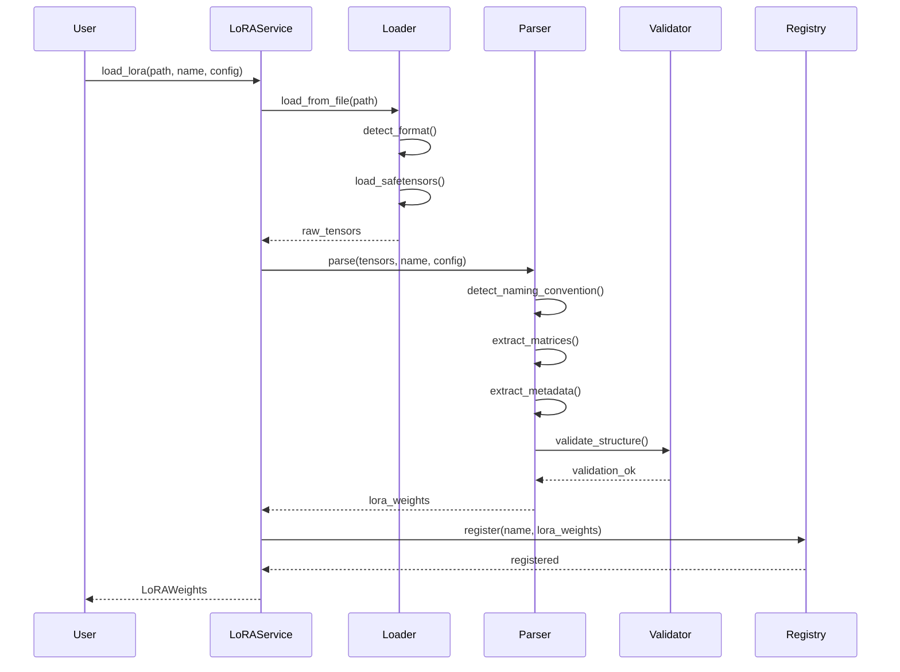

### 4.2 Flujo de Fusión de Múltiples LoRAs

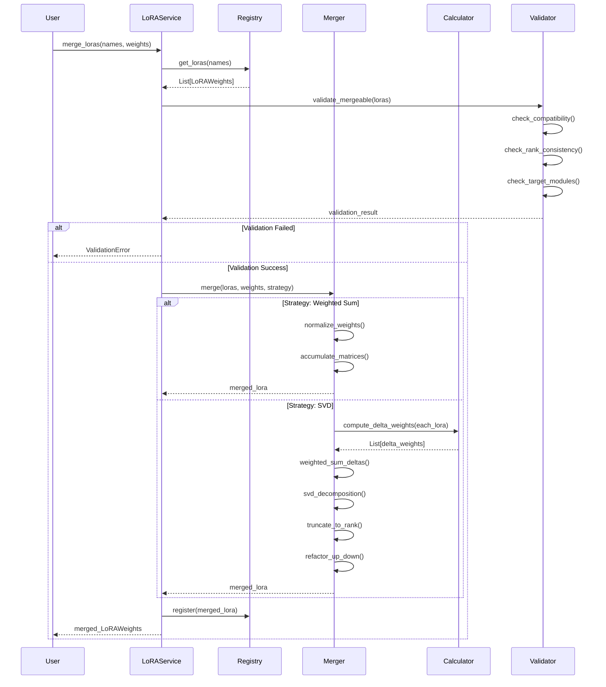

### 4.3 Flujo de Inyección en Pipeline

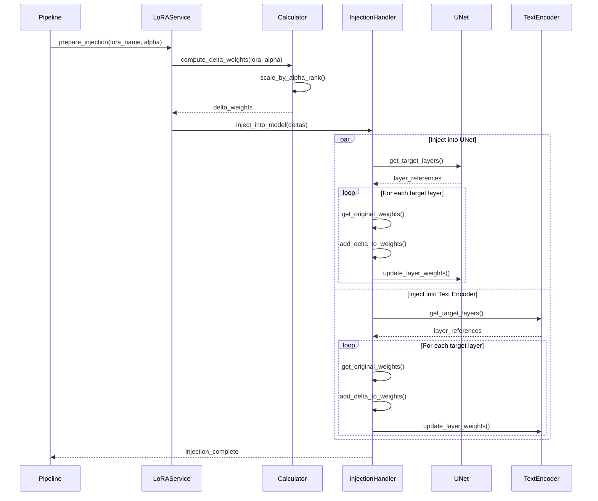

---

## 5. Estructura de Datos {#datos}

### 5.1 LoRAWeights - Estructura Principal

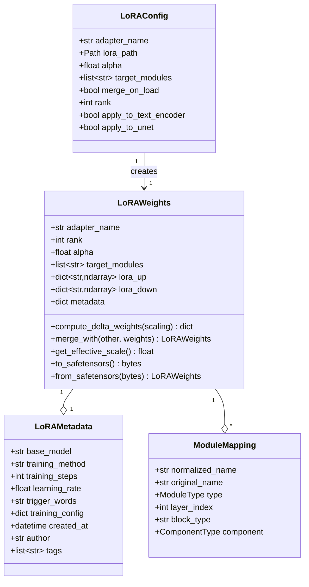

### 5.2 Jerarquía de Módulos Objetivo

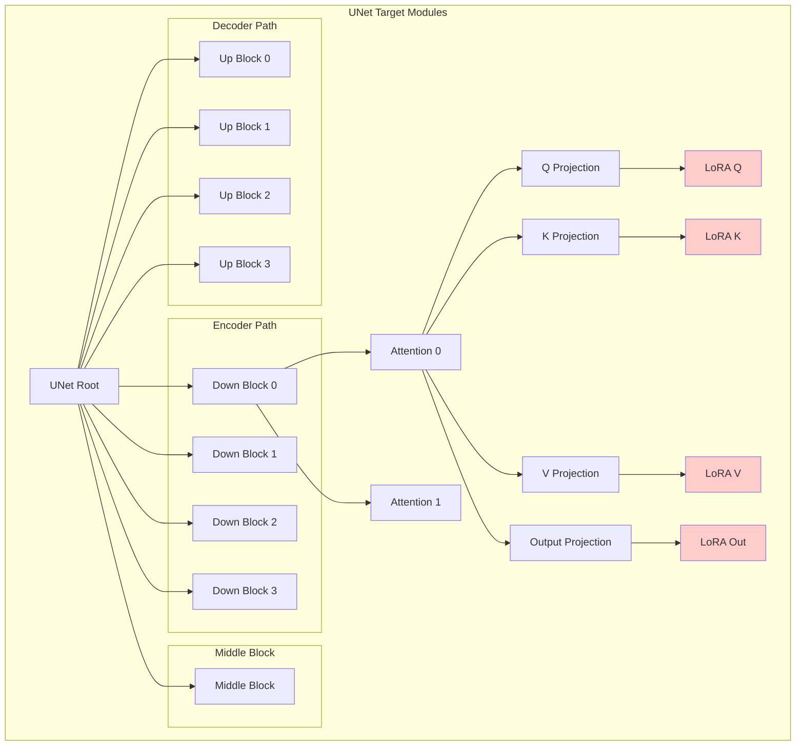

### 5.3 Estructura de Registro (Registry)

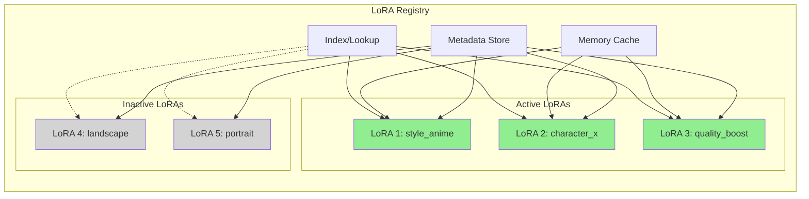

---

## 6. Algoritmos Clave {#algoritmos}

### 6.1 Algoritmo de Detección de Convención de Nombres

**Objetivo**: Identificar automáticamente el formato de nombres usado en un archivo LoRA.

**Entrada**: Diccionario de tensores con sus keys

**Salida**: Enum NamingConvention

**Proceso**:

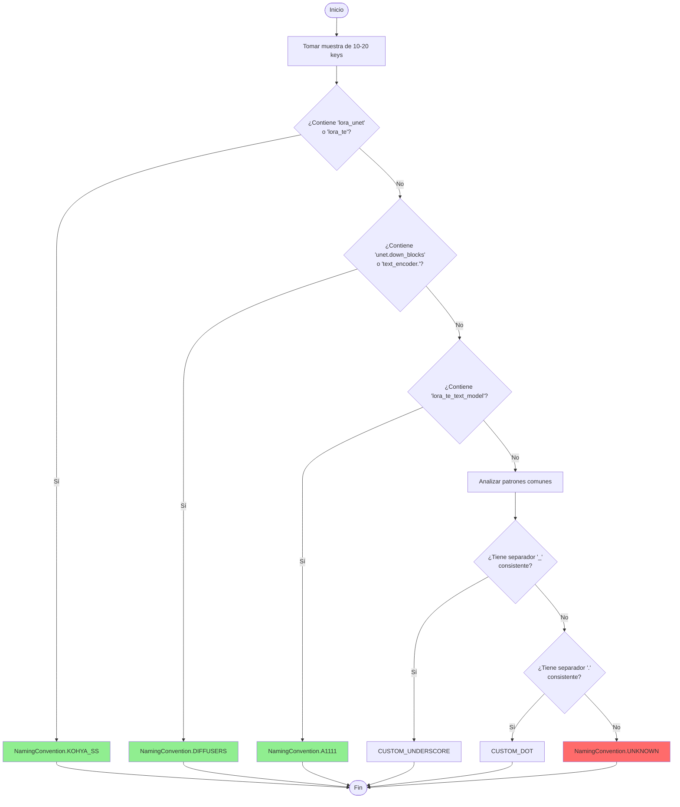

**Heurísticas Específicas**:

- **Kohya SS**: Prefijo "lora_" + componente (unet/te) + underscores para jerarquía
- **Diffusers**: Notación de puntos jerárquica + sin prefijos especiales
- **A1111**: Prefijo "lora_te" para text encoder + nombres descriptivos largos
- **Custom**: Patrones no estándar que requieren configuración manual

---

### 6.2 Algoritmo de Fusión SVD

**Objetivo**: Fusionar múltiples LoRAs manteniendo rank bajo mediante descomposición SVD.

**Entrada**: 
- Lista de N LoRAWeights
- Lista de N pesos (suman 1.0)
- Target rank deseado

**Salida**: Nuevo LoRAWeights fusionado

**Proceso**:

```mermaid
flowchart TD
    Start([Inicio: N LoRAs]) --> Union[Unión de target modules]
    
    Union --> LoopStart{Para cada módulo}
    
    LoopStart --> ComputeDelta[Computar delta weights<br/>de cada LoRA:<br/>Δᵢ = upᵢ @ downᵢ]
    
    ComputeDelta --> WeightedSum[Suma ponderada:<br/>Δ = Σ wᵢ·Δᵢ]
    
    WeightedSum --> SVD[Descomposición SVD:<br/>Δ = U·S·Vᵀ]
    
    SVD --> Truncate[Truncar a rank r:<br/>U[:,:r], S[:r], Vᵀ[:r,:]]
    
    Truncate --> Refactor[Re-factorizar:<br/>up = U[:,:r]·√S[:r]<br/>down = √S[:r]·Vᵀ[:r,:]]
    
    Refactor --> Store[Guardar up/down<br/>en merged LoRA]
    
    Store --> LoopEnd{¿Más módulos?}
    
    LoopEnd -->|Sí| LoopStart
    LoopEnd -->|No| Finalize[Calcular rank y alpha<br/>promedios]
    
    Finalize --> End([Fin: LoRA fusionado])
    
    style SVD fill:#FFD700
    style Truncate fill:#FFD700
    style Refactor fill:#FFD700
```

**Ventajas del SVD Merge**:
- Mantiene estructura principal de las transformaciones
- Reduce rank efectivo (menos parámetros)
- Elimina componentes redundantes
- Produce LoRA más limpio y eficiente

**Consideraciones**:
- Costoso computacionalmente (O(n³) por módulo)
- Puede perder detalles finos de LoRAs originales
- Requiere ajuste de target rank según caso de uso

---

### 6.3 Algoritmo de Validación de Compatibilidad

**Objetivo**: Verificar que un LoRA es compatible con un modelo base antes de cargarlo.

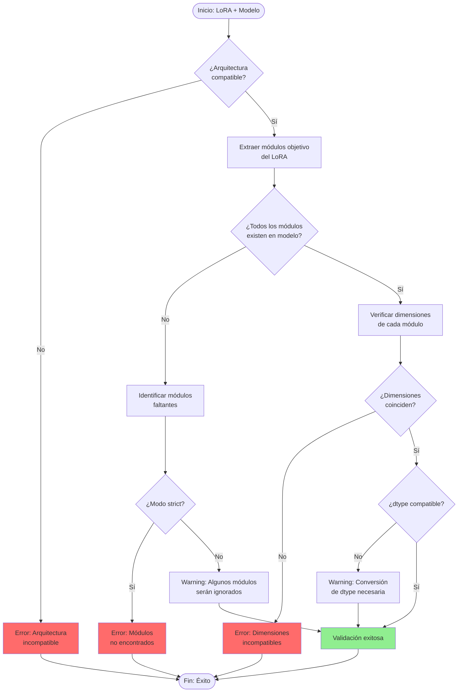

**Validaciones Específicas**:

1. **Arquitectura**: SD1.5 LoRA no funciona en SDXL
2. **Módulos**: Todos los target modules deben existir
3. **Dimensiones**: up/down deben ser compatibles con pesos del modelo
4. **Dtype**: float16/float32 compatibility

---

### 6.4 Algoritmo de Scheduling de Pesos

**Objetivo**: Controlar dinámicamente la influencia de LoRA durante el proceso de generación.

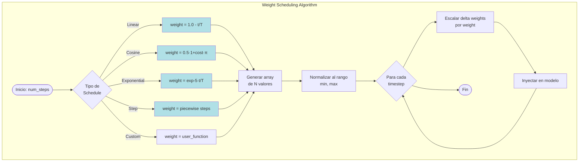

**Ejemplo de Curvas**:

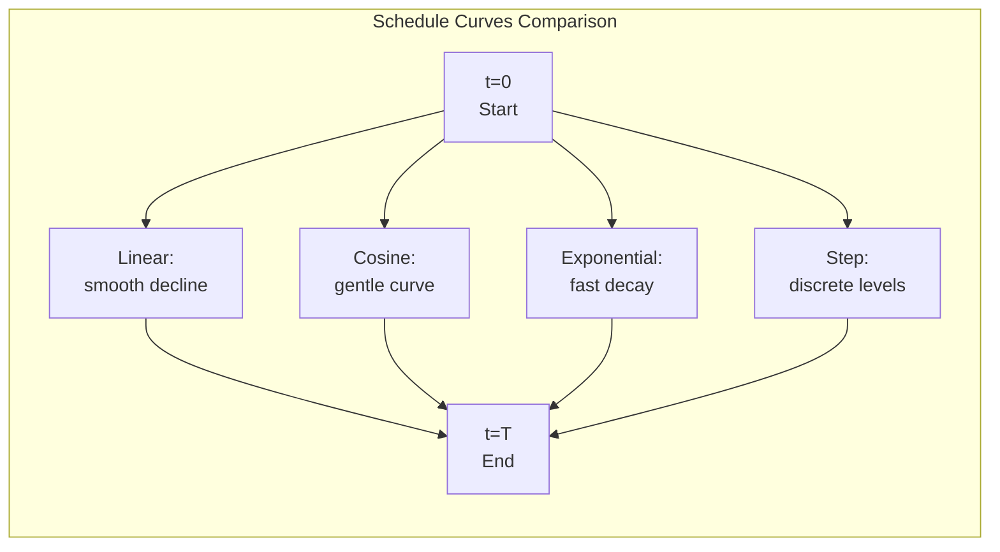

**Estrategias Comunes**:

- **High→Low**: Estructura al inicio, detalles al final
- **Low→High**: Detalles al inicio, estilo al final
- **Constant**: Influencia uniforme (más simple)
- **Peaked**: Máxima influencia en medio del proceso

---

## 7. Casos de Uso {#casos-uso}

### 7.1 Caso de Uso: Composición Multi-Estilo

**Escenario**: Generar imagen con múltiples estilos artísticos combinados.

**Actores**: Usuario, LoRA Service, Pipeline

**Flujo**:

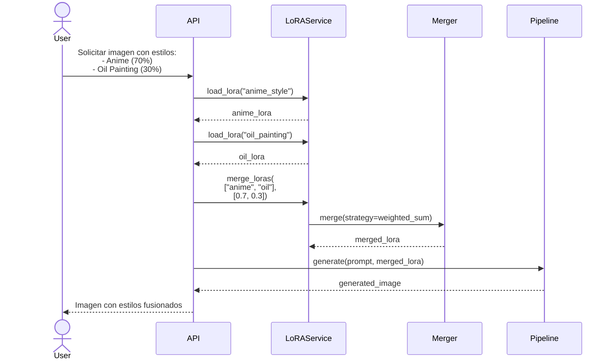

**Beneficios**:
- Control fino sobre balance de estilos
- Evita entrenamiento de nuevo LoRA
- Experimentación rápida con combinaciones

---

### 7.2 Caso de Uso: LoRA Progresivo por Región

**Escenario**: Aplicar diferentes LoRAs en diferentes regiones de la imagen.

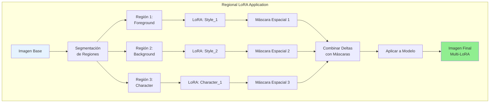

**Implementación**:
- Usar máscaras espaciales para modular delta weights
- Cada LoRA afecta solo su región asignada
- Transiciones suaves entre regiones mediante blending

---

### 7.3 Caso de Uso: LoRA Dinámico por Timestep

**Escenario**: Cambiar LoRAs activos durante el proceso de generación.

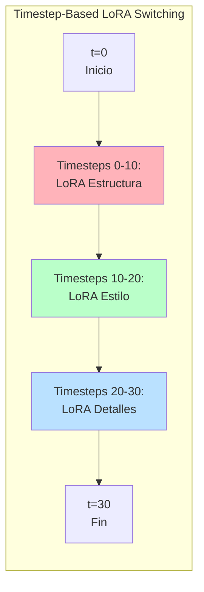

**Estrategia**:
- **Fase Temprana**: LoRA de estructura/composición (alto peso)
- **Fase Media**: LoRA de estilo/iluminación (peso medio)
- **Fase Final**: LoRA de detalles/texturas (peso bajo)

**Ventajas**:
- Control jerárquico del proceso de generación
- Evita conflictos entre LoRAs
- Resultados más coherentes y refinados

---

## 8. Métricas y Monitoreo

### 8.1 Métricas de Performance

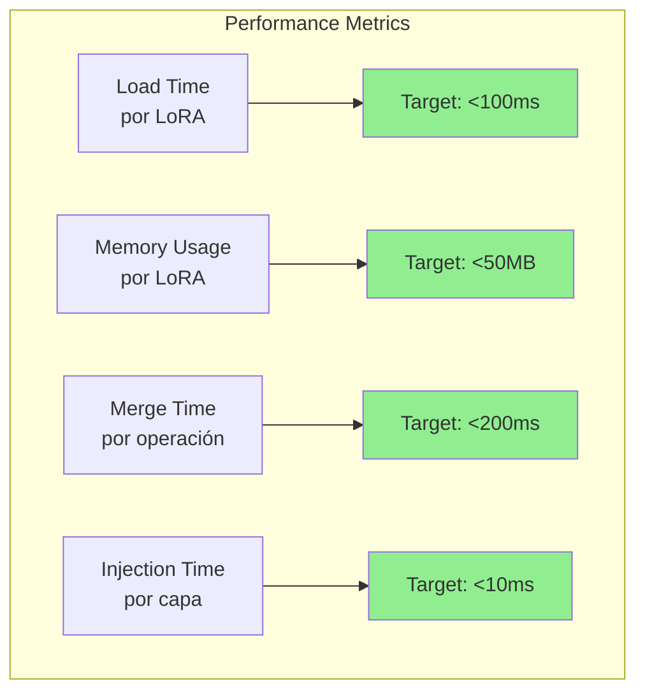

### 8.2 Métricas de Calidad

- **Compatibility Score**: % de LoRAs cargados exitosamente
- **Merge Quality**: Distancia entre merged LoRA y expectativa
- **Injection Accuracy**: Corrección de pesos inyectados
- **Cache Hit Rate**: Eficiencia de cache de LoRAs

---

## 9. Consideraciones de Implementación

### 9.1 Optimizaciones Clave

**Memory Management**:
- LRU cache para LoRAs usados frecuentemente
- Lazy loading de matrices pesadas
- Compression de LoRAs inactivos

**Computation**:
- Batch processing de cálculos de delta
- SIMD acceleration para operaciones matriciales
- GPU offloading para merges grandes

**Storage**:
- Indexación eficiente de metadata
- Deduplicación de LoRAs similares
- Versionado de LoRAs modificados

### 9.2 Manejo de Errores

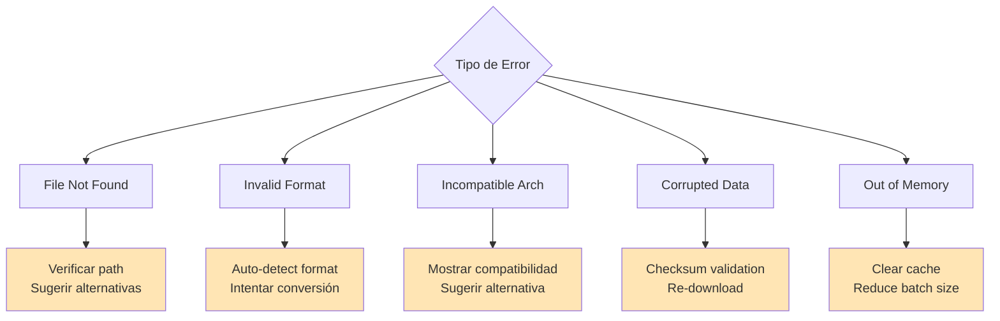

---

## 10. Referencias y Recursos

### Formatos de Archivo
- **SafeTensors**: Formato seguro y eficiente
- **PyTorch**: Formato legacy (pickle-based)
- **ONNX**: Para interoperabilidad

### Convenciones de Nombres
- **Kohya SS**: Estándar de facto para entrenamiento
- **Diffusers**: Estándar de HuggingFace
- **A1111**: Formato de Automatic1111 WebUI

### Algoritmos
- **SVD**: Descomposición en valores singulares
- **Low-Rank Approximation**: Teoría detrás de LoRA
- **Matrix Factorization**: Técnicas de factorización