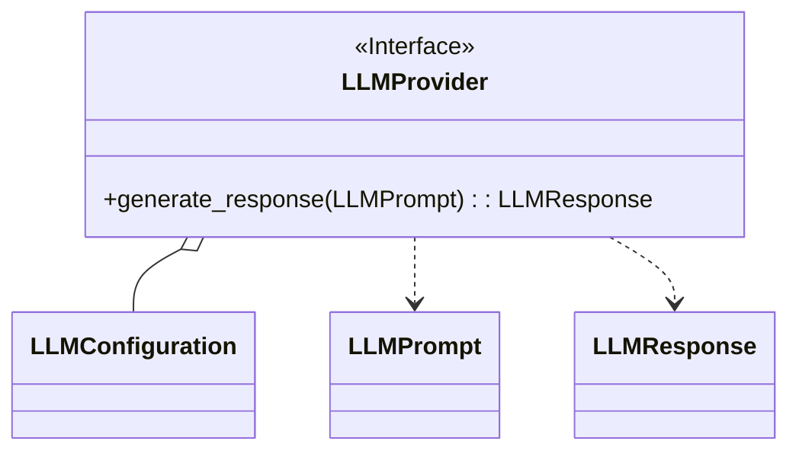

# Módulo de Infraestructura de LLM (`infrastructure/llm`)

Este módulo proporciona la infraestructura necesaria para interactuar con Modelos de Lenguaje Grandes (LLMs). Se encarga de abstraer los detalles de los diferentes proveedores de LLM, ofreciendo una interfaz unificada al resto de la aplicación.

## Submódulos

-   **[entities](./entities/README.md)**: Define las entidades de datos para la configuración, los prompts y las respuestas de los LLMs.
-   **[interfaces](./interfaces/README.md)**: Define la interfaz abstracta `LLMProvider` que deben implementar todos los adaptadores de proveedores de LLM.

## Arquitectura General

La arquitectura de este módulo sigue el principio de inversión de dependencias. La capa de aplicación depende de la interfaz `LLMProvider`, y no de las implementaciones concretas. Esto permite cambiar de proveedor de LLM con un impacto mínimo en el resto del sistema.

## Diagrama de Clases de Alto Nivel

