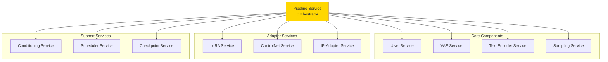
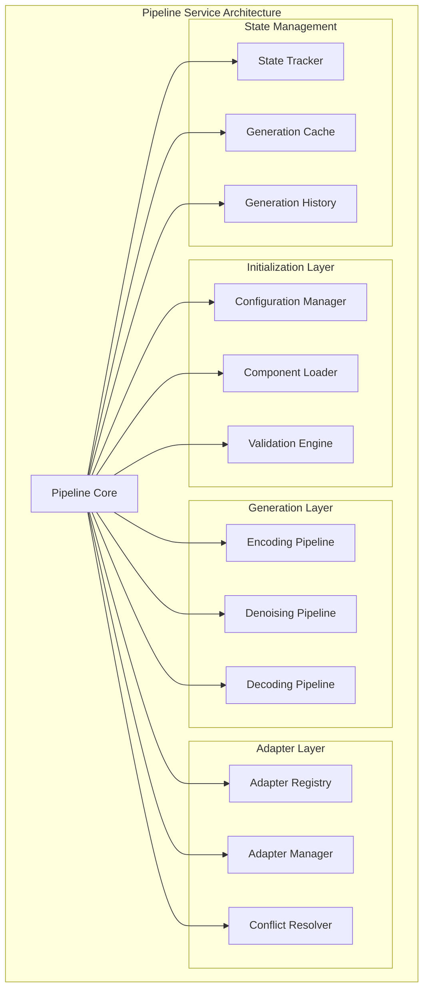

# Pipeline Service - Documentación Técnica Detallada

## Tabla de Contenidos
1. [Visión General](#vision-general)
2. [Arquitectura del Servicio](#arquitectura)
3. [Componentes de Integración](#componentes)
4. [Flujos de Generación](#flujos)
5. [Gestión de Estado](#estado)
6. [Optimizaciones](#optimizaciones)

---

## 1. Visión General {#vision-general}

### Propósito
Servicio orquestador central que coordina todos los componentes del sistema de difusión para generar imágenes. Actúa como fachada unificada integrando UNet, VAE, text encoding, sampling, y adaptadores.

### Responsabilidades
- Inicialización y configuración de pipeline completo
- Coordinación de componentes (UNet, VAE, LoRA, ControlNet, IP-Adapter)
- Gestión del ciclo de generación (encoding → denoising → decoding)
- Control de adaptadores activos y sus configuraciones
- Manejo de múltiples condicionamientos simultáneos
- Optimización de recursos y memoria

### Relación con Otros Servicios



---

## 2. Arquitectura del Servicio {#arquitectura}

### 2.1 Estructura General



### 2.2 Modelo de Configuración

```mermaid
classDiagram
    class DiffusionPipelineConfig {
        +str model_type
        +Path checkpoint_path
        +Path vae_path
        +Path text_encoder_path
        +str scheduler_type
        +bool safety_checker
        +str torch_dtype
        +str device
        +list~LoRAConfig~ lora_configs
        +float default_lora_alpha
        +int default_steps
        +float default_guidance_scale
        +int default_width
        +int default_height
        
        +validate() bool
        +to_dict() dict
        +from_dict(dict) Config
    }
    
    class PipelineState {
        +bool initialized
        +dict active_adapters
        +dict component_states
        +GenerationParams last_params
        +datetime last_generation
        +int generation_count
        
        +snapshot() StateSnapshot
        +restore(StateSnapshot) void
    }
    
    class ComponentRegistry {
        +dict components
        +dict dependencies
        +list initialization_order
        
        +register(component) void
        +get(name) Component
        +resolve_dependencies() list
    }
    
    class AdapterStack {
        +list~Adapter~ adapters
        +dict priorities
        +dict weights