# UNet Service - Documentación Técnica Detallada

## Tabla de Contenidos
1. [Visión General](#vision-general)
2. [Arquitectura del Servicio](#arquitectura)
3. [Estructura de Capas](#capas)
4. [Flujos de Predicción](#flujos)
5. [Gestión de Condicionamiento](#condicionamiento)
6. [Optimizaciones](#optimizaciones)

---

## 1. Visión General {#vision-general}

### Propósito
El UNet es el componente central del proceso de difusión, responsable de predecir el ruido en cada paso del proceso iterativo. Opera en el espacio latente y utiliza múltiples formas de condicionamiento para guiar la generación.

### Responsabilidades
- **Predicción de Ruido**: Estimar ruido en latents para cada timestep
- **Condicionamiento Multi-modal**: Integrar texto, imágenes, máscaras
- **Cross-Attention**: Fusionar embeddings de texto con features visuales
- **Gestión de Adaptadores**: Inyectar LoRA, ControlNet, IP-Adapter
- **Self-Attention**: Capturar relaciones espaciales en la imagen
- **Residual Connections**: Mantener información entre bloques

### Relación con Otros Servicios

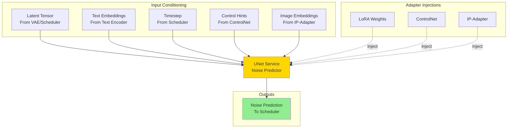

---

## 2. Arquitectura del Servicio {#arquitectura}

### 2.1 Estructura General

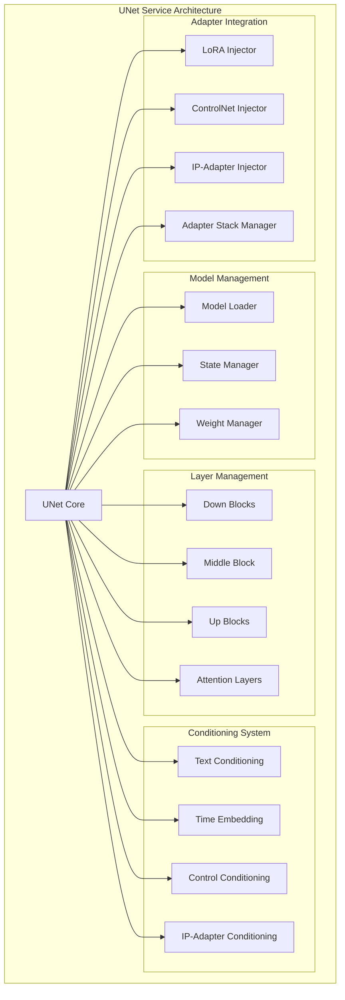

### 2.2 Modelo de Datos

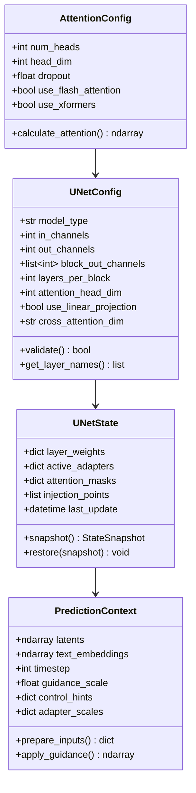

---

## 3. Estructura de Capas {#capas}

### 3.1 Arquitectura Completa del UNet

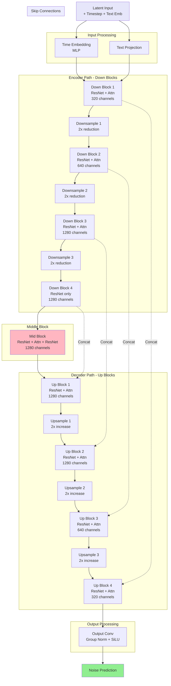

### 3.2 Bloque Residual (ResNet)

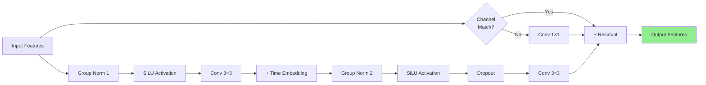

### 3.3 Bloque de Atención

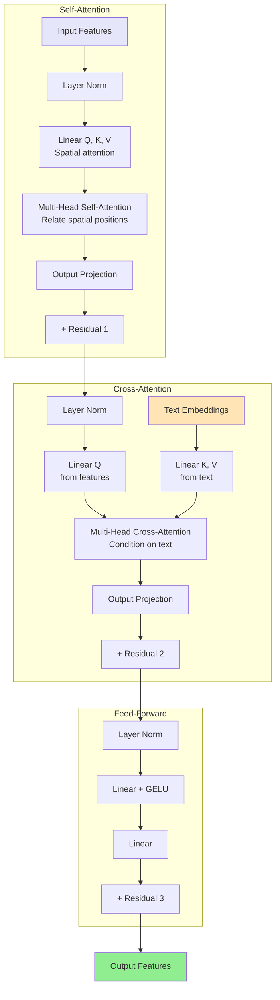

---

## 4. Flujos de Predicción {#flujos}

### 4.1 Flujo Completo de Predicción de Ruido

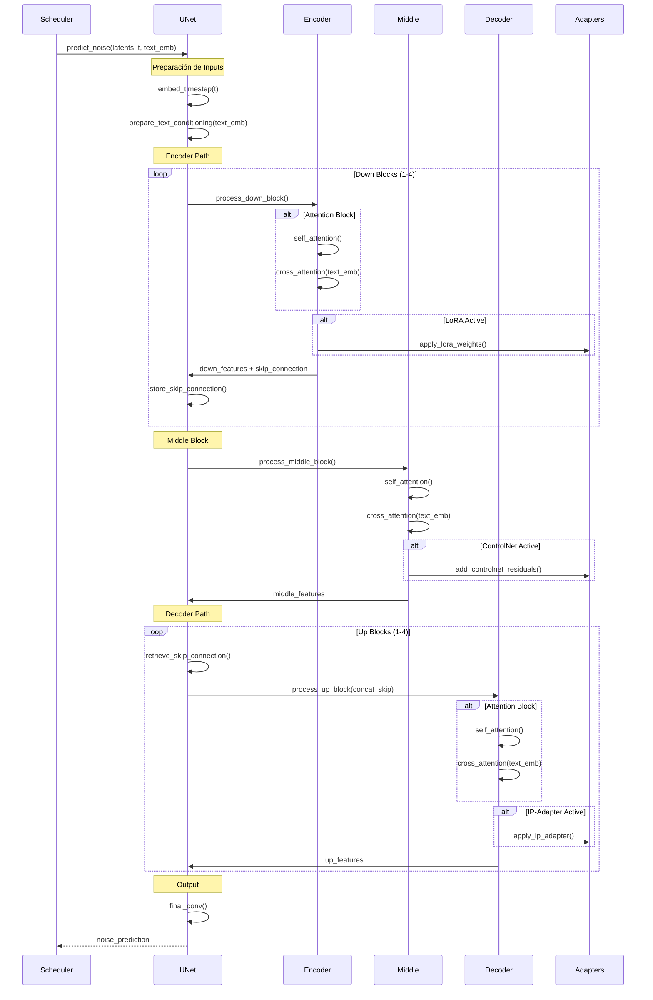

### 4.2 Classifier-Free Guidance

```mermaid
graph TB
    Input[Latents + Timestep]
    
    Input --> Duplicate[Duplicate Batch<br/>2× size]
    
    Duplicate --> Cond[Conditional Path<br/>With text embeddings]
    Duplicate --> Uncond[Unconditional Path<br/>Empty/negative prompt]
    
    Cond --> UNetCond[UNet Forward<br/>Conditional]
    Uncond --> UNetUncond[UNet Forward<br/>Unconditional]
    
    UNetCond --> NoiseCond[Noise Pred<br/>Conditional]
    UNetUncond --> NoiseUncond[Noise Pred<br/>Unconditional]
    
    NoiseCond --> Guidance[Apply Guidance Scale<br/>noise = uncond + scale × (cond - uncond)]
    NoiseUncond --> Guidance
    
    Guidance --> Output[Guided Noise Prediction]
    
    style Input fill:#E6E6FA
    style Output fill:#90EE90
    style Guidance fill:#FFE4B5
```

**Fórmula del Guidance:**
```
noise_pred = noise_uncond + guidance_scale × (noise_cond - noise_uncond)
```

### 4.3 Inyección de Adaptadores en Forward Pass

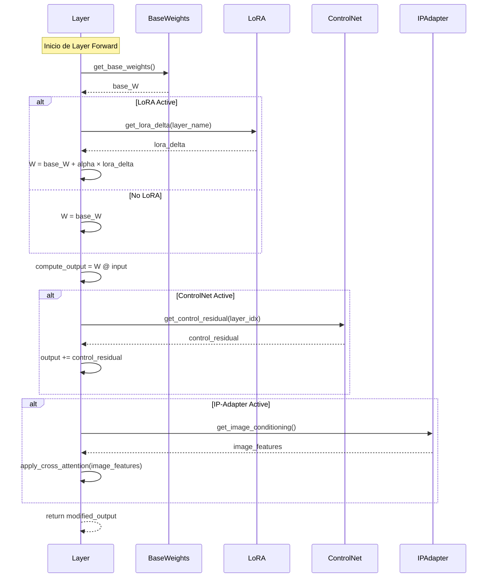

---

## 5. Gestión de Condicionamiento {#condicionamiento}

### 5.1 Sistema de Condicionamiento Multi-Modal

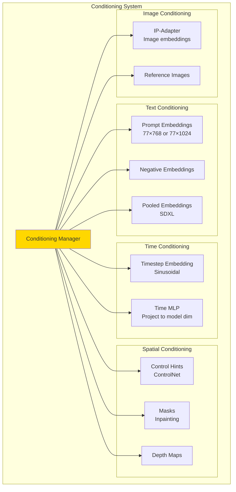

### 5.2 Fusión de Condicionamientos

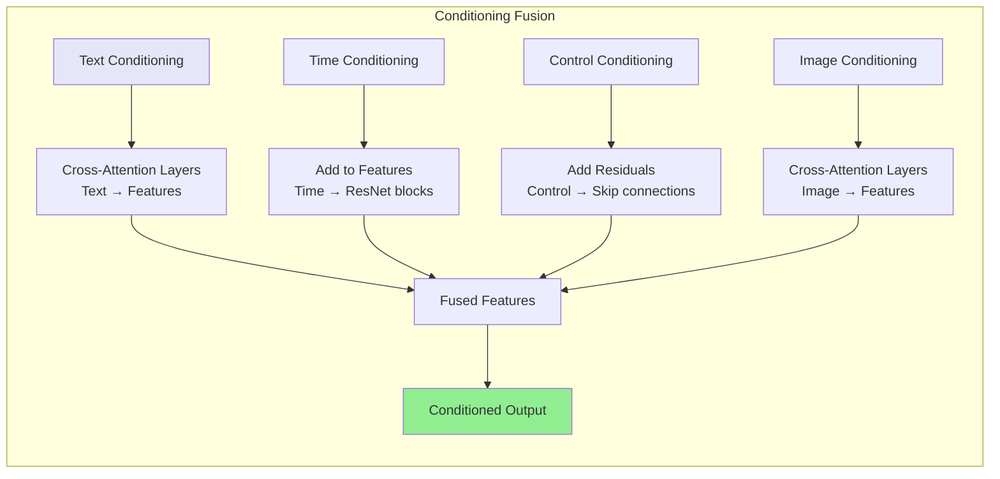

### 5.3 Attention Masking

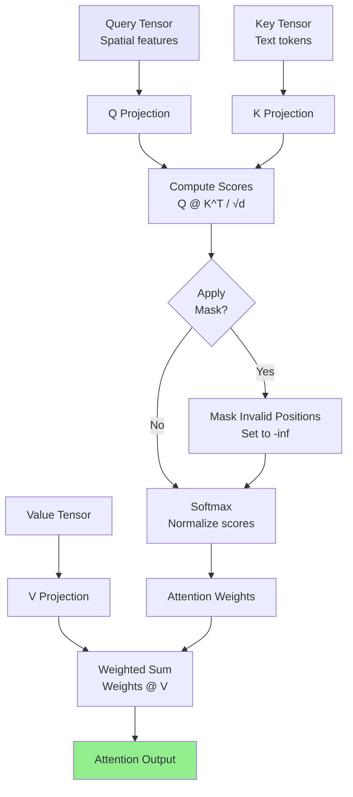

---

## 6. Optimizaciones {#optimizaciones}

### 6.1 Estrategias de Optimización

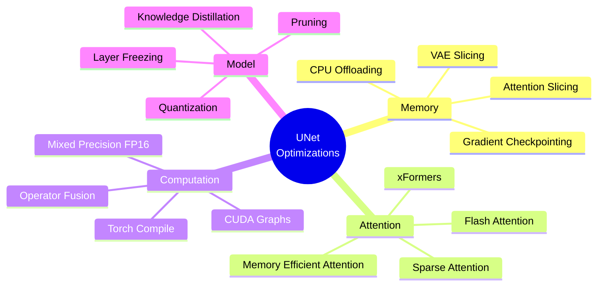

### 6.2 Attention Optimization

```mermaid
graph TB
    subgraph "Attention Optimization Strategies"
        Standard[Standard Attention<br/>O(N²) memory]
        
        Standard --> Choose{Choose<br/>Strategy}
        
        Choose -->|Memory Critical| Flash[Flash Attention<br/>O(N) memory<br/>Tiling + recompute]
        
        Choose -->|Speed Critical| xFormers[xFormers Attention<br/>Block-sparse<br/>Optimized kernels]
        
        Choose -->|Balanced| MemEfficient[Memory Efficient<br/>Chunked processing<br/>Lower peak memory]
        
        Flash --> Benchmark[Benchmark Performance]
        xFormers --> Benchmark
        MemEfficient --> Benchmark
        
        Benchmark --> Select[Select Best for Hardware]
    end
    
    style Standard fill:#FFB6C1
    style Select fill:#90EE90
```

### 6.3 Gradient Checkpointing

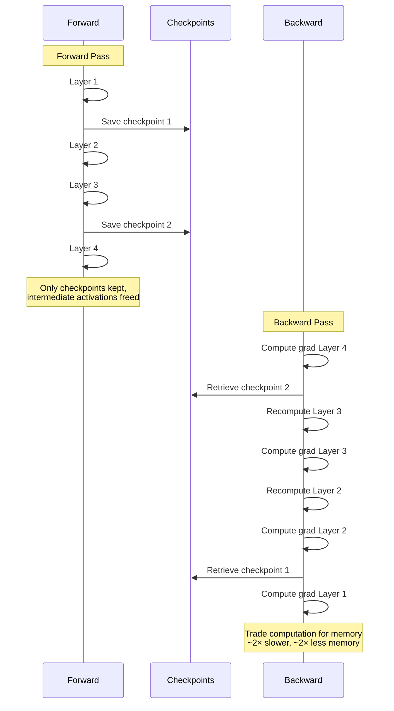

### 6.4 Gestión de Memoria por Layers

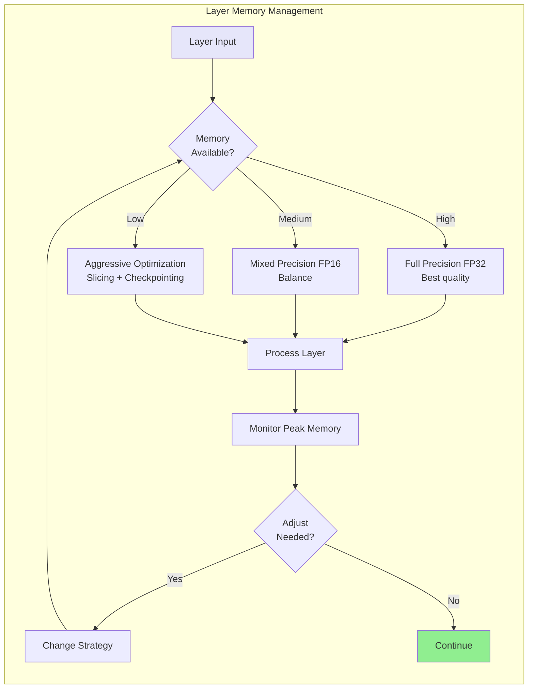

---

## 7. Integración con Adaptadores

### 7.1 Stack de Adaptadores en UNet

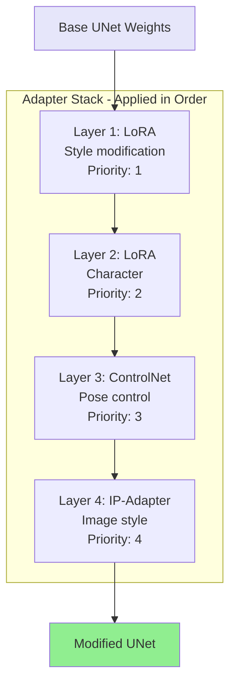

### 7.2 Resolución de Conflictos entre Adaptadores

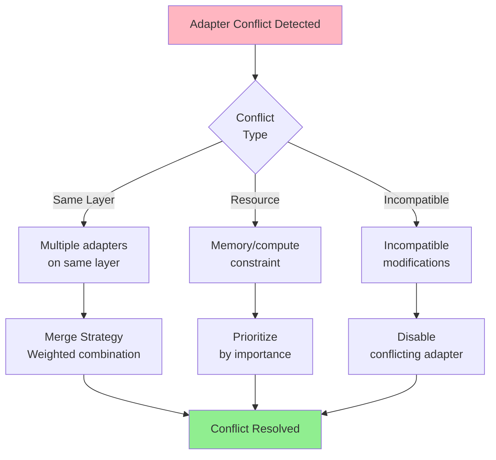

### 7.3 Puntos de Inyección de Adaptadores

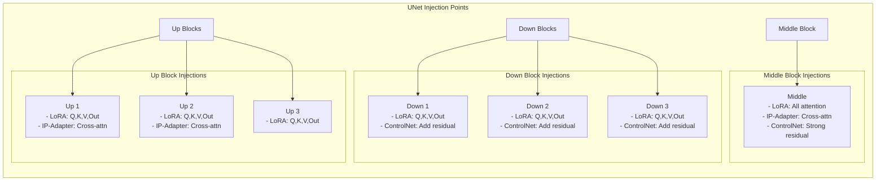

---

## 8. Monitoreo y Debugging

### 8.1 Métricas del UNet

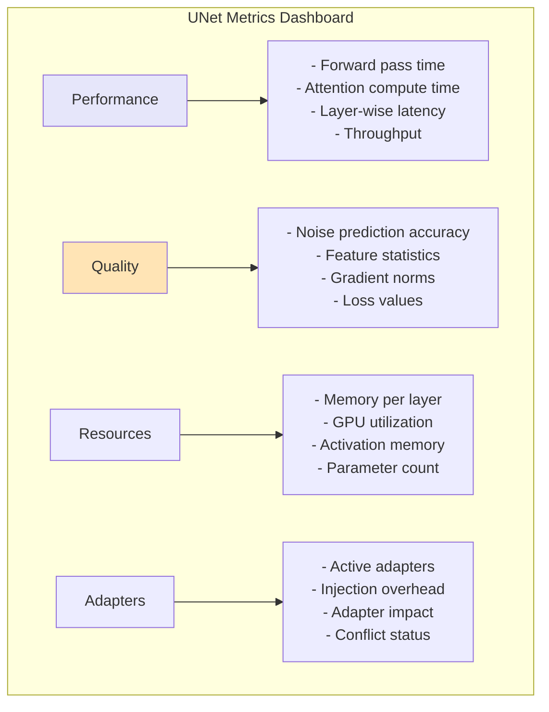

### 8.2 Debugging Flow

```mermaid
sequenceDiagram
    participant User
    participant UNet
    participant Debugger
    participant Visualizer
    
    User->>UNet: generate() with debug=True
    
    UNet->>Debugger: enable_layer_hooks()
    
    loop Each Layer
        UNet->>Debugger: log_layer_input(layer_name)
        UNet->>UNet: process_layer()
        UNet->>Debugger: log_layer_output(layer_name)
        UNet->>Debugger: log_attention_maps()
    end
    
    UNet->>Debugger: log_final_prediction()
    
    User->>Debugger: get_debug_info()
    Debugger-->>User: layer_statistics
    
    User->>Visualizer: visualize_attention()
    Visualizer-->>User: attention_heatmaps
    
    User->>Visualizer: visualize_activations()
    Visualizer-->>User: activation_plots
```

### 8.3 Troubleshooting Common Issues

```mermaid
graph TB
    Issue[UNet Issue]
    
    Issue --> Type{Issue Type}
    
    Type -->|NaN Values| NaN[NaN in Output]
    Type -->|Poor Quality| Quality[Bad Generation]
    Type -->|Slow| Performance[Slow Inference]
    Type -->|Memory| Memory[OOM Error]
    
    NaN --> NaNSol[- Check gradient clipping<br/>- Reduce learning rate<br/>- Check adapter weights<br/>- Validate input ranges]
    
    Quality --> QualSol[- Verify text embeddings<br/>- Check adapter scales<br/>- Validate timesteps<br/>- Review conditioning]
    
    Performance --> PerfSol[- Enable flash attention<br/>- Use torch.compile<br/>- Reduce attention heads<br/>- Enable gradient checkpointing]
    
    Memory --> MemSol[- Enable attention slicing<br/>- Use FP16<br/>- Reduce batch size<br/>- Offload to CPU]
    
    style Issue fill:#FFB6C1
    style NaNSol fill:#90EE90
    style QualSol fill:#90EE90
    style PerfSol fill:#90EE90
    style MemSol fill:#90EE90
```